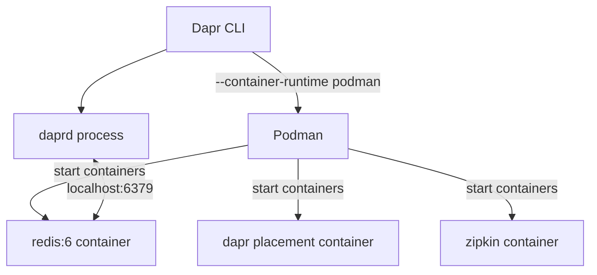

# How to Use Dapr with Podman

Author: [nawazdhandala](https://www.github.com/nawazdhandala)

Tags: Dapr, Podman, Container, Local Development, Self-Hosted

Description: Initialize Dapr with Podman instead of Docker, run Dapr sidecars using Podman containers, and configure the Dapr CLI to use the Podman container runtime.

---

## Why Podman with Dapr?

Podman is a daemonless container runtime that is a drop-in replacement for Docker in many scenarios. It runs rootless containers by default and does not require a background daemon. Dapr supports Podman as an alternative to Docker for local development.



## Prerequisites

Install Podman:

```bash
# macOS
brew install podman
podman machine init
podman machine start

# Ubuntu/Debian
apt-get install -y podman

# Fedora/RHEL
dnf install -y podman

# Verify
podman --version
```

## Initialize Dapr with Podman

```bash
dapr init --container-runtime podman
```

This tells the Dapr CLI to use Podman instead of Docker to pull and start the Redis, Zipkin, and placement containers.

Expected output:

```text
Making the jump to hyperspace...
Installing runtime version 1.14.x
Downloading binaries and setting up components...
Container images are being pulled via Podman...
dapr_redis container created
dapr_placement container created
dapr_zipkin container created
Success! Dapr is up and running.
```

Verify containers:

```bash
podman ps
```

Output:

```text
CONTAINER ID  IMAGE                    NAMES
...           redis:6                  dapr_redis
...           daprio/dapr:1.14.0       dapr_placement
...           openzipkin/zipkin        dapr_zipkin
```

## Running Applications with Podman

The `dapr run` command works the same way - the `--container-runtime` flag is only needed for `dapr init` and `dapr stop`:

```bash
dapr run \
  --app-id myapp \
  --app-port 3000 \
  --dapr-http-port 3500 \
  -- python3 app.py
```

## Stopping Dapr with Podman

```bash
dapr stop --all --container-runtime podman
```

Or uninstall everything:

```bash
dapr uninstall --container-runtime podman
```

## Docker Compose Equivalent with Podman Compose

If you use Podman Compose (the Podman equivalent of Docker Compose):

```bash
pip3 install podman-compose
```

Your existing `docker-compose.yaml` files work without modification:

```bash
podman-compose up --build
```

The compose configuration for Dapr sidecars is identical to the Docker Compose setup.

## Rootless Podman Considerations

When using rootless Podman, container names resolve differently. Adjust the component files to use container IP addresses or configure Podman networking:

```bash
# Get the Redis container IP in rootless Podman
podman inspect dapr_redis --format '{{.NetworkSettings.IPAddress}}'
```

Update `statestore.yaml` if needed:

```yaml
metadata:
- name: redisHost
  value: 10.88.0.2:6379   # use the container IP if DNS doesn't resolve
```

Alternatively, use Podman's DNS support:

```bash
# Create a named network
podman network create dapr-network

# Redis will be resolvable by name on this network
podman run -d --name dapr_redis --network dapr-network redis:6
```

## Using Podman in CI/CD

In CI environments (GitHub Actions, GitLab CI) that have Podman available:

```yaml
# GitHub Actions example
- name: Initialize Dapr with Podman
  run: |
    dapr init --container-runtime podman --slim
    dapr run \
      --app-id test-app \
      --dapr-http-port 3500 \
      --container-runtime podman \
      -- python3 -m pytest tests/

- name: Stop Dapr
  run: dapr stop --all --container-runtime podman
```

## Slim Init with Podman

If you don't need the full Redis and Zipkin setup:

```bash
dapr init --slim --container-runtime podman
```

Slim init only installs the `daprd` binary and the placement service binary without pulling container images. You provide your own state store and pub/sub backends.

## Podman Desktop Integration

Podman Desktop provides a GUI for managing containers. With Dapr containers running, you can see and manage them through the Podman Desktop interface similarly to Docker Desktop.

```bash
# Check Podman socket (required for Podman Desktop integration)
systemctl --user status podman.socket
systemctl --user enable --now podman.socket
```

## Verifying the Setup

```bash
# Check Dapr status using Podman
dapr status

# Check component configurations
ls ~/.dapr/components/

# Test the state API
dapr run --app-id test --dapr-http-port 3500 -- sleep 5 &
curl -X POST http://localhost:3500/v1.0/state/statestore \
  -H "Content-Type: application/json" \
  -d '[{"key": "hello", "value": "world"}]'
curl http://localhost:3500/v1.0/state/statestore/hello
```

## Summary

Using Dapr with Podman requires passing `--container-runtime podman` to `dapr init` and `dapr uninstall`. The `dapr run` command works identically regardless of the container runtime. Rootless Podman may require explicit network configuration or container IP addresses in component files. Podman Compose supports the same `docker-compose.yaml` format for multi-service local development setups.
