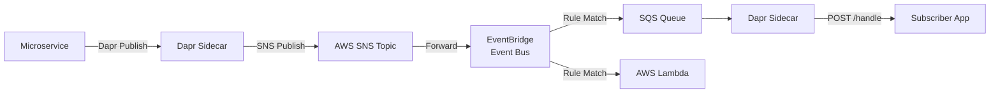

# How to Set Up Dapr Pub/Sub with AWS EventBridge

Author: [OneUptime](https://www.github.com/OneUptime)

Tags: Dapr, Pub/Sub, AWS, EventBridge, Serverless

Description: Configure the Dapr AWS SNS/SQS pub/sub component to route events through AWS EventBridge for cross-account event routing and serverless integration patterns.

---

## Overview

AWS EventBridge is a serverless event bus that can route events between AWS services, SaaS providers, and your applications. Dapr connects to AWS EventBridge using the SNS/SQS pub/sub component, where EventBridge rules forward events to SQS queues that Dapr subscribes to.



## Prerequisites

- AWS account with IAM permissions for SNS, SQS, and EventBridge
- Dapr CLI installed and initialized
- AWS CLI configured

## AWS Resource Setup

```bash
AWS_REGION="us-east-1"
ACCOUNT_ID=$(aws sts get-caller-identity --query Account --output text)
TOPIC_NAME="dapr-orders"
QUEUE_NAME="dapr-orders-queue"
DLQ_NAME="dapr-orders-dlq"
EVENT_BUS="dapr-event-bus"

# Create EventBridge custom event bus
aws events create-event-bus \
  --name $EVENT_BUS \
  --region $AWS_REGION

# Create SNS topic
SNS_ARN=$(aws sns create-topic \
  --name $TOPIC_NAME \
  --region $AWS_REGION \
  --query TopicArn --output text)

# Create SQS DLQ
DLQ_URL=$(aws sqs create-queue \
  --queue-name $DLQ_NAME \
  --region $AWS_REGION \
  --query QueueUrl --output text)

DLQ_ARN=$(aws sqs get-queue-attributes \
  --queue-url $DLQ_URL \
  --attribute-names QueueArn \
  --query Attributes.QueueArn --output text)

# Create SQS queue with redrive policy
QUEUE_URL=$(aws sqs create-queue \
  --queue-name $QUEUE_NAME \
  --region $AWS_REGION \
  --attributes '{
    "VisibilityTimeout": "60",
    "RedrivePolicy": "{\"deadLetterTargetArn\":\"'"$DLQ_ARN"'\",\"maxReceiveCount\":\"5\"}"
  }' \
  --query QueueUrl --output text)

QUEUE_ARN=$(aws sqs get-queue-attributes \
  --queue-url $QUEUE_URL \
  --attribute-names QueueArn \
  --query Attributes.QueueArn --output text)

# Subscribe SQS to SNS
aws sns subscribe \
  --topic-arn $SNS_ARN \
  --protocol sqs \
  --notification-endpoint $QUEUE_ARN \
  --region $AWS_REGION

# Allow SNS to publish to SQS
aws sqs set-queue-attributes \
  --queue-url $QUEUE_URL \
  --attributes '{
    "Policy": "{\"Version\":\"2012-10-17\",\"Statement\":[{\"Effect\":\"Allow\",\"Principal\":{\"Service\":\"sns.amazonaws.com\"},\"Action\":\"sqs:SendMessage\",\"Resource\":\"'"$QUEUE_ARN"'\",\"Condition\":{\"ArnEquals\":{\"aws:SourceArn\":\"'"$SNS_ARN"'\"}}}]}"
  }'

echo "SNS ARN: $SNS_ARN"
echo "Queue URL: $QUEUE_URL"
```

## EventBridge Rule to Forward SNS Events

```bash
# Create a rule that matches all order events
aws events put-rule \
  --name "forward-orders-rule" \
  --event-bus-name $EVENT_BUS \
  --event-pattern '{
    "source": ["com.example.orders"],
    "detail-type": ["OrderCreated"]
  }' \
  --state ENABLED \
  --region $AWS_REGION

# Add the SQS queue as a target
aws events put-targets \
  --rule "forward-orders-rule" \
  --event-bus-name $EVENT_BUS \
  --targets '[{"Id":"1","Arn":"'"$QUEUE_ARN"'"}]' \
  --region $AWS_REGION
```

## IAM Policy for Dapr

```json
{
  "Version": "2012-10-17",
  "Statement": [
    {
      "Effect": "Allow",
      "Action": [
        "sns:Publish",
        "sns:Subscribe",
        "sns:ListTopics",
        "sns:CreateTopic"
      ],
      "Resource": "arn:aws:sns:us-east-1:*:dapr-*"
    },
    {
      "Effect": "Allow",
      "Action": [
        "sqs:SendMessage",
        "sqs:ReceiveMessage",
        "sqs:DeleteMessage",
        "sqs:GetQueueAttributes",
        "sqs:CreateQueue",
        "sqs:ListQueues"
      ],
      "Resource": "arn:aws:sqs:us-east-1:*:dapr-*"
    },
    {
      "Effect": "Allow",
      "Action": [
        "events:PutEvents"
      ],
      "Resource": "arn:aws:events:us-east-1:*:event-bus/dapr-event-bus"
    }
  ]
}
```

## Dapr Component Configuration

```yaml
# pubsub-aws.yaml
apiVersion: dapr.io/v1alpha1
kind: Component
metadata:
  name: pubsub
  namespace: default
spec:
  type: pubsub.aws.snssqs
  version: v1
  metadata:
  - name: accessKey
    secretKeyRef:
      name: aws-secret
      key: accessKey
  - name: secretKey
    secretKeyRef:
      name: aws-secret
      key: secretKey
  - name: region
    value: "us-east-1"
  - name: sqsDeadLettersQueueName
    value: "dapr-orders-dlq"
  - name: messageReceiveLimit
    value: "5"
  - name: disableEntityManagement
    value: "false"
  - name: assetsManagementTimeoutSeconds
    value: "5"
```

With IRSA (IAM Roles for Service Accounts) on EKS:

```yaml
  metadata:
  - name: region
    value: "us-east-1"
  - name: sqsDeadLettersQueueName
    value: "dapr-orders-dlq"
```

## Kubernetes Secret

```bash
kubectl create secret generic aws-secret \
  --from-literal=accessKey=YOUR_ACCESS_KEY \
  --from-literal=secretKey=YOUR_SECRET_KEY \
  --namespace default
```

## Publishing to EventBridge

```python
# publisher.py
import json
import boto3
from dapr.clients import DaprClient

def publish_via_dapr(order_id: str, amount: float):
    """Publish through Dapr SNS/SQS which routes to EventBridge."""
    with DaprClient() as client:
        data = {
            "orderId": order_id,
            "amount": amount,
            "source": "com.example.orders"
        }
        client.publish_event(
            pubsub_name="pubsub",
            topic_name="dapr-orders",
            data=json.dumps(data),
            data_content_type="application/json"
        )
        print(f"Published order {order_id} via Dapr to SNS/EventBridge")

def publish_directly_to_eventbridge(order_id: str, amount: float):
    """Publish directly to EventBridge custom bus."""
    client = boto3.client('events', region_name='us-east-1')
    response = client.put_events(
        Entries=[{
            'EventBusName': 'dapr-event-bus',
            'Source': 'com.example.orders',
            'DetailType': 'OrderCreated',
            'Detail': json.dumps({
                "orderId": order_id,
                "amount": amount
            })
        }]
    )
    print(f"Published to EventBridge: {response['FailedEntryCount']} failures")

if __name__ == "__main__":
    publish_via_dapr("eb-order-001", 250.00)
```

## Subscriber

```python
# subscriber.py
from flask import Flask, request, jsonify

app = Flask(__name__)

@app.route('/dapr/subscribe', methods=['GET'])
def subscribe():
    return jsonify([{
        "pubsubname": "pubsub",
        "topic": "dapr-orders",
        "route": "/handle-order"
    }])

@app.route('/handle-order', methods=['POST'])
def handle_order():
    event = request.get_json()
    order = event.get('data', {})
    print(f"EventBridge order received: {order.get('orderId')}, amount: {order.get('amount')}")
    return jsonify({"status": "SUCCESS"})

if __name__ == '__main__':
    app.run(host='0.0.0.0', port=5001)
```

## Summary

Dapr integrates with AWS EventBridge using the SNS/SQS pub/sub component. Publish events through Dapr to SNS, then configure EventBridge rules to route events from the SNS topic or custom event bus to SQS queues that Dapr subscribers poll. Use IRSA for production EKS deployments to avoid long-lived credentials, and set `messageReceiveLimit` alongside `sqsDeadLettersQueueName` to capture messages that fail repeatedly.
