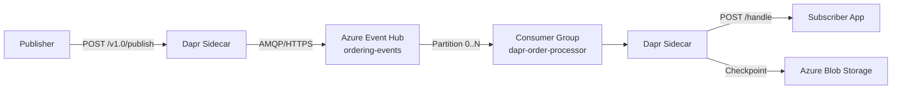

# How to Set Up Dapr Pub/Sub with Azure Event Hubs

Author: [OneUptime](https://www.github.com/OneUptime)

Tags: Dapr, Pub/Sub, Azure, Event Hubs, Streaming

Description: Configure the Dapr Azure Event Hubs pub/sub component to stream high-throughput messages using consumer groups, managed identity, and checkpoint storage in Kubernetes.

---

## Overview

Azure Event Hubs is a high-throughput streaming platform. The Dapr `pubsub.azure.eventhubs` component maps Dapr topics to Event Hubs, uses consumer groups for subscriber isolation, and Azure Blob Storage for checkpointing partition offsets.



## Prerequisites

- Azure subscription with Event Hubs namespace
- Azure Blob Storage account for checkpointing
- Dapr CLI installed and initialized
- Azure CLI installed

## Create Azure Resources

```bash
RESOURCE_GROUP="dapr-rg"
LOCATION="eastus"
NAMESPACE="dapr-eventhubs-ns"
EVENTHUB="orders"
STORAGE_ACCOUNT="daprcheckpoints"
CONTAINER="checkpoints"

# Create resource group
az group create --name $RESOURCE_GROUP --location $LOCATION

# Create Event Hubs namespace (Standard tier for consumer groups)
az eventhubs namespace create \
  --name $NAMESPACE \
  --resource-group $RESOURCE_GROUP \
  --sku Standard \
  --location $LOCATION

# Create an Event Hub (topic)
az eventhubs eventhub create \
  --name $EVENTHUB \
  --namespace-name $NAMESPACE \
  --resource-group $RESOURCE_GROUP \
  --partition-count 4 \
  --message-retention 1

# Create consumer group for the subscriber
az eventhubs eventhub consumer-group create \
  --name dapr-order-processor \
  --eventhub-name $EVENTHUB \
  --namespace-name $NAMESPACE \
  --resource-group $RESOURCE_GROUP

# Create storage for checkpoints
az storage account create \
  --name $STORAGE_ACCOUNT \
  --resource-group $RESOURCE_GROUP \
  --location $LOCATION \
  --sku Standard_LRS

az storage container create \
  --name $CONTAINER \
  --account-name $STORAGE_ACCOUNT

# Get connection strings
az eventhubs namespace authorization-rule keys list \
  --name RootManageSharedAccessKey \
  --namespace-name $NAMESPACE \
  --resource-group $RESOURCE_GROUP \
  --query primaryConnectionString -o tsv

az storage account show-connection-string \
  --name $STORAGE_ACCOUNT \
  --resource-group $RESOURCE_GROUP \
  --query connectionString -o tsv
```

## Kubernetes Secrets

```bash
kubectl create secret generic eventhubs-secret \
  --from-literal=connectionString="Endpoint=sb://dapr-eventhubs-ns.servicebus.windows.net/;SharedAccessKeyName=RootManageSharedAccessKey;SharedAccessKey=YOUR_KEY" \
  --from-literal=storageConnectionString="DefaultEndpointsProtocol=https;AccountName=daprcheckpoints;AccountKey=YOUR_KEY;EndpointSuffix=core.windows.net" \
  --namespace default
```

## Dapr Component Configuration

```yaml
# pubsub-eventhubs.yaml
apiVersion: dapr.io/v1alpha1
kind: Component
metadata:
  name: pubsub
  namespace: default
spec:
  type: pubsub.azure.eventhubs
  version: v1
  metadata:
  - name: connectionString
    secretKeyRef:
      name: eventhubs-secret
      key: connectionString
  - name: storageConnectionString
    secretKeyRef:
      name: eventhubs-secret
      key: storageConnectionString
  - name: storageContainerName
    value: "checkpoints"
  - name: consumerID
    value: "dapr-order-processor"
  - name: partitionCount
    value: "4"
  - name: messageCount
    value: "100"
```

Apply:

```bash
kubectl apply -f pubsub-eventhubs.yaml
```

## Component with Managed Identity (Recommended)

```yaml
# pubsub-eventhubs-msi.yaml
apiVersion: dapr.io/v1alpha1
kind: Component
metadata:
  name: pubsub
  namespace: default
spec:
  type: pubsub.azure.eventhubs
  version: v1
  metadata:
  - name: eventHubNamespace
    value: "dapr-eventhubs-ns"
  - name: storageAccountName
    value: "daprcheckpoints"
  - name: storageContainerName
    value: "checkpoints"
  - name: consumerID
    value: "dapr-order-processor"
  - name: azureClientId
    value: "YOUR_MANAGED_IDENTITY_CLIENT_ID"
```

## Subscription

```yaml
# subscription.yaml
apiVersion: dapr.io/v1alpha1
kind: Subscription
metadata:
  name: orders-subscription
  namespace: default
spec:
  pubsubname: pubsub
  topic: orders
  route: /handle-order
scopes:
- order-processor
```

## Publisher (Python)

```python
# publisher.py
import json
from dapr.clients import DaprClient

def publish_event(order_id: str, amount: float):
    with DaprClient() as client:
        data = {"orderId": order_id, "amount": amount}
        client.publish_event(
            pubsub_name="pubsub",
            topic_name="orders",
            data=json.dumps(data),
            data_content_type="application/json"
        )
        print(f"Published order {order_id} to Azure Event Hubs")

if __name__ == "__main__":
    for i in range(10):
        publish_event(f"order-{i}", 100.0 * (i + 1))
```

## Subscriber (Python)

```python
# subscriber.py
from flask import Flask, request, jsonify

app = Flask(__name__)

@app.route('/dapr/subscribe', methods=['GET'])
def subscribe():
    return jsonify([{
        "pubsubname": "pubsub",
        "topic": "orders",
        "route": "/handle-order"
    }])

@app.route('/handle-order', methods=['POST'])
def handle_order():
    event = request.get_json()
    order = event.get('data', {})
    print(f"Event Hub message: orderId={order.get('orderId')}, amount={order.get('amount')}")
    return jsonify({"status": "SUCCESS"})

if __name__ == '__main__':
    app.run(host='0.0.0.0', port=5001)
```

## Verifying Messages with Azure CLI

```bash
# Monitor Event Hub messages (useful for debugging)
az eventhubs eventhub show \
  --name orders \
  --namespace-name dapr-eventhubs-ns \
  --resource-group dapr-rg \
  --query "{name:name, partitionCount:partitionCount, messageRetentionInDays:messageRetentionInDays}"
```

## Summary

The Dapr Azure Event Hubs pub/sub component requires an Event Hubs namespace, individual Event Hub instances per topic, a consumer group per subscriber app, and Azure Blob Storage for checkpoint persistence. Use the connection string approach for quick setup or Managed Identity for production. The `consumerID` field maps to the consumer group name, ensuring each subscriber maintains its own read offset across pod restarts and scaling events.
