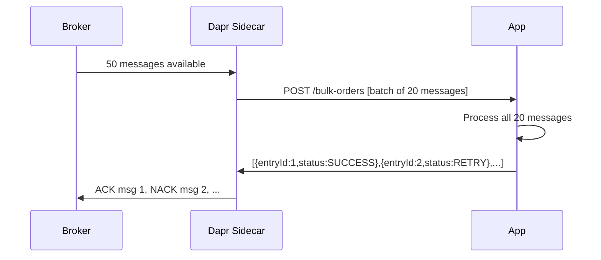

# How to Use Dapr Pub/Sub Bulk Subscribe

Author: [nawazdhandala](https://www.github.com/nawazdhandala)

Tags: Dapr, Pub/Sub, Bulk Subscribe, Performance, Throughput

Description: Configure Dapr bulk subscribe to receive and process multiple pub/sub messages in a single HTTP request, reducing overhead for high-throughput messaging workloads.

---

## What Is Dapr Bulk Subscribe?

Dapr bulk subscribe delivers multiple messages to your application in a single HTTP request, instead of one request per message. This reduces the per-message HTTP overhead and improves throughput for high-volume event processing scenarios. Your handler receives a batch and responds with per-message success or failure statuses.

## How Bulk Subscribe Works



## Prerequisites

- Dapr 1.10 or later
- A pub/sub component configured

## Enabling Bulk Subscribe

### Programmatic Subscription

```python
@app.route('/dapr/subscribe', methods=['GET'])
def subscribe():
    return jsonify([
        {
            "pubsubname": "pubsub",
            "topic": "orders",
            "route": "/bulk-orders",
            "bulkSubscribe": {
                "enabled": True,
                "maxMessagesCount": 100,
                "maxAwaitDurationMs": 40
            }
        }
    ])
```

The `maxMessagesCount` sets the maximum batch size and `maxAwaitDurationMs` is the maximum time the sidecar waits to collect messages before delivering the batch.

### Declarative Subscription

```yaml
# bulk-subscription.yaml
apiVersion: dapr.io/v1alpha1
kind: Subscription
metadata:
  name: bulk-orders-subscription
spec:
  pubsubname: pubsub
  topic: orders
  routes:
    default: /bulk-orders
  bulkSubscribe:
    enabled: true
    maxMessagesCount: 100
    maxAwaitDurationMs: 40
scopes:
- order-processor
```

## Bulk Message Handler

The handler receives a `BulkSubscribeMessage` envelope containing all messages in the batch:

### Python

```python
# bulk_subscriber.py
from flask import Flask, request, jsonify
import json

app = Flask(__name__)

@app.route('/dapr/subscribe', methods=['GET'])
def subscribe():
    return jsonify([
        {
            "pubsubname": "pubsub",
            "topic": "orders",
            "route": "/bulk-orders",
            "bulkSubscribe": {
                "enabled": True,
                "maxMessagesCount": 50,
                "maxAwaitDurationMs": 100
            }
        }
    ])

@app.route('/bulk-orders', methods=['POST'])
def handle_bulk_orders():
    body = request.get_json()

    # body["entries"] is a list of messages
    entries = body.get("entries", [])
    print(f"Received batch of {len(entries)} orders")

    responses = []
    for entry in entries:
        entry_id = entry["entryId"]
        event_data = entry.get("event", {})
        order = event_data.get("data", {})

        try:
            process_order(order)
            responses.append({"entryId": entry_id, "status": "SUCCESS"})
        except TemporaryError:
            responses.append({"entryId": entry_id, "status": "RETRY"})
        except Exception as e:
            print(f"Permanent error for order {order.get('orderId')}: {e}")
            responses.append({"entryId": entry_id, "status": "DROP"})

    return jsonify({"statuses": responses})

def process_order(order):
    order_id = order.get("orderId", "unknown")
    amount = order.get("amount", 0)
    print(f"Processing order {order_id}: ${amount}")

class TemporaryError(Exception):
    pass

if __name__ == "__main__":
    app.run(host="0.0.0.0", port=5001)
```

## Bulk Message Envelope Format

Dapr delivers bulk messages in this format:

```json
{
  "entries": [
    {
      "entryId": "1",
      "event": {
        "id": "abc123",
        "type": "com.dapr.event.sent",
        "source": "publisher",
        "data": {"orderId": "ORD-001", "amount": 99.99}
      },
      "contentType": "application/json",
      "metadata": {}
    },
    {
      "entryId": "2",
      "event": {
        "id": "def456",
        "type": "com.dapr.event.sent",
        "source": "publisher",
        "data": {"orderId": "ORD-002", "amount": 149.99}
      },
      "contentType": "application/json",
      "metadata": {}
    }
  ],
  "id": "batch-xyz",
  "pubsubname": "pubsub",
  "topic": "orders"
}
```

## Bulk Response Format

```json
{
  "statuses": [
    {"entryId": "1", "status": "SUCCESS"},
    {"entryId": "2", "status": "RETRY"},
    {"entryId": "3", "status": "DROP"}
  ]
}
```

Each entry must have a matching `entryId` in the response. Messages with `RETRY` status are redelivered; `DROP` discards them (optionally to dead letter).

## Node.js Example

```javascript
const express = require('express');
const app = express();
app.use(express.json());

app.get('/dapr/subscribe', (req, res) => {
  res.json([{
    pubsubname: 'pubsub',
    topic: 'events',
    route: '/bulk-events',
    bulkSubscribe: {
      enabled: true,
      maxMessagesCount: 100,
      maxAwaitDurationMs: 50
    }
  }]);
});

app.post('/bulk-events', async (req, res) => {
  const { entries } = req.body;
  console.log(`Processing batch of ${entries.length} events`);

  const statuses = await Promise.all(entries.map(async (entry) => {
    try {
      const event = entry.event;
      await processEvent(event.data);
      return { entryId: entry.entryId, status: 'SUCCESS' };
    } catch (err) {
      console.error(`Failed entry ${entry.entryId}:`, err.message);
      return { entryId: entry.entryId, status: 'RETRY' };
    }
  }));

  res.json({ statuses });
});

async function processEvent(data) {
  // Your processing logic
  console.log('Processing:', data);
}

app.listen(3001);
```

## Bulk Publish

Combine bulk subscribe with bulk publish for maximum throughput:

```bash
curl -X POST http://localhost:3500/v1.0-alpha1/publish/bulk/pubsub/orders \
  -H "Content-Type: application/json" \
  -d '{
    "entries": [
      {"entryId": "1", "event": {"orderId": "ORD-001"}, "contentType": "application/json"},
      {"entryId": "2", "event": {"orderId": "ORD-002"}, "contentType": "application/json"},
      {"entryId": "3", "event": {"orderId": "ORD-003"}, "contentType": "application/json"}
    ]
  }'
```

## Performance Tuning

For maximum throughput, balance these parameters:
- `maxMessagesCount`: Higher values increase throughput but latency per message
- `maxAwaitDurationMs`: Lower values reduce latency but may produce smaller batches

## Summary

Dapr bulk subscribe reduces HTTP overhead by delivering multiple messages per request. Configure it with `bulkSubscribe.enabled: true` in your subscription definition. Your handler receives a batch in the `entries` array and returns per-entry `SUCCESS`, `RETRY`, or `DROP` statuses. This pattern is ideal for high-volume event pipelines where per-message HTTP overhead is a bottleneck.
