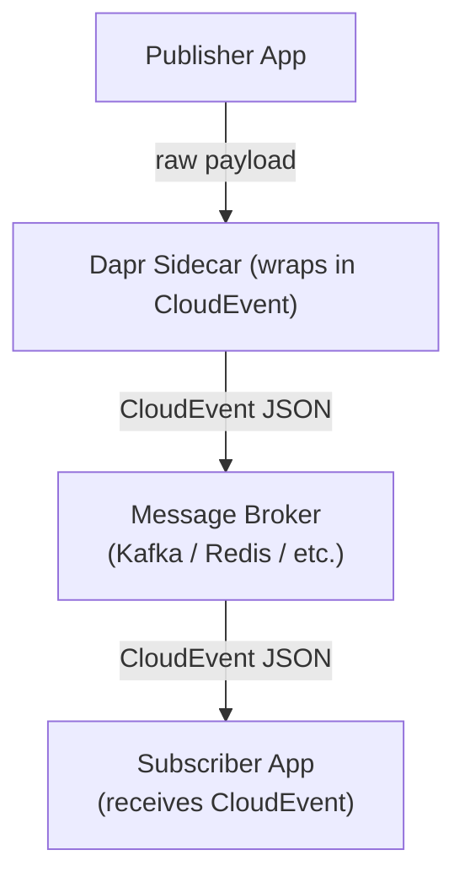

# How to Use Dapr Pub/Sub with CloudEvents Format

Author: [nawazdhandala](https://www.github.com/nawazdhandala)

Tags: Dapr, Pub/Sub, CloudEvent, Event-Driven, Microservice

Description: Understand how Dapr wraps pub/sub messages in CloudEvents 1.0 format and how to read and produce CloudEvent envelopes in your subscribers.

---

## Overview

By default, Dapr wraps every published message in a CloudEvents 1.0 envelope. CloudEvents is a CNCF specification for describing event data in a common format. The Dapr sidecar adds metadata such as `source`, `type`, `datacontenttype`, `traceid`, and `specversion` automatically.

## CloudEvent Envelope Structure



### Example CloudEvent Delivered to Your Subscriber

```json
{
  "specversion": "1.0",
  "type": "com.dapr.event.sent",
  "source": "order-service",
  "id": "a0f67dac-1e53-4d3f-91f4-b09c8ac3faba",
  "time": "2026-03-31T10:00:00Z",
  "datacontenttype": "application/json",
  "topic": "orders",
  "pubsubname": "pubsub",
  "traceid": "00-b75db8b3...",
  "traceparent": "00-b75db8b3...",
  "data": {
    "orderId": "order-1",
    "total": 99.95
  }
}
```

## Step 1: Publish with CloudEvents (Default Behaviour)

When you publish via the Dapr API, CloudEvents wrapping is automatic:

```bash
curl -X POST http://localhost:3500/v1.0/publish/pubsub/orders \
  -H "Content-Type: application/json" \
  -d '{"orderId": "order-1", "total": 99.95}'
```

You can also publish an already-formed CloudEvent:

```bash
curl -X POST http://localhost:3500/v1.0/publish/pubsub/orders \
  -H "Content-Type: application/cloudevents+json" \
  -d '{
    "specversion": "1.0",
    "type": "order.created",
    "source": "order-service",
    "id": "unique-event-id",
    "datacontenttype": "application/json",
    "data": {"orderId": "order-1", "total": 99.95}
  }'
```

## Step 2: Set a Custom CloudEvent Type and Source

Pass metadata headers to override CloudEvent attributes:

```bash
curl -X POST http://localhost:3500/v1.0/publish/pubsub/orders \
  -H "Content-Type: application/json" \
  -H "metadata.cloudevent.type: order.created" \
  -H "metadata.cloudevent.source: order-service/v2" \
  -d '{"orderId": "order-2"}'
```

Or via SDK (Go):

```go
meta := map[string]string{
    "cloudevent.type":   "order.created",
    "cloudevent.source": "order-service/v2",
}
err = client.PublishEvent(ctx, "pubsub", "orders", data,
    dapr.PublishEventWithMetadata(meta),
)
```

## Step 3: Read the CloudEvent in Your Subscriber

### Go

```go
func handleOrder(ctx context.Context, e *common.TopicEvent) (bool, error) {
    // e.ID          - CloudEvent ID
    // e.Type        - CloudEvent type
    // e.Source      - CloudEvent source
    // e.Topic       - Dapr topic name
    // e.PubsubName  - Dapr pubsub component name
    // e.DataContentType
    // e.RawData     - raw data bytes
    // e.Data        - unmarshalled data (interface{})

    fmt.Printf("CloudEvent id=%s type=%s source=%s\n", e.ID, e.Type, e.Source)

    var order map[string]interface{}
    json.Unmarshal(e.RawData, &order)
    fmt.Printf("Order: %v\n", order)
    return false, nil
}
```

### Python

```python
from dapr.ext.fastapi import DaprApp
from dapr.clients.grpc._response import TopicEventResponse
from fastapi import FastAPI

app = FastAPI()
dapr_app = DaprApp(app)

@dapr_app.subscribe(pubsub="pubsub", topic="orders")
async def handle_order(event: dict):
    # event contains the full CloudEvent envelope
    print(f"id={event['id']} type={event['type']} source={event['source']}")
    print(f"data={event['data']}")
    return TopicEventResponse("success")
```

### TypeScript

```typescript
await server.pubsub.subscribe("pubsub", "orders", async (data) => {
  // data is the CloudEvent envelope
  console.log(`id=${data.id} type=${data.type} source=${data.source}`);
  console.log("payload:", data.data);
});
```

## Step 4: Subscribe with CloudEvent Routing

Route based on CloudEvent attributes using CEL expressions:

```yaml
# components/subscription.yaml
apiVersion: dapr.io/v2alpha1
kind: Subscription
metadata:
  name: orders-subscription
spec:
  pubsubname: pubsub
  topic: orders
  routes:
    rules:
    - match: event.type == "order.created"
      path: /orders/created
    - match: event.type == "order.cancelled"
      path: /orders/cancelled
    default: /orders/default
```

## Step 5: Publish with Custom CloudEvent Headers via SDK

```python
from dapr.clients import DaprClient

async with DaprClient() as client:
    await client.publish_event(
        pubsub_name="pubsub",
        topic_name="orders",
        data=b'{"orderId":"order-3"}',
        data_content_type="application/json",
        publish_metadata={
            "cloudevent.type": "order.created",
            "cloudevent.source": "checkout-service",
            "cloudevent.subject": "order-3",
        },
    )
```

## CloudEvent Fields Reference

| Field | Description | Dapr default |
|---|---|---|
| `specversion` | CloudEvents spec version | `1.0` |
| `id` | Unique event ID | UUID generated by sidecar |
| `source` | Event source | Dapr app-id of publisher |
| `type` | Event type | `com.dapr.event.sent` |
| `datacontenttype` | Content type of `data` | From Content-Type header |
| `time` | Event timestamp | Set by sidecar |
| `traceparent` | W3C trace context | Set by sidecar |
| `topic` | Dapr topic name | Set by sidecar |
| `pubsubname` | Dapr pub/sub component | Set by sidecar |

## Summary

Dapr automatically wraps published messages in CloudEvents 1.0 envelopes. The sidecar sets standard fields (`specversion`, `id`, `source`, `type`, `time`, `traceparent`) and embeds your payload in the `data` field. Subscribers receive the full CloudEvent envelope and can access metadata alongside the payload. CloudEvent attributes can be customised via metadata headers when publishing. To disable wrapping entirely, use the `rawPayload` metadata flag or configure the component with `disableEntityManagement`.
