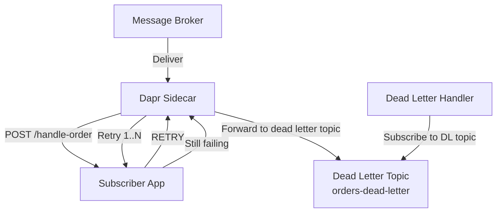

# How to Handle Dapr Pub/Sub Dead Letter Topics

Author: [nawazdhandala](https://www.github.com/nawazdhandala)

Tags: Dapr, Pub/Sub, Dead Letter, Error Handling, Messaging

Description: Configure Dapr pub/sub dead letter topics to capture and handle messages that fail processing after all retries are exhausted, preventing message loss.

---

## What Is a Dead Letter Topic?

A dead letter topic (or dead letter queue) is a destination for messages that could not be processed successfully after a configured number of retries. Instead of dropping failed messages, Dapr forwards them to a dead letter topic where they can be inspected, corrected, and reprocessed.

## How Dead Letter Topics Work in Dapr



## Prerequisites

- Dapr initialized with a pub/sub component
- Subscription configured with a dead letter topic

## Configuring Dead Letter in Declarative Subscription

```yaml
# subscription-with-deadletter.yaml
apiVersion: dapr.io/v1alpha1
kind: Subscription
metadata:
  name: orders-subscription
spec:
  pubsubname: pubsub
  topic: orders
  route: /handle-order
  deadLetterTopic: orders-dead-letter
scopes:
- order-service
```

Apply:

```bash
# Self-hosted
cp subscription-with-deadletter.yaml ~/.dapr/components/

# Kubernetes
kubectl apply -f subscription-with-deadletter.yaml
```

## Configuring Dead Letter in Programmatic Subscription

```python
@app.route('/dapr/subscribe', methods=['GET'])
def subscribe():
    return jsonify([
        {
            "pubsubname": "pubsub",
            "topic": "orders",
            "route": "/handle-order",
            "deadLetterTopic": "orders-dead-letter"
        }
    ])
```

## Main Subscriber

Return `RETRY` when processing fails temporarily, `DROP` when it fails permanently. After the configured max retries, Dapr forwards the message to the dead letter topic.

```python
# main_subscriber.py
from flask import Flask, request, jsonify
import random

app = Flask(__name__)

@app.route('/dapr/subscribe', methods=['GET'])
def subscribe():
    return jsonify([
        {
            "pubsubname": "pubsub",
            "topic": "orders",
            "route": "/handle-order",
            "deadLetterTopic": "orders-dead-letter"
        }
    ])

@app.route('/handle-order', methods=['POST'])
def handle_order():
    event = request.get_json()
    order = event.get("data", {})
    order_id = order.get("orderId", "unknown")

    try:
        result = process_order(order)
        print(f"Order {order_id} processed: {result}")
        return jsonify({"status": "SUCCESS"})
    except InventoryError as e:
        print(f"Inventory error for {order_id}: {e}. Will retry.")
        return jsonify({"status": "RETRY"}), 200
    except Exception as e:
        print(f"Permanent failure for {order_id}: {e}. Dropping to DLT.")
        return jsonify({"status": "DROP"}), 200

def process_order(order):
    # Simulate random failure
    if random.random() < 0.3:
        raise InventoryError("Out of stock")
    return "processed"

class InventoryError(Exception):
    pass

if __name__ == "__main__":
    app.run(host="0.0.0.0", port=5001)
```

## Dead Letter Topic Handler

Subscribe to the dead letter topic to inspect and handle failed messages:

```python
# dead_letter_handler.py
from flask import Flask, request, jsonify
import json
from datetime import datetime

app = Flask(__name__)

@app.route('/dapr/subscribe', methods=['GET'])
def subscribe():
    return jsonify([
        {
            "pubsubname": "pubsub",
            "topic": "orders-dead-letter",
            "route": "/handle-dead-letter"
        }
    ])

@app.route('/handle-dead-letter', methods=['POST'])
def handle_dead_letter():
    event = request.get_json()
    original_order = event.get("data", {})

    print(f"Dead letter received:")
    print(f"  CloudEvent ID: {event.get('id')}")
    print(f"  Original topic: {event.get('topic')}")
    print(f"  Order ID: {original_order.get('orderId')}")
    print(f"  Received at: {datetime.utcnow().isoformat()}")

    # Options:
    # 1. Alert an operator
    alert_operations_team(original_order)

    # 2. Store for manual review
    store_for_review(original_order)

    # 3. Attempt recovery
    if can_auto_recover(original_order):
        retry_with_correction(original_order)

    # Always acknowledge dead letter messages
    return jsonify({"status": "SUCCESS"})

def alert_operations_team(order):
    print(f"ALERT: Order {order.get('orderId')} failed processing permanently")

def store_for_review(order):
    # Save to database for operator review
    print(f"Stored order {order.get('orderId')} for review")

def can_auto_recover(order):
    return False

def retry_with_correction(order):
    pass

if __name__ == "__main__":
    app.run(host="0.0.0.0", port=5002)
```

Start the dead letter handler:

```bash
dapr run \
  --app-id dead-letter-handler \
  --app-port 5002 \
  --dapr-http-port 3502 \
  -- python dead_letter_handler.py
```

## Node.js Example

```javascript
const express = require('express');
const app = express();
app.use(express.json());

// Main subscriber
app.get('/dapr/subscribe', (req, res) => {
  res.json([{
    pubsubname: 'pubsub',
    topic: 'payments',
    route: '/process-payment',
    deadLetterTopic: 'payments-dead-letter'
  }]);
});

app.post('/process-payment', async (req, res) => {
  const { data } = req.body;
  try {
    await chargeCard(data.paymentId, data.amount);
    res.json({ status: 'SUCCESS' });
  } catch (err) {
    if (err.code === 'CARD_DECLINED') {
      // Permanent failure - forward to dead letter
      res.json({ status: 'DROP' });
    } else {
      // Transient failure - retry
      res.json({ status: 'RETRY' });
    }
  }
});
```

## Resiliency-Based Retry Before Dead Letter

Configure how many times Dapr retries before sending to the dead letter topic:

```yaml
# resiliency.yaml
apiVersion: dapr.io/v1alpha1
kind: Resiliency
metadata:
  name: pubsub-resiliency
spec:
  policies:
    retries:
      orderRetryPolicy:
        policy: constant
        duration: 5s
        maxRetries: 5
  targets:
    components:
      pubsub:
        inbound:
          retry: orderRetryPolicy
```

After 5 retries with 5-second intervals, Dapr forwards the message to the dead letter topic.

## Summary

Dapr dead letter topics prevent message loss when processing fails permanently or exhausts all retries. Configure the `deadLetterTopic` field in your subscription, implement a separate handler that subscribes to the dead letter topic for inspection and recovery, and return `RETRY` for transient errors and `DROP` for permanent failures. The Resiliency API controls retry behavior before messages reach the dead letter topic.
