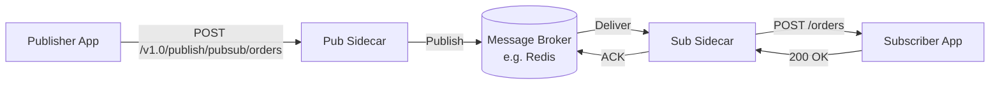

# How to Publish and Subscribe to Messages with Dapr

Author: [nawazdhandala](https://www.github.com/nawazdhandala)

Tags: Dapr, Pub/Sub, Messaging, Event-Driven, Microservice

Description: Learn how to use the Dapr pub/sub API to publish and subscribe to messages across microservices with any supported message broker backend.

---

## What Is Dapr Pub/Sub?

Dapr pub/sub provides a portable, event-driven messaging API that decouples producers and consumers. Publishers send messages to named topics, and subscribers receive them without knowing about each other. The Dapr sidecar handles broker connectivity, message delivery, retries, and dead-letter routing.

## How Pub/Sub Works in Dapr



## Prerequisites

- Dapr initialized (`dapr init` starts Redis as the default broker)
- Two services running with Dapr sidecars

## Default Pub/Sub Component

The default component created by `dapr init` uses Redis Streams:

```yaml
# ~/.dapr/components/pubsub.yaml
apiVersion: dapr.io/v1alpha1
kind: Component
metadata:
  name: pubsub
spec:
  type: pubsub.redis
  version: v1
  metadata:
  - name: redisHost
    value: localhost:6379
  - name: redisPassword
    value: ""
```

## Publishing a Message

### HTTP API

```bash
curl -X POST http://localhost:3500/v1.0/publish/pubsub/orders \
  -H "Content-Type: application/json" \
  -d '{
    "orderId": "ORD-001",
    "customerId": "CUST-42",
    "total": 99.99,
    "items": [{"sku": "WIDGET-A", "qty": 2}]
  }'
```

Success: `204 No Content`

The URL format is:

```text
POST http://localhost:{dapr-port}/v1.0/publish/{pubsub-name}/{topic}
```

### Python

```python
import requests
import os
import json

DAPR_HTTP_PORT = os.environ.get("DAPR_HTTP_PORT", "3500")

def publish(pubsub_name, topic, data):
    url = f"http://localhost:{DAPR_HTTP_PORT}/v1.0/publish/{pubsub_name}/{topic}"
    resp = requests.post(url, json=data)
    resp.raise_for_status()
    print(f"Published to {topic}: {data}")

# Publish an order event
publish("pubsub", "orders", {
    "orderId": "ORD-001",
    "customerId": "CUST-42",
    "total": 99.99
})

# Publish a user registered event
publish("pubsub", "user-events", {
    "event": "UserRegistered",
    "userId": "USR-123",
    "email": "alice@example.com"
})
```

### Node.js

```javascript
const axios = require('axios');

const DAPR_PORT = process.env.DAPR_HTTP_PORT || 3500;

async function publish(pubsubName, topic, data) {
  await axios.post(
    `http://localhost:${DAPR_PORT}/v1.0/publish/${pubsubName}/${topic}`,
    data
  );
  console.log(`Published to ${topic}`);
}

await publish('pubsub', 'orders', {
  orderId: 'ORD-002',
  total: 149.99
});
```

## Subscribing to Messages

### Option 1: Programmatic Subscription (Code)

The subscriber app exposes an HTTP endpoint that Dapr calls for each message. On startup, Dapr queries the app for its subscriptions.

**Python (Flask)**:

```python
# subscriber.py
from flask import Flask, request, jsonify

app = Flask(__name__)

@app.route('/dapr/subscribe', methods=['GET'])
def subscribe():
    return jsonify([
        {
            "pubsubname": "pubsub",
            "topic": "orders",
            "route": "/handle-order"
        },
        {
            "pubsubname": "pubsub",
            "topic": "user-events",
            "route": "/handle-user-event"
        }
    ])

@app.route('/handle-order', methods=['POST'])
def handle_order():
    event = request.get_json()
    order = event.get("data", {})
    print(f"Received order: {order['orderId']} for ${order['total']}")
    return jsonify({"status": "SUCCESS"})

@app.route('/handle-user-event', methods=['POST'])
def handle_user_event():
    event = request.get_json()
    data = event.get("data", {})
    print(f"User event: {data.get('event')} for {data.get('email')}")
    return jsonify({"status": "SUCCESS"})

if __name__ == '__main__':
    app.run(host='0.0.0.0', port=5001)
```

Start with Dapr:

```bash
dapr run \
  --app-id order-subscriber \
  --app-port 5001 \
  -- python subscriber.py
```

### Option 2: Declarative Subscription (YAML)

Create a subscription component file:

```yaml
# subscription.yaml
apiVersion: dapr.io/v1alpha1
kind: Subscription
metadata:
  name: order-subscription
spec:
  pubsubname: pubsub
  topic: orders
  route: /handle-order
scopes:
- order-subscriber
```

For self-hosted mode, place in `~/.dapr/components/`:

```bash
cp subscription.yaml ~/.dapr/components/
```

On Kubernetes:

```bash
kubectl apply -f subscription.yaml
```

## The Cloud Events Envelope

Dapr wraps published messages in a CloudEvents 1.0 envelope:

```json
{
  "specversion": "1.0",
  "type": "com.dapr.event.sent",
  "source": "publisher-app",
  "id": "a96d7b3e-4a0e-4c26-9e55-...",
  "time": "2026-03-31T10:00:00Z",
  "datacontenttype": "application/json",
  "topic": "orders",
  "pubsubname": "pubsub",
  "data": {
    "orderId": "ORD-001",
    "total": 99.99
  }
}
```

Your handler receives the full CloudEvents envelope. Access the business data via `event["data"]`.

## Handling Delivery Failures

Return specific status codes to control delivery behavior:

| Return Status | Behavior |
|--------------|---------|
| `{"status": "SUCCESS"}` | Acknowledge and remove from queue |
| `{"status": "RETRY"}` | Redeliver after backoff |
| `{"status": "DROP"}` | Discard message (no retry) |

```python
@app.route('/handle-order', methods=['POST'])
def handle_order():
    event = request.get_json()
    order = event.get("data", {})
    try:
        process_order(order)
        return jsonify({"status": "SUCCESS"})
    except TemporaryError:
        return jsonify({"status": "RETRY"}), 200
    except PermanentError:
        return jsonify({"status": "DROP"}), 200
```

## Summary

Dapr pub/sub provides a portable, cloud-agnostic messaging API that works with Redis, Kafka, Azure Service Bus, AWS SNS/SQS, and many other brokers through the same application code. Publishers send to named topics via `POST /v1.0/publish`, and subscribers register routes via `/dapr/subscribe` or declarative YAML. The sidecar handles the broker connection, CloudEvents wrapping, retries, and dead-letter routing.
