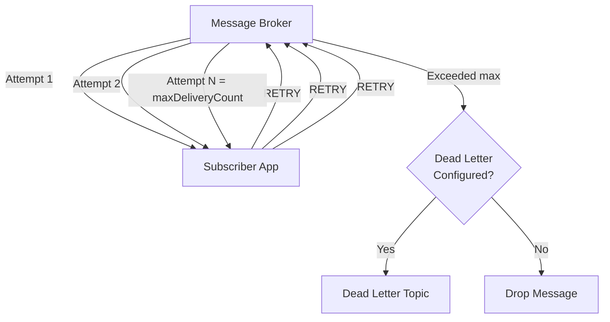

# How to Configure Max Delivery Count in Dapr Pub/Sub

Author: [nawazdhandala](https://www.github.com/nawazdhandala)

Tags: Dapr, Pub/Sub, Reliability, Resiliency, Messaging

Description: Configure max delivery count in Dapr pub/sub components and resiliency policies to control how many times a failed message is redelivered before being dropped or dead-lettered.

---

## What Is Max Delivery Count?

Max delivery count defines how many times a message broker will attempt to deliver a message to a subscriber before considering it undeliverable. After reaching this limit, the broker either drops the message or moves it to a dead letter topic, depending on the configuration.



## Prerequisites

- Dapr initialized with a pub/sub component that supports delivery count
- Azure Service Bus, AWS SQS, or Redis Streams as the broker

## Azure Service Bus: maxDeliveryCount

Azure Service Bus natively supports `maxDeliveryCount` as a component metadata property:

```yaml
# pubsub-azure-servicebus.yaml
apiVersion: dapr.io/v1alpha1
kind: Component
metadata:
  name: pubsub
  namespace: default
spec:
  type: pubsub.azure.servicebus.topics
  version: v1
  metadata:
  - name: connectionString
    secretKeyRef:
      name: azure-servicebus-secret
      key: connectionString
  - name: maxDeliveryCount
    value: "5"
  - name: lockDurationInSec
    value: "60"
  - name: defaultMessageTimeToLiveInSec
    value: "3600"
```

Apply:

```bash
kubectl apply -f pubsub-azure-servicebus.yaml
```

When a message fails 5 times, Azure Service Bus automatically moves it to its built-in dead letter sub-queue.

## AWS SQS: maxReceiveCount

For AWS SQS pub/sub, configure the redrive policy using component metadata:

```yaml
# pubsub-aws-sqs.yaml
apiVersion: dapr.io/v1alpha1
kind: Component
metadata:
  name: pubsub
  namespace: default
spec:
  type: pubsub.aws.snssqs
  version: v1
  metadata:
  - name: accessKey
    secretKeyRef:
      name: aws-secret
      key: accessKey
  - name: secretKey
    secretKeyRef:
      name: aws-secret
      key: secretKey
  - name: region
    value: "us-east-1"
  - name: sqsDeadLettersQueueName
    value: "orders-dlq"
  - name: messageReceiveLimit
    value: "5"
```

## Resiliency Policy: maxRetries

The Dapr Resiliency API controls how many times the Dapr sidecar retries delivery to your application before forwarding to a dead letter topic or dropping:

```yaml
# resiliency.yaml
apiVersion: dapr.io/v1alpha1
kind: Resiliency
metadata:
  name: pubsub-resiliency
  namespace: default
spec:
  policies:
    retries:
      pubsubRetryPolicy:
        policy: exponential
        maxInterval: 30s
        maxRetries: 5
  targets:
    components:
      pubsub:
        inbound:
          retry: pubsubRetryPolicy
```

Apply:

```bash
kubectl apply -f resiliency.yaml
```

With this policy, Dapr retries delivery to the app up to 5 times with exponential backoff capped at 30 seconds before forwarding the message to the configured `deadLetterTopic`.

## Combining Resiliency with Dead Letter Topic

```yaml
# subscription-with-dlq.yaml
apiVersion: dapr.io/v1alpha1
kind: Subscription
metadata:
  name: orders-subscription
spec:
  pubsubname: pubsub
  topic: orders
  route: /handle-order
  deadLetterTopic: orders-dead-letter
scopes:
- order-processor
```

When Dapr exhausts its retry policy, the message is published to `orders-dead-letter` for inspection.

## Subscriber: Returning Status to Control Delivery

```python
# subscriber.py
from flask import Flask, request, jsonify

app = Flask(__name__)

attempt_counts = {}

@app.route('/dapr/subscribe', methods=['GET'])
def subscribe():
    return jsonify([{
        "pubsubname": "pubsub",
        "topic": "orders",
        "route": "/handle-order",
        "deadLetterTopic": "orders-dead-letter"
    }])

@app.route('/handle-order', methods=['POST'])
def handle_order():
    event = request.get_json()
    order_id = event.get('data', {}).get('orderId', 'unknown')
    event_id = event.get('id', 'unknown')

    attempt_counts[event_id] = attempt_counts.get(event_id, 0) + 1
    attempt = attempt_counts[event_id]

    print(f"Attempt {attempt} for order {order_id}")

    if attempt < 3:
        print(f"Simulating failure, will retry")
        return jsonify({"status": "RETRY"}), 200

    print(f"Successfully processed order {order_id}")
    del attempt_counts[event_id]
    return jsonify({"status": "SUCCESS"})

if __name__ == '__main__':
    app.run(host='0.0.0.0', port=5001)
```

## Checking Delivery Count in the Event

Some brokers expose the delivery count in the CloudEvent extension attributes:

```python
@app.route('/handle-order', methods=['POST'])
def handle_order():
    event = request.get_json()

    # Check broker-specific delivery count header
    delivery_count = request.headers.get('X-Delivery-Count', '1')
    print(f"Delivery attempt: {delivery_count}")

    data = event.get('data', {})
    return jsonify({"status": "SUCCESS"})
```

## Testing Max Delivery Behavior

```bash
# Start subscriber
dapr run \
  --app-id order-processor \
  --app-port 5001 \
  --dapr-http-port 3500 \
  -- python subscriber.py

# Publish a message that will trigger retries
curl -X POST http://localhost:3500/v1.0/publish/pubsub/orders \
  -H "Content-Type: application/json" \
  -d '{"orderId": "fail-123", "item": "broken-item"}'

# Observe retries in sidecar logs
dapr logs --app-id order-processor
```

## Summary

Max delivery count in Dapr pub/sub is controlled at two levels: the broker level (via component metadata such as `maxDeliveryCount` for Azure Service Bus or `messageReceiveLimit` for AWS SQS) and the Dapr sidecar level (via Resiliency API `maxRetries`). Combine a resiliency retry policy with a `deadLetterTopic` on the subscription to ensure messages that exceed the delivery limit are captured for inspection rather than silently dropped.
