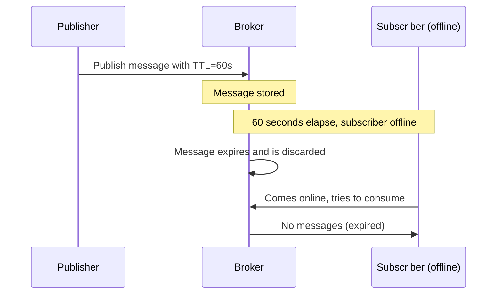

# How to Configure Dapr Pub/Sub Message TTL

Author: [nawazdhandala](https://www.github.com/nawazdhandala)

Tags: Dapr, Pub/Sub, TTL, Message Expiration, Messaging

Description: Set time-to-live (TTL) on Dapr pub/sub messages to automatically discard stale events that are not consumed within a specified time window.

---

## What Is Message TTL?

Message TTL (time-to-live) sets an expiration time on a published message. If the message is not consumed before the TTL expires, it is automatically discarded by the message broker. This prevents stale, irrelevant events from being processed out of order - for example, a price update event that is 10 minutes old should not be applied if a newer update has already been published.

## How Message TTL Works in Dapr



## Setting Message TTL via URL Metadata

The simplest way to set TTL is via the `ttlInSeconds` metadata query parameter:

```bash
# Publish with 60-second TTL
curl -X POST \
  "http://localhost:3500/v1.0/publish/pubsub/prices?metadata.ttlInSeconds=60" \
  -H "Content-Type: application/json" \
  -d '{"productId": "WIDGET-A", "price": 9.99, "timestamp": "2026-03-31T10:00:00Z"}'
```

## Setting TTL in the CloudEvent

Alternatively, set the `ttlInSeconds` in the CloudEvent extensions:

```bash
curl -X POST http://localhost:3500/v1.0/publish/pubsub/prices \
  -H "Content-Type: application/cloudevents+json" \
  -d '{
    "specversion": "1.0",
    "type": "price.updated",
    "source": "pricing-service",
    "id": "abc123",
    "datacontenttype": "application/json",
    "ttlinseconds": "120",
    "data": {
      "productId": "WIDGET-A",
      "price": 9.99
    }
  }'
```

## Python Publisher with TTL

```python
import requests
import os
import time

DAPR_HTTP_PORT = os.environ.get("DAPR_HTTP_PORT", "3500")

def publish_with_ttl(pubsub_name, topic, data, ttl_seconds):
    url = (f"http://localhost:{DAPR_HTTP_PORT}/v1.0/publish/{pubsub_name}/{topic}"
           f"?metadata.ttlInSeconds={ttl_seconds}")
    resp = requests.post(url, json=data,
                         headers={"Content-Type": "application/json"})
    resp.raise_for_status()
    print(f"Published to {topic} with TTL={ttl_seconds}s")

# Price update valid for 30 seconds
publish_with_ttl("pubsub", "prices", {
    "productId": "WIDGET-A",
    "newPrice": 8.99,
    "effectiveAt": "2026-03-31T10:00:00Z"
}, ttl_seconds=30)

# Session notification valid for 5 minutes
publish_with_ttl("pubsub", "notifications", {
    "userId": "USR-001",
    "message": "Your session expires in 5 minutes"
}, ttl_seconds=300)

# OTP code valid for 10 minutes
publish_with_ttl("pubsub", "auth-codes", {
    "userId": "USR-002",
    "code": "847291",
    "type": "2fa"
}, ttl_seconds=600)
```

## Go Publisher with TTL

```go
package main

import (
    "bytes"
    "encoding/json"
    "fmt"
    "net/http"
    "log"
)

func publishWithTTL(pubsub, topic string, data interface{}, ttlSeconds int) error {
    url := fmt.Sprintf(
        "http://localhost:3500/v1.0/publish/%s/%s?metadata.ttlInSeconds=%d",
        pubsub, topic, ttlSeconds,
    )
    body, _ := json.Marshal(data)
    resp, err := http.Post(url, "application/json", bytes.NewBuffer(body))
    if err != nil {
        return err
    }
    if resp.StatusCode != 204 {
        return fmt.Errorf("publish failed with status %d", resp.StatusCode)
    }
    fmt.Printf("Published to %s with TTL=%ds\n", topic, ttlSeconds)
    return nil
}

func main() {
    // Price update - valid for 60 seconds
    err := publishWithTTL("pubsub", "prices", map[string]interface{}{
        "productId": "WIDGET-B",
        "price":     14.99,
    }, 60)
    if err != nil {
        log.Fatal(err)
    }
}
```

## Node.js Publisher with TTL

```javascript
const axios = require('axios');

const DAPR_PORT = process.env.DAPR_HTTP_PORT || 3500;

async function publishWithTTL(pubsub, topic, data, ttlSeconds) {
  const url = `http://localhost:${DAPR_PORT}/v1.0/publish/${pubsub}/${topic}?metadata.ttlInSeconds=${ttlSeconds}`;
  await axios.post(url, data, {
    headers: { 'Content-Type': 'application/json' }
  });
  console.log(`Published to ${topic} with TTL=${ttlSeconds}s`);
}

// Publish with different TTL values
await publishWithTTL('pubsub', 'flash-sales', {
  productId: 'FLASH-001',
  discount: 50,
  code: 'FLASH50'
}, 3600); // 1 hour flash sale

await publishWithTTL('pubsub', 'alerts', {
  severity: 'warning',
  message: 'High CPU usage detected'
}, 300); // 5-minute alert window
```

## Component-Level Default TTL

Set a default TTL for all messages in a pub/sub component:

### Redis

```yaml
apiVersion: dapr.io/v1alpha1
kind: Component
metadata:
  name: pubsub
spec:
  type: pubsub.redis
  version: v1
  metadata:
  - name: redisHost
    value: localhost:6379
  - name: processingTimeout
    value: "60s"
```

### Azure Service Bus

```yaml
  - name: defaultMessageTimeToLiveInSec
    value: "3600"
```

## Per-Message TTL vs Component-Level TTL

| Scope | How to Set | Priority |
|-------|-----------|---------|
| Per message | `metadata.ttlInSeconds` query param | Higher |
| Component default | Component metadata field | Lower |

Per-message TTL overrides the component default.

## Use Cases for Message TTL

| Scenario | Recommended TTL |
|----------|----------------|
| Real-time price updates | 30-60 seconds |
| Session expiry notifications | 5-10 minutes |
| Flash sale events | Duration of the sale |
| OTP / verification codes | 10-30 minutes |
| Heartbeat / health signals | 30-60 seconds |
| Batch job completion | Until next batch window |

## Detecting Expired Messages

In some brokers like Azure Service Bus, expired messages are moved to a dead-letter queue. In Redis and Kafka, they are silently discarded. Monitor unprocessed message counts to detect TTL-related drops.

## Summary

Dapr pub/sub message TTL sets an expiration on individual messages via the `ttlInSeconds` metadata parameter. Messages not consumed before their TTL expires are automatically discarded, preventing stale data from being processed out of context. This is essential for real-time data streams, time-sensitive notifications, and any event where processing after the TTL window is meaningless or harmful.
