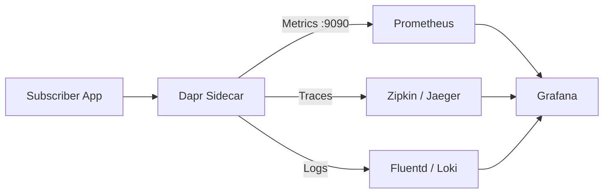

# How to Monitor Pub/Sub Message Processing in Dapr

Author: [nawazdhandala](https://www.github.com/nawazdhandala)

Tags: Dapr, Pub/Sub, Monitoring, Prometheus, Observability

Description: Monitor Dapr pub/sub message processing using Prometheus metrics, Zipkin traces, and structured logs to detect failures, latency spikes, and dropped messages.

---

## Why Monitor Pub/Sub Processing?

Message processing failures in pub/sub systems are often silent. A subscriber might time out, return RETRY indefinitely, or drop messages without your application knowing. Dapr exposes Prometheus metrics, distributed traces, and structured logs so you can build dashboards, alerts, and SLOs for your messaging pipelines.



## Prerequisites

- Dapr running with metrics enabled
- Prometheus and Grafana for visualization
- Zipkin or Jaeger for distributed tracing

## Enabling Dapr Metrics

Dapr emits metrics on port `9090` by default. Enable metrics in the Dapr configuration:

```yaml
# dapr-config.yaml
apiVersion: dapr.io/v1alpha1
kind: Configuration
metadata:
  name: daprconfig
  namespace: default
spec:
  metric:
    enabled: true
  tracing:
    samplingRate: "1"
    zipkin:
      endpointAddress: http://zipkin.default.svc.cluster.local:9411/api/v2/spans
```

Apply:

```bash
kubectl apply -f dapr-config.yaml
```

## Key Pub/Sub Metrics

Dapr exposes the following pub/sub-related Prometheus metrics:

| Metric | Description |
|--------|-------------|
| `dapr_component_pubsub_ingress_count` | Number of messages received from broker |
| `dapr_component_pubsub_egress_count` | Number of messages published to broker |
| `dapr_component_pubsub_ingress_latencies` | Latency of message processing by the app |
| `dapr_component_pubsub_egress_latencies` | Latency of publishing to the broker |

```bash
# Scrape Dapr sidecar metrics directly
curl http://localhost:9090/metrics | grep dapr_component_pubsub
```

Sample output:

```text
dapr_component_pubsub_ingress_count{app_id="order-processor",component="pubsub",namespace="default",process_status="success",topic="orders"} 1432
dapr_component_pubsub_ingress_count{app_id="order-processor",component="pubsub",namespace="default",process_status="retry",topic="orders"} 17
dapr_component_pubsub_ingress_count{app_id="order-processor",component="pubsub",namespace="default",process_status="drop",topic="orders"} 3
dapr_component_pubsub_ingress_latencies_bucket{app_id="order-processor",component="pubsub",topic="orders",le="100"} 1290
```

## Prometheus Scrape Configuration

```yaml
# prometheus-config.yaml
scrape_configs:
  - job_name: 'dapr-sidecars'
    kubernetes_sd_configs:
    - role: pod
    relabel_configs:
    - source_labels: [__meta_kubernetes_pod_annotation_dapr_io_enabled]
      action: keep
      regex: "true"
    - source_labels: [__meta_kubernetes_pod_ip]
      target_label: __address__
      replacement: "${1}:9090"
    - source_labels: [__meta_kubernetes_pod_annotation_dapr_io_app_id]
      target_label: app_id
```

## Grafana Dashboard Queries

```text
# Messages processed per second (success)
rate(dapr_component_pubsub_ingress_count{process_status="success"}[5m])

# Failed message rate (retry + drop)
rate(dapr_component_pubsub_ingress_count{process_status=~"retry|drop"}[5m])

# P99 processing latency in milliseconds
histogram_quantile(0.99,
  rate(dapr_component_pubsub_ingress_latencies_bucket[5m])
)

# Publish error rate
rate(dapr_component_pubsub_egress_count{success="false"}[5m])
```

## Distributed Tracing for Pub/Sub

Dapr automatically propagates trace context through CloudEvent `traceid` and `tracestate` fields.

Deploy Zipkin:

```bash
kubectl create deployment zipkin \
  --image=openzipkin/zipkin \
  --namespace default

kubectl expose deployment zipkin \
  --type=ClusterIP \
  --port=9411 \
  --namespace default
```

Annotate your pod to use the config:

```yaml
# deployment.yaml (excerpt)
spec:
  template:
    metadata:
      annotations:
        dapr.io/enabled: "true"
        dapr.io/app-id: "order-processor"
        dapr.io/app-port: "5001"
        dapr.io/config: "daprconfig"
```

## Structured Logging in the Subscriber

Add correlation IDs from the CloudEvent to your application logs:

```python
# subscriber.py
import logging
import json
from flask import Flask, request, jsonify

logging.basicConfig(
    level=logging.INFO,
    format='{"timestamp":"%(asctime)s","level":"%(levelname)s","message":"%(message)s"}'
)
logger = logging.getLogger(__name__)

app = Flask(__name__)

@app.route('/handle-order', methods=['POST'])
def handle_order():
    event = request.get_json()
    event_id = event.get('id')
    trace_id = event.get('traceid')
    order = event.get('data', {})

    logger.info(json.dumps({
        "event": "message_received",
        "eventId": event_id,
        "traceId": trace_id,
        "orderId": order.get('orderId'),
        "topic": event.get('topic'),
    }))

    try:
        process_order(order)
        logger.info(json.dumps({
            "event": "message_processed",
            "eventId": event_id,
            "orderId": order.get('orderId'),
        }))
        return jsonify({"status": "SUCCESS"})
    except Exception as e:
        logger.error(json.dumps({
            "event": "message_failed",
            "eventId": event_id,
            "error": str(e),
        }))
        return jsonify({"status": "RETRY"}), 200

def process_order(order):
    pass

if __name__ == '__main__':
    app.run(host='0.0.0.0', port=5001)
```

## Alerting Rules in Prometheus

```yaml
# pubsub-alerts.yaml
groups:
- name: dapr-pubsub
  rules:
  - alert: HighPubSubRetryRate
    expr: |
      rate(dapr_component_pubsub_ingress_count{process_status="retry"}[5m]) > 0.1
    for: 5m
    labels:
      severity: warning
    annotations:
      summary: "High pub/sub retry rate on {{ $labels.app_id }}"
      description: "Topic {{ $labels.topic }} retry rate is {{ $value }} msg/s"

  - alert: PubSubDropDetected
    expr: |
      increase(dapr_component_pubsub_ingress_count{process_status="drop"}[5m]) > 0
    labels:
      severity: critical
    annotations:
      summary: "Messages dropped on {{ $labels.app_id }}"
      description: "{{ $value }} messages dropped on topic {{ $labels.topic }}"
```

## Summary

Monitor Dapr pub/sub message processing with three complementary signals: Prometheus metrics expose success, retry, and drop counts along with latency histograms; distributed traces via Zipkin or Jaeger link publisher and subscriber spans using CloudEvent trace context; and structured logs with CloudEvent `id` and `traceid` fields provide per-message audit trails. Set up Prometheus alert rules for high retry rates and any drop counts to catch processing failures before they affect end users.
