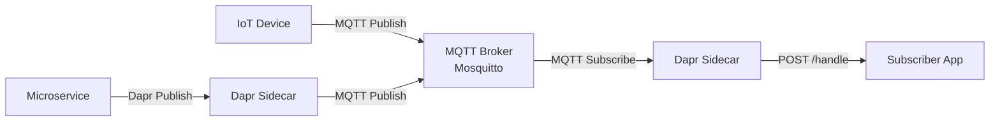

# How to Set Up Dapr Pub/Sub with MQTT

Author: [OneUptime](https://www.github.com/OneUptime)

Tags: Dapr, Pub/Sub, MQTT, IoT, Messaging

Description: Configure the Dapr MQTT3 pub/sub component to publish and subscribe to MQTT broker topics for IoT device integration and lightweight messaging use cases.

---

## Overview

MQTT is a lightweight publish-subscribe protocol commonly used in IoT and embedded systems. The Dapr `pubsub.mqtt3` component bridges your microservices to an MQTT broker such as Eclipse Mosquitto or EMQX.



## Prerequisites

- MQTT broker (Mosquitto or EMQX) running locally or on Kubernetes
- Dapr CLI installed and initialized

## Deploy Mosquitto with Docker

```bash
docker run -d \
  --name mosquitto \
  -p 1883:1883 \
  -p 9001:9001 \
  eclipse-mosquitto:2
```

For authenticated setup, create a config file:

```bash
mkdir -p mosquitto/config mosquitto/data mosquitto/log

cat > mosquitto/config/mosquitto.conf << 'EOF'
listener 1883
allow_anonymous false
password_file /mosquitto/config/passwords
EOF

# Create a password file
docker run --rm -v $(pwd)/mosquitto/config:/mosquitto/config \
  eclipse-mosquitto:2 \
  mosquitto_passwd -c /mosquitto/config/passwords dapr

docker run -d \
  --name mosquitto \
  -p 1883:1883 \
  -v $(pwd)/mosquitto/config:/mosquitto/config \
  -v $(pwd)/mosquitto/data:/mosquitto/data \
  -v $(pwd)/mosquitto/log:/mosquitto/log \
  eclipse-mosquitto:2
```

## Deploy Mosquitto on Kubernetes

```yaml
# mosquitto.yaml
apiVersion: apps/v1
kind: Deployment
metadata:
  name: mosquitto
  namespace: default
spec:
  replicas: 1
  selector:
    matchLabels:
      app: mosquitto
  template:
    metadata:
      labels:
        app: mosquitto
    spec:
      containers:
      - name: mosquitto
        image: eclipse-mosquitto:2
        ports:
        - containerPort: 1883
        - containerPort: 9001
        volumeMounts:
        - name: config
          mountPath: /mosquitto/config
      volumes:
      - name: config
        configMap:
          name: mosquitto-config
---
apiVersion: v1
kind: ConfigMap
metadata:
  name: mosquitto-config
  namespace: default
data:
  mosquitto.conf: |
    listener 1883
    allow_anonymous true
---
apiVersion: v1
kind: Service
metadata:
  name: mosquitto
  namespace: default
spec:
  selector:
    app: mosquitto
  ports:
  - name: mqtt
    port: 1883
    targetPort: 1883
```

```bash
kubectl apply -f mosquitto.yaml
```

## Dapr Component Configuration

```yaml
# pubsub-mqtt.yaml
apiVersion: dapr.io/v1alpha1
kind: Component
metadata:
  name: pubsub
  namespace: default
spec:
  type: pubsub.mqtt3
  version: v1
  metadata:
  - name: url
    value: "mqtt://mosquitto:1883"
  - name: qos
    value: "1"
  - name: retain
    value: "false"
  - name: cleanSession
    value: "true"
  - name: clientID
    value: "dapr-pubsub-client"
```

For authenticated MQTT:

```yaml
  metadata:
  - name: url
    value: "mqtt://mosquitto:1883"
  - name: username
    secretKeyRef:
      name: mqtt-secret
      key: username
  - name: password
    secretKeyRef:
      name: mqtt-secret
      key: password
  - name: qos
    value: "1"
```

```bash
kubectl create secret generic mqtt-secret \
  --from-literal=username=dapr \
  --from-literal=password=yourpassword \
  --namespace default
```

## TLS Configuration

```yaml
  metadata:
  - name: url
    value: "mqtts://mosquitto-tls:8883"
  - name: caCert
    secretKeyRef:
      name: mqtt-tls-secret
      key: ca.crt
  - name: clientCert
    secretKeyRef:
      name: mqtt-tls-secret
      key: tls.crt
  - name: clientKey
    secretKeyRef:
      name: mqtt-tls-secret
      key: tls.key
```

## Subscription Configuration

```yaml
# subscription.yaml
apiVersion: dapr.io/v1alpha1
kind: Subscription
metadata:
  name: sensor-subscription
  namespace: default
spec:
  pubsubname: pubsub
  topic: sensors/temperature
  route: /handle-temperature
scopes:
- sensor-processor
```

## Publisher: Sending Sensor Data

```python
# publisher.py
import json
import time
import random
from dapr.clients import DaprClient

def publish_sensor_reading():
    with DaprClient() as client:
        reading = {
            "sensorId": "sensor-001",
            "temperature": round(20 + random.uniform(-5, 15), 2),
            "unit": "celsius",
            "timestamp": int(time.time())
        }
        client.publish_event(
            pubsub_name="pubsub",
            topic_name="sensors/temperature",
            data=json.dumps(reading),
            data_content_type="application/json"
        )
        print(f"Published: {reading}")

if __name__ == "__main__":
    while True:
        publish_sensor_reading()
        time.sleep(5)
```

## Subscriber: Processing Sensor Data

```python
# subscriber.py
from flask import Flask, request, jsonify

app = Flask(__name__)

@app.route('/dapr/subscribe', methods=['GET'])
def subscribe():
    return jsonify([{
        "pubsubname": "pubsub",
        "topic": "sensors/temperature",
        "route": "/handle-temperature"
    }])

@app.route('/handle-temperature', methods=['POST'])
def handle_temperature():
    event = request.get_json()
    reading = event.get('data', {})
    sensor_id = reading.get('sensorId')
    temp = reading.get('temperature')

    print(f"Sensor {sensor_id}: {temp}C")

    if temp > 30:
        print(f"ALERT: High temperature on {sensor_id}: {temp}C")

    return jsonify({"status": "SUCCESS"})

if __name__ == '__main__':
    app.run(host='0.0.0.0', port=5001)
```

## Testing with mosquitto_pub

```bash
# Publish a test message directly to the broker
docker exec -it mosquitto \
  mosquitto_pub -h localhost -t "sensors/temperature" \
  -m '{"sensorId":"test-001","temperature":25.5}'

# Subscribe and observe messages
docker exec -it mosquitto \
  mosquitto_sub -h localhost -t "sensors/temperature"
```

## QoS Levels

| QoS | Meaning | Use Case |
|-----|---------|----------|
| 0 | At most once (fire and forget) | Sensor telemetry |
| 1 | At least once (ACK required) | Command messages |
| 2 | Exactly once (4-way handshake) | Financial transactions |

Set in the component metadata with `qos: "1"` for most pub/sub scenarios.

## Summary

The Dapr MQTT3 component connects microservices to MQTT brokers like Mosquitto for lightweight IoT-style messaging. Configure the broker URL, QoS level, and optional TLS certificates in the component YAML. MQTT topic hierarchies (using `/` separators) map directly to Dapr topic names, enabling you to subscribe to sensor feeds or device command channels without custom broker client code.
