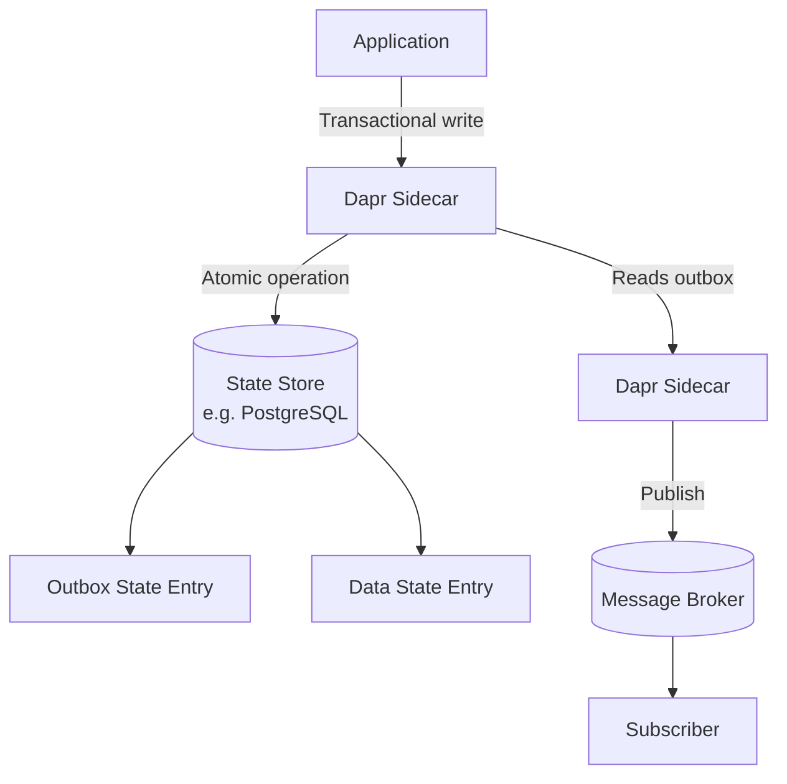
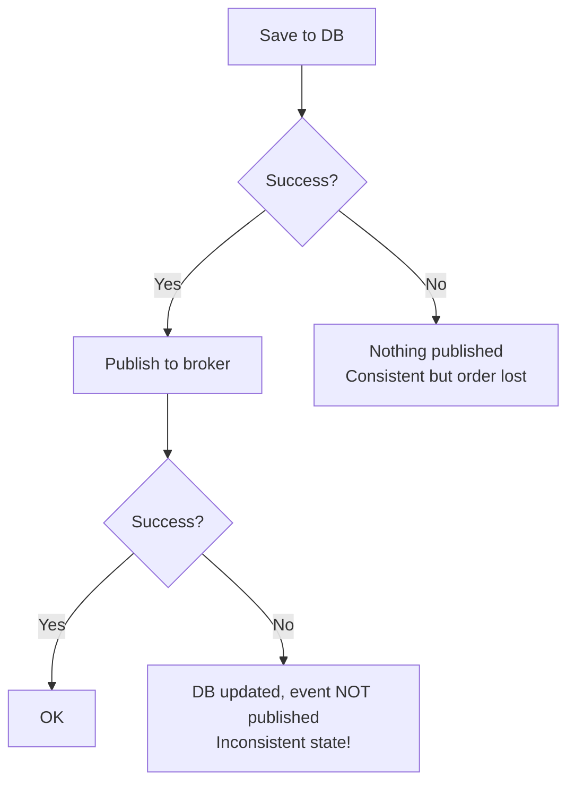

# How to Use Dapr Pub/Sub Outbox Pattern

Author: [nawazdhandala](https://www.github.com/nawazdhandala)

Tags: Dapr, Pub/Sub, Outbox Pattern, Transactional Messaging, Consistency

Description: Implement the transactional outbox pattern with Dapr to atomically save state and publish events in a single transaction, ensuring consistency between databases and message brokers.

---

## What Is the Transactional Outbox Pattern?

The transactional outbox pattern solves a common distributed systems problem: how do you guarantee that a database update and a message publication both succeed or both fail? Without it, you might save an order to the database but fail to publish the event, leaving subscribers unaware.

With the outbox pattern, the message is written to an "outbox" table in the same transaction as the data change. A separate process then reads from the outbox and publishes to the message broker.

Dapr natively supports the outbox pattern, combining state management and pub/sub into an atomic operation.

## How Dapr Implements the Outbox Pattern



## Prerequisites

- Dapr 1.12 or later
- A state store that supports transactions (PostgreSQL, MongoDB, CosmosDB)
- A pub/sub component configured
- Outbox feature enabled

## Enabling the Outbox Feature

In your Dapr configuration:

```yaml
apiVersion: dapr.io/v1alpha1
kind: Configuration
metadata:
  name: daprConfig
spec:
  features:
  - name: ActorStateTTL
    enabled: true
```

## Configuring the State Store for Outbox

The outbox state store component needs `outboxPublishPubsub` and related metadata:

```yaml
# statestore-with-outbox.yaml
apiVersion: dapr.io/v1alpha1
kind: Component
metadata:
  name: statestore
spec:
  type: state.postgresql
  version: v1
  metadata:
  - name: connectionString
    value: "host=localhost user=postgres password=secret dbname=daprstate"
  - name: outboxPublishPubsub
    value: "pubsub"
  - name: outboxPublishTopic
    value: "orders-outbox"
  - name: outboxPubsub
    value: "pubsub"
  - name: outboxDiscardWhenMissingState
    value: "false"
```

## Using the Outbox Pattern via HTTP API

With outbox enabled, use the transaction endpoint and include an `outbox` entry:

```bash
curl -X POST http://localhost:3500/v1.0/state/statestore/transaction \
  -H "Content-Type: application/json" \
  -d '{
    "operations": [
      {
        "operation": "upsert",
        "request": {
          "key": "order:ORD-001",
          "value": {
            "orderId": "ORD-001",
            "customerId": "CUST-42",
            "amount": 99.99,
            "status": "confirmed"
          }
        }
      }
    ],
    "metadata": {
      "outbox.topic": "orders",
      "outbox.pubsub": "pubsub"
    }
  }'
```

Dapr atomically saves the state AND enqueues the event in the outbox. The event is then published to the message broker.

## Python Example

```python
import requests
import os
import json

DAPR_HTTP_PORT = os.environ.get("DAPR_HTTP_PORT", "3500")

def confirm_order(order_id, customer_id, amount):
    """
    Atomically:
    1. Save order to state store
    2. Publish order-confirmed event via outbox
    """
    url = f"http://localhost:{DAPR_HTTP_PORT}/v1.0/state/statestore/transaction"

    order_data = {
        "orderId": order_id,
        "customerId": customer_id,
        "amount": amount,
        "status": "confirmed"
    }

    payload = {
        "operations": [
            {
                "operation": "upsert",
                "request": {
                    "key": f"order:{order_id}",
                    "value": order_data
                }
            }
        ],
        "metadata": {
            "outbox.topic": "orders",
            "outbox.pubsub": "pubsub",
            "outbox.cloudevent.type": "order.confirmed"
        }
    }

    resp = requests.post(url, json=payload)
    resp.raise_for_status()
    print(f"Order {order_id} confirmed and event published atomically")

# Confirm an order - atomically saves state and publishes event
confirm_order("ORD-001", "CUST-42", 99.99)
```

## Go Example

```go
package main

import (
    "bytes"
    "encoding/json"
    "fmt"
    "net/http"
    "log"
)

type TransactionRequest struct {
    Operations []Operation       `json:"operations"`
    Metadata   map[string]string `json:"metadata"`
}

type Operation struct {
    Type    string      `json:"operation"`
    Request OperationReq `json:"request"`
}

type OperationReq struct {
    Key   string      `json:"key"`
    Value interface{} `json:"value"`
}

func confirmOrderWithOutbox(orderID, customerID string, amount float64) error {
    tx := TransactionRequest{
        Operations: []Operation{
            {
                Type: "upsert",
                Request: OperationReq{
                    Key: fmt.Sprintf("order:%s", orderID),
                    Value: map[string]interface{}{
                        "orderId":    orderID,
                        "customerId": customerID,
                        "amount":     amount,
                        "status":     "confirmed",
                    },
                },
            },
        },
        Metadata: map[string]string{
            "outbox.topic":              "orders",
            "outbox.pubsub":             "pubsub",
            "outbox.cloudevent.type":    "order.confirmed",
        },
    }

    body, _ := json.Marshal(tx)
    resp, err := http.Post(
        "http://localhost:3500/v1.0/state/statestore/transaction",
        "application/json",
        bytes.NewBuffer(body),
    )
    if err != nil {
        return err
    }
    if resp.StatusCode != 204 {
        return fmt.Errorf("transaction failed with status %d", resp.StatusCode)
    }
    fmt.Printf("Order %s confirmed with outbox\n", orderID)
    return nil
}

func main() {
    if err := confirmOrderWithOutbox("ORD-002", "CUST-43", 149.99); err != nil {
        log.Fatal(err)
    }
}
```

## Subscriber for Outbox Events

The subscriber for outbox-published events is identical to any other Dapr pub/sub subscriber:

```python
from flask import Flask, request, jsonify

app = Flask(__name__)

@app.route('/dapr/subscribe', methods=['GET'])
def subscribe():
    return jsonify([{
        "pubsubname": "pubsub",
        "topic": "orders",
        "route": "/handle-confirmed-order"
    }])

@app.route('/handle-confirmed-order', methods=['POST'])
def handle_confirmed_order():
    event = request.get_json()
    order = event.get("data", {})
    print(f"Outbox event received for order: {order.get('orderId')}")
    # Send confirmation email, update warehouse, etc.
    return jsonify({"status": "SUCCESS"})
```

## Why the Outbox Pattern Matters

Without the outbox, you face the "dual write" problem:



With the outbox pattern, both writes are atomic in the database, and the broker publication is a reliable follow-up read.

## Summary

The Dapr transactional outbox pattern atomically combines a state store write with a pub/sub event publication. By including outbox metadata in a state transaction, Dapr writes the event to the state store in the same transaction as the data, then reliably publishes it to the message broker. This eliminates dual-write consistency issues between your database and message broker without complex application-level coordination.
