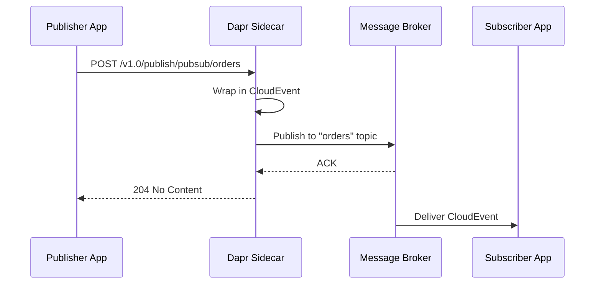

# How to Publish a Message Using the Dapr Pub/Sub API

Author: [OneUptime](https://www.github.com/OneUptime)

Tags: Dapr, Pub/Sub, Messaging, Event-driven, Microservice

Description: Publish messages to a Dapr pub/sub topic using the HTTP API, gRPC, and language SDKs with real CloudEvent payloads and component configuration examples.

---

## How Dapr Pub/Sub Publishing Works

When your application calls the Dapr publish endpoint, the Dapr sidecar wraps the payload in a CloudEvent envelope and forwards it to the configured message broker. The broker stores the message until one or more subscribers consume it.



## Prerequisites

- Dapr CLI installed and initialized
- A pub/sub component configured (Redis, Kafka, Azure Service Bus, etc.)

## Pub/Sub Component Configuration

```yaml
# pubsub.yaml
apiVersion: dapr.io/v1alpha1
kind: Component
metadata:
  name: pubsub
  namespace: default
spec:
  type: pubsub.redis
  version: v1
  metadata:
  - name: redisHost
    value: "localhost:6379"
  - name: redisPassword
    value: ""
```

Copy to the Dapr components folder:

```bash
cp pubsub.yaml ~/.dapr/components/
```

## Publishing with the HTTP API

```bash
# Publish a JSON message to the "orders" topic
curl -X POST http://localhost:3500/v1.0/publish/pubsub/orders \
  -H "Content-Type: application/json" \
  -d '{"orderId": "abc-123", "item": "laptop", "qty": 1, "total": 999.99}'
```

A successful publish returns `204 No Content`.

## Publishing a Raw CloudEvent

You can supply a pre-formed CloudEvent by setting the content type to `application/cloudevents+json`:

```bash
curl -X POST http://localhost:3500/v1.0/publish/pubsub/orders \
  -H "Content-Type: application/cloudevents+json" \
  -d '{
    "specversion": "1.0",
    "type": "com.example.order.created",
    "source": "order-service",
    "id": "abc-123",
    "datacontenttype": "application/json",
    "data": {
      "orderId": "abc-123",
      "item": "laptop",
      "qty": 1,
      "total": 999.99
    }
  }'
```

## Publishing with Metadata

Pass broker-specific metadata as query parameters:

```bash
# Set a TTL of 60 seconds on the message
curl -X POST \
  "http://localhost:3500/v1.0/publish/pubsub/orders?metadata.ttlInSeconds=60" \
  -H "Content-Type: application/json" \
  -d '{"orderId": "xyz-456"}'
```

## Publishing with the Go SDK

```go
package main

import (
    "context"
    "fmt"
    "log"

    dapr "github.com/dapr/go-sdk/client"
)

type Order struct {
    OrderID string  `json:"orderId"`
    Item    string  `json:"item"`
    Total   float64 `json:"total"`
}

func main() {
    client, err := dapr.NewClient()
    if err != nil {
        log.Fatalf("failed to create dapr client: %v", err)
    }
    defer client.Close()

    order := Order{
        OrderID: "abc-123",
        Item:    "laptop",
        Total:   999.99,
    }

    if err := client.PublishEvent(
        context.Background(),
        "pubsub",   // component name
        "orders",   // topic name
        order,
    ); err != nil {
        log.Fatalf("failed to publish: %v", err)
    }

    fmt.Println("Order published successfully")
}
```

Run it:

```bash
dapr run \
  --app-id publisher \
  --dapr-http-port 3500 \
  -- go run main.go
```

## Publishing with the Python SDK

```python
# publisher.py
import json
from dapr.clients import DaprClient

def publish_order(order_id: str, item: str, total: float):
    with DaprClient() as client:
        event_data = {
            "orderId": order_id,
            "item": item,
            "total": total
        }
        client.publish_event(
            pubsub_name="pubsub",
            topic_name="orders",
            data=json.dumps(event_data),
            data_content_type="application/json",
        )
        print(f"Published order {order_id}")

if __name__ == "__main__":
    publish_order("abc-123", "laptop", 999.99)
```

```bash
dapr run \
  --app-id publisher \
  --dapr-http-port 3500 \
  -- python publisher.py
```

## Publishing with Node.js SDK

```javascript
// publisher.js
const { DaprClient } = require('@dapr/dapr');

async function publishOrder(orderId, item, total) {
  const client = new DaprClient();

  await client.pubsub.publish('pubsub', 'orders', {
    orderId,
    item,
    total,
  });

  console.log(`Published order ${orderId}`);
  await client.stop();
}

publishOrder('abc-123', 'laptop', 999.99).catch(console.error);
```

## Bulk Publishing

Dapr supports publishing multiple messages in a single API call:

```bash
curl -X POST http://localhost:3500/v1.0-alpha1/publish/bulk/pubsub/orders \
  -H "Content-Type: application/json" \
  -d '[
    {
      "entryId": "entry1",
      "event": {"orderId": "o1", "item": "mouse"},
      "contentType": "application/json"
    },
    {
      "entryId": "entry2",
      "event": {"orderId": "o2", "item": "keyboard"},
      "contentType": "application/json"
    }
  ]'
```

Response:

```json
{
  "failedEntries": [],
  "invalidEntries": []
}
```

## Verifying Publish in Logs

```bash
# Run with verbose logging
dapr run \
  --app-id publisher \
  --log-level debug \
  --dapr-http-port 3500 \
  -- python publisher.py
```

Look for lines containing `"Published message"` and the topic name in the sidecar logs.

## Summary

Publishing a message in Dapr requires a `POST` to `/v1.0/publish/{pubsubName}/{topic}` with a JSON payload. The Dapr sidecar automatically wraps the payload in a CloudEvent envelope before forwarding it to the broker. Use query parameters such as `metadata.ttlInSeconds` for broker-specific options, or pass a fully formed CloudEvent with `application/cloudevents+json`. All major Dapr SDKs expose a `publish_event` / `PublishEvent` method that simplifies this further.
