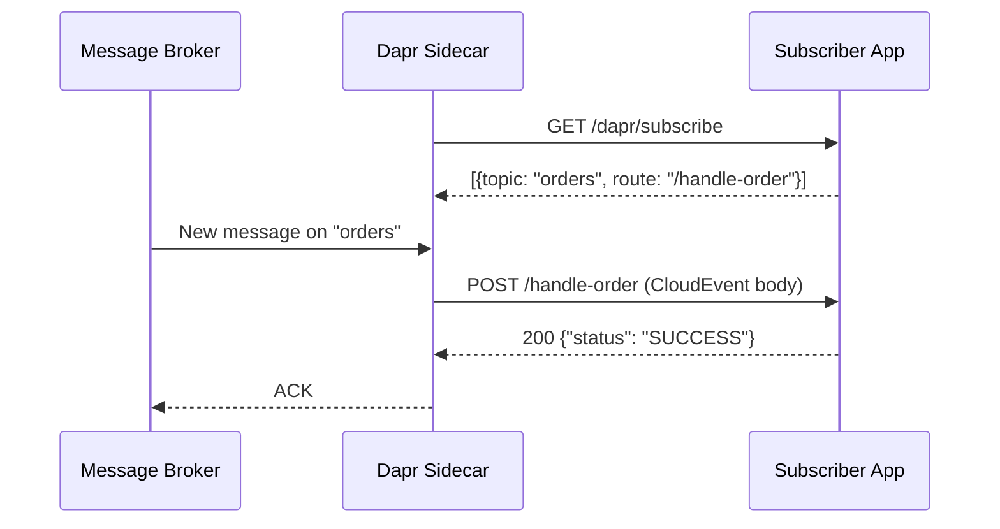

# How to Subscribe to Topics Using Dapr Pub/Sub

Author: [OneUptime](https://www.github.com/OneUptime)

Tags: Dapr, Pub/Sub, Subscription, Event-driven, Microservice

Description: Subscribe to Dapr pub/sub topics using declarative YAML subscriptions and programmatic endpoints, process CloudEvents, and return the correct status codes.

---

## How Dapr Subscriptions Work

Dapr supports two subscription models: declarative (YAML files loaded at startup) and programmatic (an endpoint your app exposes). In both cases, the Dapr sidecar polls the broker for new messages and delivers them to your application over HTTP or gRPC.



## Prerequisites

- Dapr CLI installed and initialized
- A pub/sub component configured

## Pub/Sub Component

```yaml
# pubsub.yaml
apiVersion: dapr.io/v1alpha1
kind: Component
metadata:
  name: pubsub
  namespace: default
spec:
  type: pubsub.redis
  version: v1
  metadata:
  - name: redisHost
    value: "localhost:6379"
  - name: redisPassword
    value: ""
```

## Declarative Subscription (YAML)

```yaml
# subscription.yaml
apiVersion: dapr.io/v1alpha1
kind: Subscription
metadata:
  name: orders-subscription
  namespace: default
spec:
  pubsubname: pubsub
  topic: orders
  route: /handle-order
scopes:
- order-processor
```

Apply:

```bash
# Self-hosted: place in components folder
cp subscription.yaml ~/.dapr/components/

# Kubernetes
kubectl apply -f subscription.yaml
```

## Programmatic Subscription (Python)

```python
# subscriber.py
from flask import Flask, request, jsonify
import json

app = Flask(__name__)

# Dapr calls this on startup to discover subscriptions
@app.route('/dapr/subscribe', methods=['GET'])
def subscribe():
    return jsonify([
        {
            "pubsubname": "pubsub",
            "topic": "orders",
            "route": "/handle-order"
        },
        {
            "pubsubname": "pubsub",
            "topic": "payments",
            "route": "/handle-payment"
        }
    ])

@app.route('/handle-order', methods=['POST'])
def handle_order():
    event = request.get_json()
    order = event.get('data', {})
    order_id = order.get('orderId', 'unknown')

    print(f"Received order: {order_id}")

    try:
        process_order(order)
        return jsonify({"status": "SUCCESS"})
    except Exception as e:
        print(f"Error processing order {order_id}: {e}")
        return jsonify({"status": "RETRY"}), 200

@app.route('/handle-payment', methods=['POST'])
def handle_payment():
    event = request.get_json()
    payment = event.get('data', {})
    print(f"Received payment: {payment.get('paymentId')}")
    return jsonify({"status": "SUCCESS"})

def process_order(order):
    # Business logic here
    print(f"Processing order: {order}")

if __name__ == '__main__':
    app.run(host='0.0.0.0', port=5001)
```

Start the subscriber:

```bash
dapr run \
  --app-id order-processor \
  --app-port 5001 \
  --dapr-http-port 3500 \
  -- python subscriber.py
```

## Subscription Status Codes

Your handler must return one of these statuses:

| Status | Meaning |
|--------|---------|
| `SUCCESS` | Message processed, ACK to broker |
| `RETRY` | Transient failure, redeliver later |
| `DROP` | Permanent failure, discard message |

```python
@app.route('/handle-order', methods=['POST'])
def handle_order():
    event = request.get_json()
    order = event.get('data', {})

    try:
        process_order(order)
        return jsonify({"status": "SUCCESS"})
    except TemporaryError:
        return jsonify({"status": "RETRY"}), 200
    except PermanentError:
        return jsonify({"status": "DROP"}), 200
```

## Subscribing with the Go SDK

```go
package main

import (
    "context"
    "fmt"
    "log"

    "github.com/dapr/go-sdk/service/common"
    daprd "github.com/dapr/go-sdk/service/http"
)

type Order struct {
    OrderID string  `json:"orderId"`
    Item    string  `json:"item"`
    Total   float64 `json:"total"`
}

func main() {
    s := daprd.NewService(":5001")

    sub := &common.Subscription{
        PubsubName: "pubsub",
        Topic:      "orders",
        Route:      "/handle-order",
    }

    if err := s.AddTopicEventHandler(sub, handleOrder); err != nil {
        log.Fatalf("error adding handler: %v", err)
    }

    if err := s.Start(); err != nil {
        log.Fatalf("error starting service: %v", err)
    }
}

func handleOrder(ctx context.Context, e *common.TopicEvent) (retry bool, err error) {
    var order Order
    if err := e.DataAs(&order); err != nil {
        return false, fmt.Errorf("failed to parse order: %w", err)
    }

    fmt.Printf("Received order: %s, item: %s\n", order.OrderID, order.Item)

    // Return true to retry, false to acknowledge
    return false, nil
}
```

## Accessing CloudEvent Metadata

```python
@app.route('/handle-order', methods=['POST'])
def handle_order():
    event = request.get_json()

    # CloudEvent metadata
    event_id = event.get('id')
    event_type = event.get('type')
    source = event.get('source')
    topic = event.get('topic')
    pubsub_name = event.get('pubsubname')
    trace_id = event.get('traceid')

    # Your application data
    data = event.get('data', {})

    print(f"Event ID: {event_id}, Type: {event_type}, Topic: {topic}")
    print(f"Order data: {data}")

    return jsonify({"status": "SUCCESS"})
```

## Multiple Routes with Route Rules

```yaml
# subscription-with-routes.yaml
apiVersion: dapr.io/v1alpha1
kind: Subscription
metadata:
  name: orders-advanced
spec:
  pubsubname: pubsub
  topic: orders
  routes:
    rules:
    - match: event.type == "com.example.order.express"
      path: /handle-express-order
    - match: event.type == "com.example.order.standard"
      path: /handle-standard-order
    default: /handle-order
scopes:
- order-processor
```

## Summary

Dapr subscriptions deliver messages from a broker to your application through either declarative YAML subscription files or a programmatic `/dapr/subscribe` endpoint. Your handler receives a CloudEvent-wrapped payload and must return `SUCCESS`, `RETRY`, or `DROP`. The Go and Python SDKs abstract away the endpoint registration. Use route rules in declarative subscriptions to dispatch different event types to different handlers in the same application.
