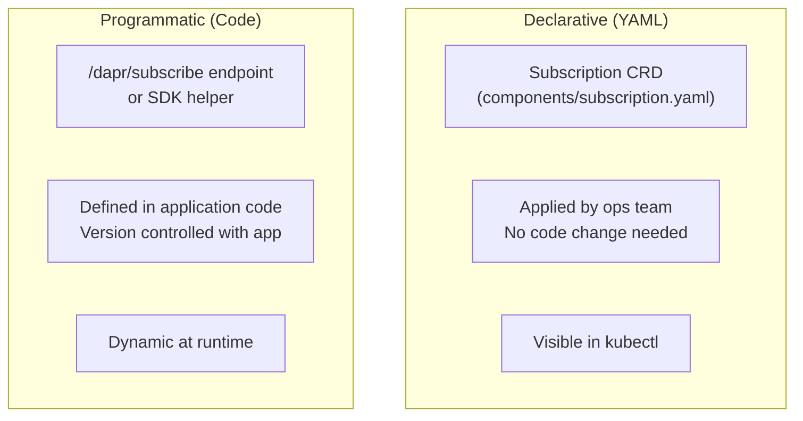

# How to Configure Dapr Pub/Sub Subscriptions in Code vs YAML

Author: [nawazdhandala](https://www.github.com/nawazdhandala)

Tags: Dapr, Pub/Sub, Subscription, Configuration, Microservice

Description: Compare declarative YAML subscriptions and programmatic code-based subscriptions in Dapr pub/sub, with examples in Go, Python, and TypeScript.

---

## Overview

Dapr pub/sub subscriptions can be defined in two ways: declarative YAML files (applied at the cluster or component directory level) or programmatically in code via the `/dapr/subscribe` endpoint. Both approaches are equivalent in capability and can be mixed. Understanding the trade-offs helps you choose the right approach for each use case.

## Comparison



| Feature | YAML / CRD | Code / Programmatic |
|---|---|---|
| Change without redeploy | Yes | No |
| Version controlled with app | No | Yes |
| Dynamic topic names | No | Yes |
| Multiple routes per topic | Yes | Yes |
| Dead letter support | Yes | Yes |
| Scoping per app | Yes | Yes |

## Declarative YAML Subscriptions

### v1 Subscription (Single Route)

```yaml
# components/subscription.yaml
apiVersion: dapr.io/v1alpha1
kind: Subscription
metadata:
  name: orders-subscription
  namespace: default
spec:
  topic: orders
  route: /orders
  pubsubname: pubsub
scopes:
- order-processor
```

### v2 Subscription (Multiple Routes with Rules)

```yaml
# components/subscription-v2.yaml
apiVersion: dapr.io/v2alpha1
kind: Subscription
metadata:
  name: orders-routing-subscription
  namespace: default
spec:
  pubsubname: pubsub
  topic: orders
  routes:
    rules:
    - match: event.type == "order.created"
      path: /orders/created
    - match: event.type == "order.cancelled"
      path: /orders/cancelled
    - match: event.data.priority == "high"
      path: /orders/priority
    default: /orders/default
scopes:
- order-processor
```

Apply the subscription:

```bash
kubectl apply -f components/subscription.yaml
```

### Subscription with Dead Letter Topic

```yaml
apiVersion: dapr.io/v2alpha1
kind: Subscription
metadata:
  name: orders-with-dlq
  namespace: default
spec:
  pubsubname: pubsub
  topic: orders
  routes:
    default: /orders
  deadLetterTopic: orders-deadletter
scopes:
- order-processor
```

## Programmatic Subscriptions

Your app exposes a `GET /dapr/subscribe` endpoint that returns the subscription configuration. The Dapr sidecar calls this at startup to discover subscriptions.

### Go (HTTP)

```go
package main

import (
    "encoding/json"
    "net/http"
)

type Subscription struct {
    PubsubName  string            `json:"pubsubname"`
    Topic       string            `json:"topic"`
    Route       string            `json:"route,omitempty"`
    Routes      *Routes           `json:"routes,omitempty"`
    Metadata    map[string]string `json:"metadata,omitempty"`
    DeadLetter  string            `json:"deadLetterTopic,omitempty"`
}

type Routes struct {
    Rules   []Rule `json:"rules"`
    Default string `json:"default"`
}

type Rule struct {
    Match string `json:"match"`
    Path  string `json:"path"`
}

func main() {
    http.HandleFunc("/dapr/subscribe", func(w http.ResponseWriter, r *http.Request) {
        subs := []Subscription{
            {
                PubsubName: "pubsub",
                Topic:      "orders",
                Routes: &Routes{
                    Rules: []Rule{
                        {Match: `event.type == "order.created"`, Path: "/orders/created"},
                        {Match: `event.type == "order.cancelled"`, Path: "/orders/cancelled"},
                    },
                    Default: "/orders/default",
                },
            },
            {
                PubsubName: "pubsub",
                Topic:      "payments",
                Route:      "/payments",
            },
        }
        w.Header().Set("Content-Type", "application/json")
        json.NewEncoder(w).Encode(subs)
    })

    http.HandleFunc("/orders/created", func(w http.ResponseWriter, r *http.Request) {
        // handle created orders
        w.WriteHeader(http.StatusOK)
    })

    http.HandleFunc("/orders/cancelled", func(w http.ResponseWriter, r *http.Request) {
        // handle cancelled orders
        w.WriteHeader(http.StatusOK)
    })

    http.HandleFunc("/orders/default", func(w http.ResponseWriter, r *http.Request) {
        // handle all other orders
        w.WriteHeader(http.StatusOK)
    })

    http.ListenAndServe(":8080", nil)
}
```

### Go SDK (Programmatic via daprd.NewService)

```go
package main

import (
    "context"
    "fmt"

    "github.com/dapr/go-sdk/service/common"
    daprd "github.com/dapr/go-sdk/service/grpc"
)

func main() {
    s, _ := daprd.NewService(":6000")

    // Register subscription programmatically
    s.AddTopicEventHandler(&common.Subscription{
        PubsubName: "pubsub",
        Topic:      "orders",
        Route:      "/orders",
        Match:      `event.type == "order.created"`,
    }, func(ctx context.Context, e *common.TopicEvent) (bool, error) {
        fmt.Printf("Order created: %s\n", e.RawData)
        return false, nil
    })

    s.AddTopicEventHandler(&common.Subscription{
        PubsubName: "pubsub",
        Topic:      "payments",
        Route:      "/payments",
    }, func(ctx context.Context, e *common.TopicEvent) (bool, error) {
        fmt.Printf("Payment received: %s\n", e.RawData)
        return false, nil
    })

    s.Start()
}
```

### Python (FastAPI)

```python
from fastapi import FastAPI
from dapr.ext.fastapi import DaprApp
from dapr.clients.grpc._response import TopicEventResponse

app = FastAPI()
dapr_app = DaprApp(app)

# Programmatic subscriptions via decorator
@dapr_app.subscribe(pubsub="pubsub", topic="orders")
async def handle_order(event: dict):
    print(f"Order: {event['data']}")
    return TopicEventResponse("success")

@dapr_app.subscribe(pubsub="pubsub", topic="payments")
async def handle_payment(event: dict):
    print(f"Payment: {event['data']}")
    return TopicEventResponse("success")

# FastAPI generates /dapr/subscribe automatically
```

### TypeScript

```typescript
import { DaprServer } from "@dapr/dapr";

const server = new DaprServer({
  serverHost: "localhost",
  serverPort: "6000",
  clientOptions: { daprHost: "http://localhost", daprPort: "3500" },
});

// SDK registers /dapr/subscribe automatically
await server.pubsub.subscribe("pubsub", "orders", async (data) => {
  console.log("Order:", data);
});

await server.pubsub.subscribe("pubsub", "payments", async (data) => {
  console.log("Payment:", data);
});

await server.start();
```

## Mixed Approach

You can use both YAML subscriptions and programmatic subscriptions in the same app. YAML subscriptions are merged with programmatic ones at startup:

```yaml
# components/audit-subscription.yaml (ops-managed)
apiVersion: dapr.io/v1alpha1
kind: Subscription
metadata:
  name: audit-subscription
spec:
  topic: orders
  route: /audit
  pubsubname: pubsub
scopes:
- audit-service
```

```go
// code-based subscription (dev-managed)
s.AddTopicEventHandler(&common.Subscription{
    PubsubName: "pubsub",
    Topic:      "orders",
    Route:      "/orders/process",
}, processHandler)
```

## Summary

Dapr pub/sub subscriptions can be declared in YAML CRD files (ops-friendly, no redeploy needed) or programmatically through the `/dapr/subscribe` endpoint or SDK helpers (dev-friendly, version-controlled with app code). YAML subscriptions are best for infrastructure-level routing and cross-team management. Programmatic subscriptions are best when subscription logic evolves with the application. Both approaches support multi-route rules, dead-letter topics, scoping, and metadata.
