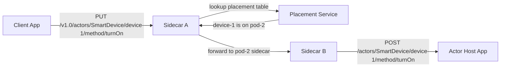
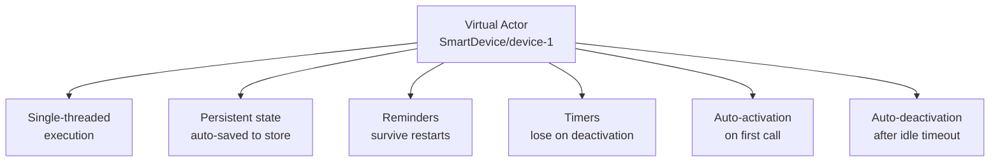

# How to Run Dapr Quickstart for Actors

Author: [nawazdhandala](https://www.github.com/nawazdhandala)

Tags: Dapr, Actor, Quickstart, Virtual Actor, Stateful

Description: Run the Dapr actors quickstart to create a virtual actor with state and timers, invoke actor methods, and understand single-threaded actor execution guarantees.

---

## What You Will Build

A `SmartDevice` actor that tracks a device's on/off state and data. Each device ID gets its own isolated actor instance. Multiple replicas of the service can run concurrently, but only one instance of `SmartDevice/device-1` is active at a time.



## Prerequisites

```bash
dapr init
```

The default state store must have `actorStateStore: "true"`:

```yaml
# ~/.dapr/components/statestore.yaml
spec:
  type: state.redis
  version: v1
  metadata:
  - name: redisHost
    value: localhost:6379
  - name: actorStateStore
    value: "true"
```

## Actor Host Application

```python
# actor-host/app.py
from dapr.actor import Actor, ActorInterface, actormethod
from dapr.actor.runtime.runtime import ActorRuntime
from dapr.actor.runtime.config import ActorRuntimeConfig, ActorTypeConfig
from flask import Flask, request, jsonify
import json

flask_app = Flask(__name__)

class SmartDeviceInterface(ActorInterface):
    @actormethod(name="TurnOn")
    async def turn_on(self) -> None: ...

    @actormethod(name="TurnOff")
    async def turn_off(self) -> None: ...

    @actormethod(name="GetStatus")
    async def get_status(self) -> dict: ...

class SmartDeviceActor(Actor, SmartDeviceInterface):
    def __init__(self, ctx, actor_id):
        super().__init__(ctx, actor_id)

    async def turn_on(self):
        await self._state_manager.set_state("status", "on")
        await self._state_manager.save_state()
        print(f"Device {self.id.id} turned ON")

    async def turn_off(self):
        await self._state_manager.set_state("status", "off")
        await self._state_manager.save_state()
        print(f"Device {self.id.id} turned OFF")

    async def get_status(self) -> dict:
        status = await self._state_manager.try_get_state("status")
        return {"deviceId": self.id.id, "status": status.value or "unknown"}

# Register the actor type
ActorRuntime.set_actor_config(
    ActorRuntimeConfig(actor_idle_timeout="1h", actor_scan_interval="30s")
)

@flask_app.route('/dapr/config', methods=['GET'])
def get_dapr_config():
    return jsonify({
        "entities": ["SmartDevice"],
        "actorIdleTimeout": "1h",
        "actorScanInterval": "30s",
        "drainOngoingCallTimeout": "60s",
        "drainRebalancedActors": True
    })

@flask_app.route('/healthz', methods=['GET'])
def healthz():
    return '', 200

@flask_app.route('/actors/<actor_type>/<actor_id>/method/<method_name>', methods=['PUT'])
def invoke_actor(actor_type, actor_id, method_name):
    import asyncio
    actor = SmartDeviceActor(None, type('id', (), {'id': actor_id})())
    data = request.get_json() or {}
    loop = asyncio.new_event_loop()
    if method_name == 'TurnOn':
        loop.run_until_complete(actor.turn_on())
        return '', 200
    elif method_name == 'TurnOff':
        loop.run_until_complete(actor.turn_off())
        return '', 200
    elif method_name == 'GetStatus':
        result = loop.run_until_complete(actor.get_status())
        return jsonify(result)
    return jsonify({"error": "unknown method"}), 404

if __name__ == '__main__':
    flask_app.run(port=5001)
```

## Run the Actor Host

```bash
pip3 install dapr flask
dapr run \
  --app-id smart-device-host \
  --app-port 5001 \
  --dapr-http-port 3500 \
  -- python3 app.py
```

## Invoke Actor Methods from a Client

```bash
# Turn on device-1
curl -X PUT http://localhost:3500/v1.0/actors/SmartDevice/device-1/method/TurnOn \
  -H "Content-Type: application/json" \
  -d '{}'

# Get device-1 status
curl -X PUT http://localhost:3500/v1.0/actors/SmartDevice/device-1/method/GetStatus \
  -H "Content-Type: application/json" \
  -d '{}'
```

Response:

```json
{"deviceId": "device-1", "status": "on"}
```

## Actor Reminders (Persistent)

```bash
# Set a reminder to check device status every hour
curl -X POST \
  "http://localhost:3500/v1.0/actors/SmartDevice/device-1/reminders/hourly-check" \
  -H "Content-Type: application/json" \
  -d '{
    "dueTime": "0h0m30s0ms",
    "period": "1h"
  }'
```

Your actor must implement a `receiveReminder` method (or handler endpoint) to process reminders.

## Actor Timers (Non-Persistent)

```bash
# Set a 5-second timer
curl -X POST \
  "http://localhost:3500/v1.0/actors/SmartDevice/device-1/timers/ping" \
  -H "Content-Type: application/json" \
  -d '{
    "dueTime": "5s",
    "period": "10s",
    "callback": "ping"
  }'
```

## Actor State

Actor state is automatically associated with the actor instance ID:

```bash
# Read actor state directly (useful for debugging)
curl http://localhost:3500/v1.0/actors/SmartDevice/device-1/state/status
```

## Key Actor Concepts



## Dapr Config Endpoint

Your actor host app must expose `/dapr/config` to declare actor types:

```python
@app.route('/dapr/config', methods=['GET'])
def get_dapr_config():
    return jsonify({
        "entities": ["SmartDevice", "UserActor"],
        "actorIdleTimeout": "1h",
        "actorScanInterval": "30s"
    })
```

## Summary

The Dapr actors quickstart demonstrates creating a virtual actor with persistent state and single-threaded execution guarantees. Each device ID maps to exactly one active `SmartDevice` actor instance across all replicas. The Placement service routes method calls to the correct host. Reminders persist actor callbacks across restarts while timers are non-persistent. State is automatically saved to the configured actor state store.
