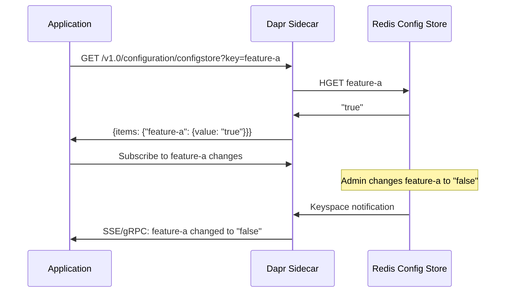

# How to Run Dapr Quickstart for Configuration

Author: [nawazdhandala](https://www.github.com/nawazdhandala)

Tags: Dapr, Configuration API, Quickstart, Dynamic Configuration, Feature Flag

Description: Run the Dapr configuration quickstart to read dynamic configuration values and subscribe to changes at runtime without redeploying your application.

---

## What You Will Build

An application that reads feature flags and tuning parameters from a Redis-backed configuration store and subscribes to live changes. When a value changes in Redis, the app receives a notification and updates its behavior immediately.



## Prerequisites

```bash
dapr init   # starts Redis on port 6379
```

Enable Redis keyspace notifications (required for subscriptions):

```bash
docker exec dapr_redis redis-cli CONFIG SET notify-keyspace-events KEA
```

## Configuration Store Component

```yaml
# components/configstore.yaml
apiVersion: dapr.io/v1alpha1
kind: Component
metadata:
  name: configstore
spec:
  type: configuration.redis
  version: v1
  metadata:
  - name: redisHost
    value: localhost:6379
  - name: redisPassword
    value: ""
```

## Seed Configuration Values in Redis

```bash
docker exec dapr_redis redis-cli HSET feature-flags \
  feature-new-ui "true" \
  feature-checkout-v2 "false" \
  max-retries "3" \
  timeout-seconds "30"
```

## The Application

```python
# app.py
import requests
import os
import json
import threading
import time

DAPR_HTTP_PORT = os.getenv('DAPR_HTTP_PORT', '3500')
CONFIG_STORE = 'configstore'

def get_config(keys: list) -> dict:
    key_params = "&".join(f"key={k}" for k in keys)
    url = f"http://localhost:{DAPR_HTTP_PORT}/v1.0/configuration/{CONFIG_STORE}?{key_params}"
    response = requests.get(url)
    items = response.json().get('items', {})
    return {k: v['value'] for k, v in items.items()}

def subscribe_config(keys: list):
    """Subscribe to configuration changes (polling approach via alpha API)."""
    key_params = "&".join(f"key={k}" for k in keys)
    url = f"http://localhost:{DAPR_HTTP_PORT}/v1.0-alpha1/configuration/{CONFIG_STORE}/subscribe?{key_params}"
    response = requests.get(url, stream=True)
    for line in response.iter_lines():
        if line:
            update = json.loads(line.decode())
            items = update.get('items', {})
            for key, meta in items.items():
                print(f"Config changed: {key} = {meta['value']}")

# Read initial configuration
config = get_config(['feature-new-ui', 'feature-checkout-v2', 'max-retries', 'timeout-seconds'])
print("Initial configuration:")
for key, value in config.items():
    print(f"  {key}: {value}")

# Subscribe to changes in background thread
sub_thread = threading.Thread(
    target=subscribe_config,
    args=[['feature-new-ui', 'feature-checkout-v2']],
    daemon=True
)
sub_thread.start()

# Simulate the application using config values
for i in range(5):
    current = get_config(['feature-new-ui', 'max-retries'])
    use_new_ui = current.get('feature-new-ui') == 'true'
    max_retries = int(current.get('max-retries', '3'))
    print(f"\nIteration {i+1}: new-ui={use_new_ui}, max-retries={max_retries}")
    time.sleep(5)
```

## Run the Application

```bash
pip3 install requests
dapr run \
  --app-id config-app \
  --dapr-http-port 3500 \
  --resources-path ./components \
  -- python3 app.py
```

## Change a Configuration Value at Runtime

In another terminal, update a value in Redis:

```bash
docker exec dapr_redis redis-cli HSET feature-flags feature-new-ui "false"
```

The subscription stream will emit the update immediately:

```text
Config changed: feature-new-ui = false
```

## Unsubscribing

Store the subscription ID returned by the subscribe call:

```python
response = requests.get(
    f"http://localhost:{DAPR_HTTP_PORT}/v1.0-alpha1/configuration/{CONFIG_STORE}/subscribe?key=feature-new-ui"
)
subscription_id = response.json().get('id')

# Unsubscribe
requests.get(
    f"http://localhost:{DAPR_HTTP_PORT}/v1.0-alpha1/configuration/{CONFIG_STORE}/{subscription_id}/unsubscribe"
)
```

## Kubernetes Configuration Store

For Kubernetes, use the same Redis component but deployed to the cluster:

```yaml
apiVersion: dapr.io/v1alpha1
kind: Component
metadata:
  name: configstore
  namespace: default
spec:
  type: configuration.redis
  version: v1
  metadata:
  - name: redisHost
    value: redis.default.svc.cluster.local:6379
  - name: redisPassword
    secretKeyRef:
      name: redis-secret
      key: password
auth:
  secretStore: kubernetes
```

## Use Cases for the Configuration API

| Use Case | Example Key |
|----------|-------------|
| Feature flags | `feature-new-checkout: "true"` |
| Rate limits | `api-rate-limit: "1000"` |
| Timeout tuning | `db-query-timeout: "5000"` |
| A/B test weights | `ab-test-variant-b-weight: "0.3"` |
| Circuit breaker thresholds | `cb-failure-threshold: "5"` |

## Summary

The Dapr configuration quickstart demonstrates reading dynamic key-value configuration from a Redis-backed store and subscribing to live changes. When a value changes, the subscription stream delivers the update without any application restart. This enables feature flags, runtime tuning, and A/B testing across a fleet of microservices with immediate effect.
