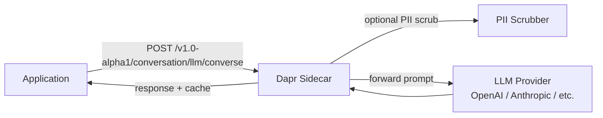

# How to Run Dapr Quickstart for Conversation API

Author: [nawazdhandala](https://www.github.com/nawazdhandala)

Tags: Dapr, Conversation API, LLM, AI, Quickstart

Description: Run the Dapr conversation API quickstart to send prompts to a large language model through the Dapr sidecar with built-in PII scrubbing and provider abstraction.

---

## What You Will Build

A service that sends prompts to an LLM (OpenAI GPT-4 or a compatible provider) through the Dapr conversation API. Dapr provides a unified interface across providers, optional PII scrubbing, and prompt caching.



## Prerequisites

```bash
dapr init
pip3 install dapr flask
```

You will need an OpenAI API key (or compatible provider).

## Define the Conversation Component

```yaml
# components/conversation.yaml
apiVersion: dapr.io/v1alpha1
kind: Component
metadata:
  name: llm
spec:
  type: conversation.openai
  version: v1
  metadata:
  - name: key
    secretKeyRef:
      name: openai-secret
      key: api-key
  - name: model
    value: gpt-4o-mini
  - name: cachingEnabled
    value: "true"    # cache identical prompts
auth:
  secretStore: local-store
```

Create the secret:

```bash
cat > secrets.json << 'EOF'
{
  "api-key": "sk-your-openai-api-key-here"
}
EOF
```

```yaml
# components/secretstore.yaml
apiVersion: dapr.io/v1alpha1
kind: Component
metadata:
  name: local-store
spec:
  type: secretstores.local.file
  version: v1
  metadata:
  - name: secretsFile
    value: ./secrets.json
```

## The Application

```python
# app.py
import requests
import os
import json
from flask import Flask, request, jsonify

app = Flask(__name__)
DAPR_HTTP_PORT = os.getenv('DAPR_HTTP_PORT', '3500')

def converse(messages: list, scrub_pii: bool = False) -> str:
    url = f"http://localhost:{DAPR_HTTP_PORT}/v1.0-alpha1/conversation/llm/converse"
    payload = {
        "inputs": messages,
        "parameters": {
            "temperature": 0.7,
            "maxTokens": 500
        }
    }
    if scrub_pii:
        payload["scrubPII"] = True

    response = requests.post(url, json=payload)
    if response.status_code == 200:
        outputs = response.json().get('outputs', [])
        if outputs:
            return outputs[0].get('result', '')
    raise Exception(f"Conversation failed: {response.status_code} {response.text}")

# Simple question answering
answer = converse([{
    "role": "user",
    "content": "Explain the Dapr sidecar pattern in one paragraph."
}])
print(f"Answer:\n{answer}\n")

# Multi-turn conversation
conversation = [
    {"role": "system", "content": "You are a Dapr expert helping developers."},
    {"role": "user", "content": "What is service invocation?"},
    {"role": "assistant", "content": "Service invocation lets services call each other by app ID..."},
    {"role": "user", "content": "How does mTLS work with it?"}
]
answer2 = converse(conversation)
print(f"Multi-turn answer:\n{answer2}\n")

# With PII scrubbing
pii_prompt = [{
    "role": "user",
    "content": "Analyze this customer complaint from John Smith (john@example.com, SSN: 123-45-6789): 'The product broke after one day.'"
}]
scrubbed_answer = converse(pii_prompt, scrub_pii=True)
print(f"PII-scrubbed answer:\n{scrubbed_answer}")

if __name__ == '__main__':
    app.run(port=5001)
```

## Run the Application

```bash
dapr run \
  --app-id conversation-app \
  --app-port 5001 \
  --dapr-http-port 3500 \
  --resources-path ./components \
  -- python3 app.py
```

## Using Anthropic Claude

```yaml
# components/claude-conversation.yaml
apiVersion: dapr.io/v1alpha1
kind: Component
metadata:
  name: claude
spec:
  type: conversation.anthropic
  version: v1
  metadata:
  - name: key
    secretKeyRef:
      name: anthropic-secret
      key: api-key
  - name: model
    value: claude-3-haiku-20240307
auth:
  secretStore: local-store
```

Switch the component name in the API call:

```python
url = f"http://localhost:{DAPR_HTTP_PORT}/v1.0-alpha1/conversation/claude/converse"
```

## Using a Hugging Face Model

```yaml
apiVersion: dapr.io/v1alpha1
kind: Component
metadata:
  name: hf-model
spec:
  type: conversation.huggingface
  version: v1
  metadata:
  - name: key
    secretKeyRef:
      name: hf-secret
      key: token
  - name: model
    value: microsoft/DialoGPT-medium
```

## Caching Identical Prompts

When `cachingEnabled: "true"`, the sidecar caches responses to identical prompts:

```python
# These two calls result in only one LLM API call
answer1 = converse([{"role": "user", "content": "What is Dapr?"}])
answer2 = converse([{"role": "user", "content": "What is Dapr?"}])
# answer1 == answer2, second call served from cache
```

## Request/Response Format

Full request structure:

```json
{
  "inputs": [
    {"role": "system", "content": "You are a helpful assistant."},
    {"role": "user", "content": "Hello, how are you?"}
  ],
  "parameters": {
    "temperature": 0.7,
    "maxTokens": 1000,
    "topP": 1.0
  },
  "scrubPII": false,
  "conversationContext": "session-123"
}
```

Response:

```json
{
  "outputs": [
    {
      "result": "I am doing well, thank you for asking!",
      "parameters": {
        "model": "gpt-4o-mini",
        "promptTokens": 25,
        "completionTokens": 12
      }
    }
  ]
}
```

## Summary

The Dapr conversation API quickstart shows how to send prompts to LLMs through a unified sidecar interface. Switching providers requires only a component YAML change - no application code modifications. The API supports multi-turn conversations, PII scrubbing to prevent sensitive data from reaching the LLM, and response caching for identical prompts. This abstraction layer future-proofs your AI integrations against provider changes.
