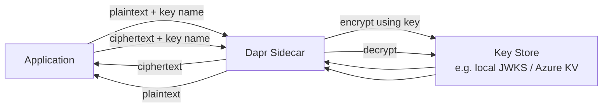

# How to Run Dapr Quickstart for Cryptography

Author: [nawazdhandala](https://www.github.com/nawazdhandala)

Tags: Dapr, Cryptography, Quickstart, Encryption, Security

Description: Run the Dapr cryptography quickstart to encrypt and decrypt data using keys managed by a secrets backend without your application handling raw key material.

---

## What You Will Build

An application that encrypts a message using the Dapr cryptography API and decrypts it back. The encryption key is managed by a key store (local JWKS file in development, Azure Key Vault or AWS KMS in production). Your application never handles the raw key.



## Prerequisites

```bash
dapr init
pip3 install dapr cryptography
```

## Step 1 - Create a Local Key

```python
# generate-key.py
from cryptography.hazmat.primitives.asymmetric import rsa
from cryptography.hazmat.primitives import serialization
import json, base64

# Generate RSA key pair
private_key = rsa.generate_private_key(
    public_exponent=65537,
    key_size=2048
)

# Export as JWKS
pub = private_key.public_key()
pub_numbers = pub.public_key().public_numbers() if hasattr(pub, 'public_key') else pub.public_numbers()

print("Key generated. For production, store in Azure Key Vault or AWS KMS.")
print("For local testing, use the dapr local.jwks component.")
```

For local development, Dapr provides a built-in local key store. Create a JWKS file:

```bash
mkdir -p components

cat > components/keys.json << 'EOF'
{
  "keys": [
    {
      "kty": "oct",
      "kid": "mykey",
      "k": "qmLDb03LyHF4tqbQwxDt3ArDfPHNbwp7b-EW9XCFBSA",
      "alg": "A256CBC"
    }
  ]
}
EOF
```

## Step 2 - Define the Cryptography Component

```yaml
# components/crypto.yaml
apiVersion: dapr.io/v1alpha1
kind: Component
metadata:
  name: local-crypto
spec:
  type: crypto.dapr.jwks
  version: v1
  metadata:
  - name: jwks
    value: |
      {
        "keys": [
          {
            "kty": "oct",
            "kid": "mykey",
            "k": "qmLDb03LyHF4tqbQwxDt3ArDfPHNbwp7b-EW9XCFBSA",
            "alg": "A256CBC"
          }
        ]
      }
```

## Step 3 - The Application

```python
# app.py
import requests
import base64
import os
import json

DAPR_HTTP_PORT = os.getenv('DAPR_HTTP_PORT', '3500')
CRYPTO_STORE = 'local-crypto'

def encrypt_value(plaintext: str, key_name: str) -> str:
    url = f"http://localhost:{DAPR_HTTP_PORT}/v1.0-alpha1/crypto/{CRYPTO_STORE}/encrypt"
    payload = {
        "plaintext": base64.b64encode(plaintext.encode()).decode(),
        "options": {
            "keyName": key_name,
            "keyWrapAlgorithm": "A256KW"
        }
    }
    response = requests.put(url, json=payload)
    if response.status_code == 200:
        return response.json().get('ciphertext', '')
    raise Exception(f"Encryption failed: {response.status_code} {response.text}")

def decrypt_value(ciphertext: str, key_name: str) -> str:
    url = f"http://localhost:{DAPR_HTTP_PORT}/v1.0-alpha1/crypto/{CRYPTO_STORE}/decrypt"
    payload = {
        "ciphertext": ciphertext,
        "options": {
            "keyName": key_name
        }
    }
    response = requests.put(url, json=payload)
    if response.status_code == 200:
        plaintext_b64 = response.json().get('plaintext', '')
        return base64.b64decode(plaintext_b64).decode()
    raise Exception(f"Decryption failed: {response.status_code} {response.text}")

# Test data
sensitive_data = [
    ("credit-card", "4111-1111-1111-1111"),
    ("ssn", "123-45-6789"),
    ("password", "supersecret123")
]

print("=== Encrypting sensitive data ===")
encrypted = {}
for field, value in sensitive_data:
    ciphertext = encrypt_value(value, 'mykey')
    encrypted[field] = ciphertext
    print(f"{field}: {value} -> {ciphertext[:30]}...")

print("\n=== Decrypting data ===")
for field, ciphertext in encrypted.items():
    plaintext = decrypt_value(ciphertext, 'mykey')
    print(f"{field}: {ciphertext[:20]}... -> {plaintext}")
```

## Run the Application

```bash
dapr run \
  --app-id crypto-app \
  --dapr-http-port 3500 \
  --resources-path ./components \
  -- python3 app.py
```

## Using Azure Key Vault

```yaml
apiVersion: dapr.io/v1alpha1
kind: Component
metadata:
  name: azure-keyvault-crypto
spec:
  type: crypto.azure.keyvault
  version: v1
  metadata:
  - name: vaultName
    value: my-keyvault
  - name: azureClientId
    secretKeyRef:
      name: azure-creds
      key: client-id
  - name: azureClientSecret
    secretKeyRef:
      name: azure-creds
      key: client-secret
  - name: azureTenantId
    secretKeyRef:
      name: azure-creds
      key: tenant-id
auth:
  secretStore: kubernetes
```

```python
# Same application code, different store name
ciphertext = encrypt_value("my-secret-data", "my-key-name", store="azure-keyvault-crypto")
```

## Streaming Encryption for Large Files

For large files, use the streaming API:

```python
DAPR_GRPC_PORT = os.getenv('DAPR_GRPC_PORT', '50001')

from dapr.clients import DaprClient

with DaprClient() as client:
    # Encrypt a file
    with open("sensitive-report.pdf", "rb") as f:
        plaintext = f.read()

    encrypted = client.encrypt(
        data=plaintext,
        options={
            "componentName": "local-crypto",
            "keyName": "mykey",
            "keyWrapAlgorithm": "A256KW"
        }
    )

    with open("encrypted-report.bin", "wb") as f:
        f.write(encrypted)
```

## Key Rotation

Key rotation requires:
1. Create a new key version in the key store
2. Update component metadata to use the new key name/version
3. Old data encrypted with the old key can still be decrypted (key store keeps old versions)
4. Re-encrypt old data with the new key at your own pace

## Summary

The Dapr cryptography quickstart demonstrates encrypting and decrypting data through the Dapr cryptography API without the application ever seeing or handling raw key material. The key store backend (local JWKS, Azure Key Vault, AWS KMS) manages key lifecycle. The application only passes a key name and data - the sidecar handles the cryptographic operations. This pattern separates key management from application logic and makes key rotation transparent.
