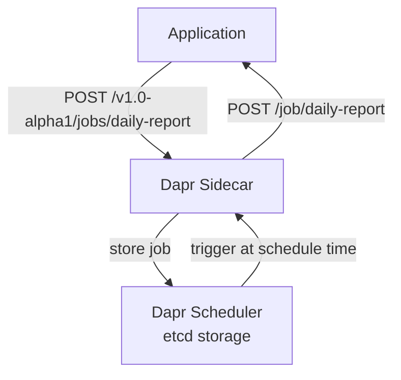
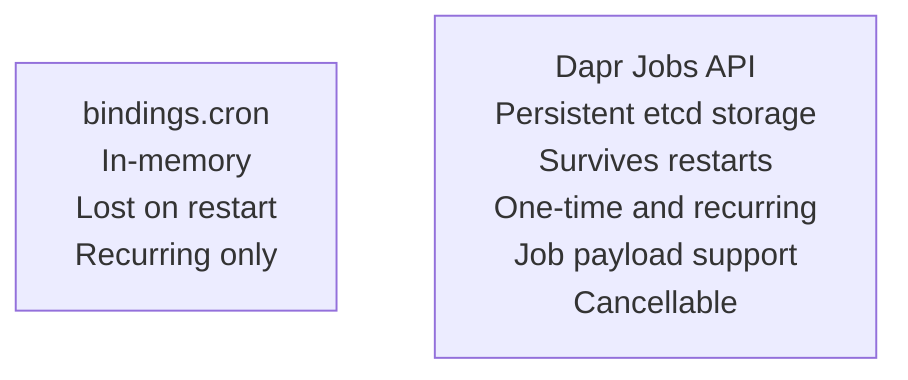

# How to Run Dapr Quickstart for Jobs

Author: [nawazdhandala](https://www.github.com/nawazdhandala)

Tags: Dapr, Job, Quickstart, Scheduler, Cron

Description: Run the Dapr jobs quickstart to schedule one-time and recurring tasks using the Dapr Jobs API with durable persistence that survives service restarts.

---

## What You Will Build

An application that schedules two jobs: a recurring report generation job that runs daily, and a one-time cleanup job that runs at a specific date and time. Jobs are persisted by the Dapr Scheduler service and survive restarts.



## Prerequisites

```bash
dapr init   # starts Scheduler service (Dapr 1.14+)
pip3 install flask requests
```

## The Application

```python
# app.py
from flask import Flask, request, jsonify
import requests
import os

app = Flask(__name__)
DAPR_HTTP_PORT = os.getenv('DAPR_HTTP_PORT', '3500')

# Job handlers - Dapr calls these when a job is triggered
@app.route('/job/daily-report', methods=['POST'])
def handle_daily_report():
    data = request.get_json() or {}
    job_data = data.get('data', {})
    print(f"Running daily report: type={job_data.get('reportType')}, "
          f"recipients={job_data.get('recipients')}")
    # Do actual report generation here
    return '', 200

@app.route('/job/cleanup', methods=['POST'])
def handle_cleanup():
    data = request.get_json() or {}
    job_data = data.get('data', {})
    print(f"Running cleanup: target={job_data.get('target')}")
    # Do actual cleanup here
    return '', 200

@app.route('/job/batch-<batch_id>', methods=['POST'])
def handle_batch(batch_id):
    data = request.get_json() or {}
    print(f"Processing batch {batch_id}: {data}")
    return '', 200

# Scheduling endpoints
@app.route('/schedule/daily-report', methods=['POST'])
def schedule_daily_report():
    response = requests.post(
        f"http://localhost:{DAPR_HTTP_PORT}/v1.0-alpha1/jobs/daily-report",
        json={
            "schedule": "@daily",
            "data": {
                "reportType": "sales-summary",
                "recipients": ["team@example.com"],
                "format": "pdf"
            },
            "repeats": 0   # 0 = infinite
        }
    )
    return jsonify({"scheduled": True, "status": response.status_code})

@app.route('/schedule/cleanup', methods=['POST'])
def schedule_cleanup():
    response = requests.post(
        f"http://localhost:{DAPR_HTTP_PORT}/v1.0-alpha1/jobs/cleanup",
        json={
            "dueTime": "2026-04-01T02:00:00Z",    # one-time job
            "data": {
                "target": "temp-files",
                "olderThan": "7d"
            }
        }
    )
    return jsonify({"scheduled": True, "status": response.status_code})

@app.route('/schedule/recurring', methods=['POST'])
def schedule_recurring():
    # Run every 30 seconds for testing
    response = requests.post(
        f"http://localhost:{DAPR_HTTP_PORT}/v1.0-alpha1/jobs/batch-march",
        json={
            "schedule": "@every 30s",
            "repeats": 5,    # run exactly 5 times
            "data": {"batchId": "march-2026"}
        }
    )
    return jsonify({"scheduled": True, "status": response.status_code})

@app.route('/jobs/<job_name>', methods=['GET'])
def get_job(job_name):
    response = requests.get(
        f"http://localhost:{DAPR_HTTP_PORT}/v1.0-alpha1/jobs/{job_name}"
    )
    return response.json()

@app.route('/jobs/<job_name>', methods=['DELETE'])
def delete_job(job_name):
    response = requests.delete(
        f"http://localhost:{DAPR_HTTP_PORT}/v1.0-alpha1/jobs/{job_name}"
    )
    return jsonify({"deleted": True, "status": response.status_code})

if __name__ == '__main__':
    app.run(port=5001)
```

## Run the Application

```bash
dapr run \
  --app-id jobs-app \
  --app-port 5001 \
  --dapr-http-port 3500 \
  -- python3 app.py
```

## Schedule Jobs

```bash
# Schedule the daily report
curl -X POST http://localhost:5001/schedule/daily-report

# Schedule the one-time cleanup
curl -X POST http://localhost:5001/schedule/cleanup

# Schedule a recurring job (every 30s, 5 times)
curl -X POST http://localhost:5001/schedule/recurring
```

## Check Job Status

```bash
curl http://localhost:5001/jobs/daily-report
```

Response:

```json
{
  "name": "daily-report",
  "schedule": "@daily",
  "data": {"reportType": "sales-summary"},
  "repeats": 0,
  "status": {
    "lastRunTime": null,
    "nextRunTime": "2026-04-01T00:00:00Z"
  }
}
```

## Schedule Format Reference

| Format | Meaning |
|--------|---------|
| `@every 30s` | Every 30 seconds |
| `@every 5m` | Every 5 minutes |
| `@every 1h` | Every hour |
| `@daily` | Once per day at midnight UTC |
| `@weekly` | Once per week (Sunday midnight) |
| `@monthly` | First of each month at midnight |
| `0 9 * * 1-5` | 09:00 Monday-Friday (cron) |
| `0 */6 * * *` | Every 6 hours (cron) |

## Deleting a Job

```bash
curl -X DELETE http://localhost:5001/jobs/cleanup
```

Or directly through Dapr:

```bash
curl -X DELETE http://localhost:3500/v1.0-alpha1/jobs/cleanup
```

## Direct Dapr API Schedule Call

You can also call the Dapr API directly without the Flask wrapper:

```bash
curl -X POST http://localhost:3500/v1.0-alpha1/jobs/test-job \
  -H "Content-Type: application/json" \
  -d '{
    "schedule": "@every 10s",
    "data": {"message": "hello"},
    "repeats": 3
  }'
```

## Differences Between Jobs and Cron Bindings



Use Jobs API for production-grade scheduled work. Use cron bindings for simple, non-critical recurring triggers.

## Summary

The Dapr jobs quickstart demonstrates scheduling durable one-time and recurring jobs through the Jobs API. Jobs are stored in the Scheduler service's embedded etcd and survive service restarts. Your application handles job triggers via POST endpoints named after the job. The schedule format supports cron expressions, `@every` duration syntax, and one-time `dueTime` values.
