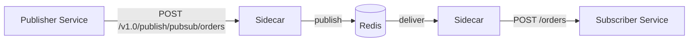

# How to Run Dapr Quickstart for Pub/Sub Messaging

Author: [nawazdhandala](https://www.github.com/nawazdhandala)

Tags: Dapr, Pub/Sub, Quickstart, Messaging, Event-Driven

Description: Run the Dapr pub/sub quickstart to publish messages to a topic and subscribe to them across multiple services using the default Redis message broker.

---

## What You Will Build

A publisher service that sends order messages to the `orders` topic, and a subscriber service that receives and processes those messages. The message broker (Redis) is managed by Dapr.



## Prerequisites

```bash
dapr init   # starts Redis on port 6379
```

## The Publisher

```python
# publisher/app.py
import requests
import os
import json
import time

DAPR_HTTP_PORT = os.getenv('DAPR_HTTP_PORT', '3500')
PUBSUB_URL = f"http://localhost:{DAPR_HTTP_PORT}/v1.0/publish/pubsub/orders"

for i in range(1, 11):
    order = {"orderId": i, "item": f"widget-{i}", "quantity": i * 2}
    response = requests.post(
        PUBSUB_URL,
        data=json.dumps(order),
        headers={"Content-Type": "application/json"}
    )
    print(f"Published order {i}: HTTP {response.status_code}")
    time.sleep(1)
```

## The Subscriber

```python
# subscriber/app.py
from flask import Flask, request, jsonify

app = Flask(__name__)

@app.route('/dapr/subscribe', methods=['GET'])
def subscribe():
    return jsonify([{
        "pubsubname": "pubsub",
        "topic": "orders",
        "route": "/orders"
    }])

@app.route('/orders', methods=['POST'])
def process_order():
    event = request.get_json()
    order = event.get('data', event)
    print(f"Received order: {order['orderId']} - {order['item']} x{order['quantity']}")
    return jsonify({"success": True})

if __name__ == '__main__':
    app.run(port=5001)
```

## Run the Subscriber

```bash
cd subscriber
pip3 install flask
dapr run \
  --app-id order-processor \
  --app-port 5001 \
  --dapr-http-port 3501 \
  -- python3 app.py
```

## Run the Publisher

```bash
cd publisher
pip3 install requests
dapr run \
  --app-id checkout \
  --dapr-http-port 3500 \
  -- python3 app.py
```

## Expected Output

Publisher:

```text
Published order 1: HTTP 204
Published order 2: HTTP 204
...
```

Subscriber:

```text
Received order: 1 - widget-1 x2
Received order: 2 - widget-2 x4
...
```

## CloudEvents Envelope

Dapr wraps messages in the CloudEvents 1.0 format. The subscriber receives:

```json
{
  "specversion": "1.0",
  "type": "com.dapr.event.sent",
  "source": "checkout",
  "id": "uuid-here",
  "datacontenttype": "application/json",
  "topic": "orders",
  "pubsubname": "pubsub",
  "data": {
    "orderId": 1,
    "item": "widget-1",
    "quantity": 2
  }
}
```

To publish raw messages without the CloudEvents wrapper:

```python
requests.post(
    PUBSUB_URL,
    data=json.dumps(order),
    headers={
        "Content-Type": "application/json",
        "dapr-pubsub-raw-payload": "true"
    }
)
```

## Declarative Subscription (No Code Change)

Instead of exposing `/dapr/subscribe`, use a subscription CRD:

```yaml
apiVersion: dapr.io/v2alpha1
kind: Subscription
metadata:
  name: orders-sub
spec:
  topic: orders
  routes:
    default: /orders
  pubsubname: pubsub
  scopes:
  - order-processor
```

```bash
kubectl apply -f subscription.yaml
```

## Changing the Message Broker

Swap Redis for Kafka by changing the component YAML - no application code changes:

```yaml
apiVersion: dapr.io/v1alpha1
kind: Component
metadata:
  name: pubsub
spec:
  type: pubsub.kafka
  version: v1
  metadata:
  - name: brokers
    value: kafka:9092
  - name: consumerGroup
    value: order-processors
```

## Summary

The Dapr pub/sub quickstart shows how a publisher sends messages to a named topic and a subscriber receives them through a POST endpoint. Dapr wraps messages in CloudEvents format and handles broker connectivity, retries, and dead-letter routing. Swapping the broker (Redis, Kafka, Service Bus) requires only a component YAML change with no application code modifications.
