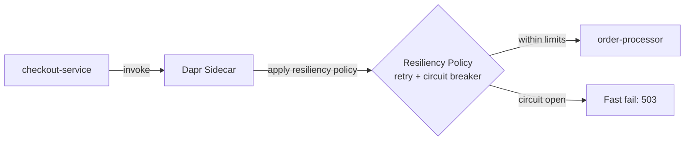
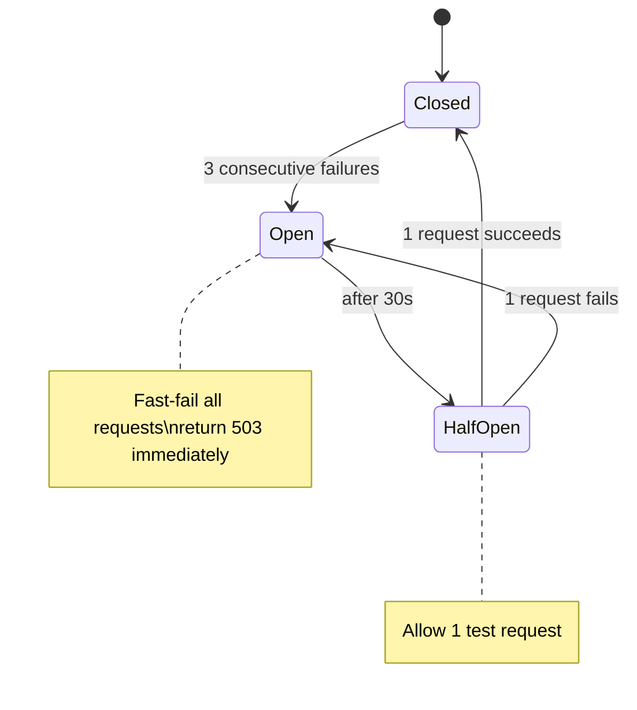

# How to Run Dapr Quickstart for Resiliency

Author: [nawazdhandala](https://www.github.com/nawazdhandala)

Tags: Dapr, Resiliency, Quickstart, Retry, Circuit Breaker

Description: Run the Dapr resiliency quickstart to observe retry, timeout, and circuit breaker policies in action when a downstream service is unavailable or slow.

---

## What You Will Build

A checkout service that calls an order processor service. You will apply a resiliency policy with retries and a circuit breaker, then simulate failures in the order processor to observe the policies in action.



## Prerequisites

```bash
dapr init
pip3 install flask requests
```

## The Resiliency Policy

```yaml
# components/resiliency.yaml
apiVersion: dapr.io/v1alpha1
kind: Resiliency
metadata:
  name: checkout-resiliency
spec:
  policies:
    retries:
      retryThrice:
        policy: constant
        duration: 5s
        maxRetries: 3
    timeouts:
      quickTimeout: 3s
    circuitBreakers:
      simpleCB:
        maxRequests: 1
        interval: 8s
        timeout: 30s
        trip: consecutiveFailures >= 3
  targets:
    apps:
      order-processor:
        timeout: quickTimeout
        retry: retryThrice
        circuitBreaker: simpleCB
```

## The Order Processor (with Controllable Failures)

```python
# order-processor/app.py
from flask import Flask, request, jsonify
import time
import os

app = Flask(__name__)

# Environment-controlled failure mode
FAIL_MODE = os.getenv('FAIL_MODE', 'none')   # none | timeout | error | slow

@app.route('/orders', methods=['POST'])
def process_order():
    order = request.get_json()
    print(f"Processing order: {order.get('orderId')}, fail_mode={FAIL_MODE}")

    if FAIL_MODE == 'timeout':
        time.sleep(10)   # exceed the 3s timeout

    if FAIL_MODE == 'error':
        return jsonify({"error": "internal server error"}), 500

    if FAIL_MODE == 'slow':
        time.sleep(2)   # slow but within timeout

    return jsonify({"success": True, "orderId": order.get('orderId')})

if __name__ == '__main__':
    app.run(port=6001)
```

## The Checkout Service

```python
# checkout/app.py
import requests
import os
import time

DAPR_HTTP_PORT = os.getenv('DAPR_HTTP_PORT', '3500')
ORDER_URL = f"http://localhost:{DAPR_HTTP_PORT}/v1.0/invoke/order-processor/method/orders"

for i in range(1, 11):
    start = time.time()
    try:
        response = requests.post(
            ORDER_URL,
            json={"orderId": i},
            timeout=10
        )
        elapsed = (time.time() - start) * 1000
        print(f"Order {i}: HTTP {response.status_code} ({elapsed:.0f}ms)")
    except Exception as e:
        elapsed = (time.time() - start) * 1000
        print(f"Order {i}: FAILED - {e} ({elapsed:.0f}ms)")
    time.sleep(1)
```

## Scenario 1 - Normal Operation

```bash
# Run order-processor (healthy)
dapr run \
  --app-id order-processor \
  --app-port 6001 \
  --dapr-http-port 3501 \
  --resources-path ./components \
  -- python3 order-processor/app.py

# Run checkout
dapr run \
  --app-id checkout \
  --dapr-http-port 3500 \
  --resources-path ./components \
  -- python3 checkout/app.py
```

Expected:

```text
Order 1: HTTP 200 (8ms)
Order 2: HTTP 200 (7ms)
...
```

## Scenario 2 - Retry on 500 Errors

Restart the order processor with error mode:

```bash
FAIL_MODE=error dapr run \
  --app-id order-processor \
  --app-port 6001 \
  --dapr-http-port 3501 \
  --resources-path ./components \
  -- python3 order-processor/app.py
```

Observe retries in the checkout sidecar logs:

```text
time="..." level=info msg="Error invoking app. Retrying..." attempt=1
time="..." level=info msg="Error invoking app. Retrying..." attempt=2
time="..." level=info msg="Error invoking app. Retrying..." attempt=3
```

After 3 consecutive failures, the circuit opens:

```text
Order 4: HTTP 503 (2ms)   <- fast fail, no retry
Order 5: HTTP 503 (1ms)   <- fast fail
```

## Scenario 3 - Timeout Policy

```bash
FAIL_MODE=timeout dapr run \
  --app-id order-processor \
  --app-port 6001 \
  --dapr-http-port 3501 \
  --resources-path ./components \
  -- python3 order-processor/app.py
```

The 3-second timeout fires and the retry policy kicks in:

```text
Order 1: HTTP 504 (3021ms)  <- timeout, retried 3 times = ~9s total
Order 2: HTTP 503 (1ms)     <- circuit open after 3 failures
```

## Scenario 4 - Circuit Recovery

After the circuit has been open for 30 seconds (`timeout` in the circuit breaker config), it moves to half-open:

```text
Order 6: HTTP 200 (8ms)   <- half-open: one test request succeeds
Order 7: HTTP 200 (8ms)   <- circuit closed, normal operation
```

## Circuit Breaker State Visualization



## Applying Resiliency to a Component

You can also apply policies to state store or pub/sub operations:

```yaml
targets:
  components:
    statestore:
      outbound:
        timeout: quickTimeout
        retry: retryThrice
```

## Summary

The Dapr resiliency quickstart demonstrates configuring retries, timeouts, and circuit breakers declaratively. With three consecutive failures, the circuit breaker opens and subsequent calls fail fast without reaching the downstream service. After the timeout period, the circuit enters half-open state and allows one test request. These policies require no application code changes - only a `Resiliency` YAML file.
