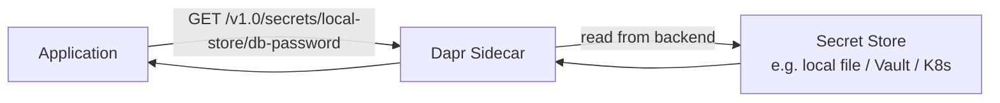

# How to Run Dapr Quickstart for Secrets Management

Author: [nawazdhandala](https://www.github.com/nawazdhandala)

Tags: Dapr, Secrets Management, Quickstart, Security, Getting Started

Description: Run the Dapr secrets management quickstart to retrieve secrets from a local secret store without hard-coding credentials in your application code.

---

## What You Will Build

An application that reads database credentials from a secret store using the Dapr secrets API. You will use a local file-based secret store in development and swap to Kubernetes secrets or HashiCorp Vault in production.



## Prerequisites

```bash
dapr init
```

## Step 1 - Create a Local Secret Store File

```bash
mkdir -p components
cat > secrets.json << 'EOF'
{
  "db-password": "supersecret123",
  "api-key": "my-api-key-abc",
  "jwt-secret": "jwt-signing-key-xyz"
}
EOF
```

## Step 2 - Define the Secret Store Component

```yaml
# components/secretstore.yaml
apiVersion: dapr.io/v1alpha1
kind: Component
metadata:
  name: local-store
spec:
  type: secretstores.local.file
  version: v1
  metadata:
  - name: secretsFile
    value: ./secrets.json
  - name: nestedSeparator
    value: ":"
```

## Step 3 - The Application

```python
# app.py
import requests
import os

DAPR_HTTP_PORT = os.getenv('DAPR_HTTP_PORT', '3500')
SECRET_STORE = 'local-store'

def get_secret(secret_name: str) -> str:
    url = f"http://localhost:{DAPR_HTTP_PORT}/v1.0/secrets/{SECRET_STORE}/{secret_name}"
    response = requests.get(url)
    if response.status_code == 200:
        return response.json()[secret_name]
    raise Exception(f"Secret {secret_name} not found: {response.status_code}")

def get_bulk_secrets() -> dict:
    url = f"http://localhost:{DAPR_HTTP_PORT}/v1.0/secrets/{SECRET_STORE}/bulk"
    response = requests.get(url)
    return response.json()

# Retrieve individual secrets
db_password = get_secret('db-password')
api_key = get_secret('api-key')
jwt_secret = get_secret('jwt-secret')

print(f"DB password retrieved: {'*' * len(db_password)}")
print(f"API key retrieved: {api_key[:4]}...")
print(f"JWT secret retrieved: {jwt_secret[:4]}...")

# Retrieve all secrets at once
all_secrets = get_bulk_secrets()
print(f"\nAll secret names: {list(all_secrets.keys())}")
```

## Run the Application

```bash
pip3 install requests
dapr run \
  --app-id secrets-app \
  --dapr-http-port 3500 \
  --resources-path ./components \
  -- python3 app.py
```

## Expected Output

```text
DB password retrieved: ****************
API key retrieved: my-a...
JWT secret retrieved: jwt-...

All secret names: ['db-password', 'api-key', 'jwt-secret']
```

## Referencing Secrets in Component YAML

The most common use case: reference secrets inside component definitions without hard-coding credentials:

```yaml
# components/postgres-statestore.yaml
apiVersion: dapr.io/v1alpha1
kind: Component
metadata:
  name: statestore
spec:
  type: state.postgresql
  version: v1
  metadata:
  - name: connectionString
    secretKeyRef:
      name: db-password       # key in the secret store
      key: db-password
auth:
  secretStore: local-store    # reference to the secret store component
```

The sidecar resolves `db-password` from `local-store` before initializing the PostgreSQL state store.

## Using Kubernetes Secrets as the Backend

For Kubernetes:

```yaml
# No component file needed - kubernetes secret store is built-in
# Create the Kubernetes secret:
kubectl create secret generic db-credentials \
  --from-literal=password=supersecret123 \
  -n default
```

Read it in code:

```python
# Store name is "kubernetes" (built-in)
url = f"http://localhost:{DAPR_HTTP_PORT}/v1.0/secrets/kubernetes/db-credentials"
response = requests.get(url)
password = response.json()['password']
```

## Using HashiCorp Vault

```yaml
# components/vault-secretstore.yaml
apiVersion: dapr.io/v1alpha1
kind: Component
metadata:
  name: vault
spec:
  type: secretstores.hashicorp.vault
  version: v1
  metadata:
  - name: vaultAddr
    value: https://vault.example.com:8200
  - name: vaultToken
    secretKeyRef:
      name: vault-token
      key: token
  - name: vaultKVPrefix
    value: secret
```

## Secret Access Control

Restrict which secrets an app can access:

```yaml
# components/secretstore.yaml
apiVersion: dapr.io/v1alpha1
kind: Component
metadata:
  name: local-store
spec:
  type: secretstores.local.file
  version: v1
  metadata:
  - name: secretsFile
    value: ./secrets.json
scopes:
- order-service           # only order-service can use this store
```

To restrict access to specific secret names:

```yaml
apiVersion: dapr.io/v1alpha1
kind: Configuration
metadata:
  name: appconfig
spec:
  secrets:
    scopes:
    - storeName: vault
      defaultAccess: deny
      allowedSecrets:
      - db-password
      - api-key
```

## Summary

The Dapr secrets management quickstart retrieves credentials from a pluggable secret store through the Dapr HTTP API, eliminating hard-coded credentials in application code. For local development, use the `secretstores.local.file` component. For production, use Kubernetes secrets (built-in) or HashiCorp Vault. Secret references in component YAML files let the sidecar resolve credentials at startup without the application ever seeing them.
