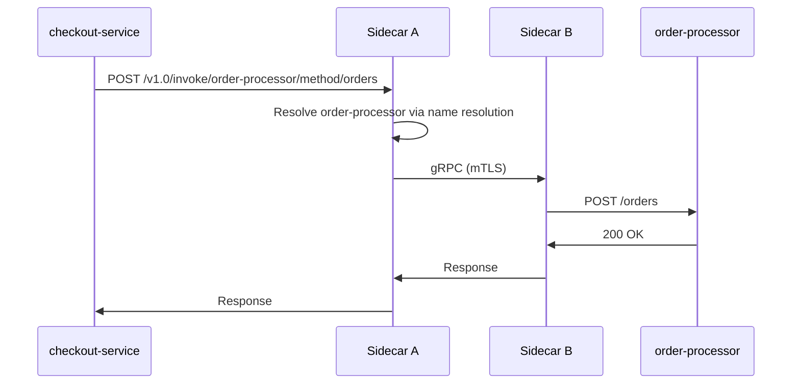

# How to Run Dapr Quickstart for Service Invocation

Author: [nawazdhandala](https://www.github.com/nawazdhandala)

Tags: Dapr, Service Invocation, Quickstart, HTTP, Getting Started

Description: Run the official Dapr service invocation quickstart to see how one service calls another using the Dapr sidecar with automatic mTLS and distributed tracing.

---

## What You Will Build

Two services: a checkout service that calls an order-processor service using Dapr service invocation. The checkout service calls the order processor by app ID, not by hostname.



## Prerequisites

```bash
dapr --version   # Dapr CLI 1.14+
docker --version # Docker for Redis container
```

Initialize Dapr if not already done:

```bash
dapr init
```

## Clone the Quickstart Repository

```bash
git clone https://github.com/dapr/quickstarts.git
cd quickstarts/service_invocation/python/http
```

## The Order Processor (Receiver)

```python
# order-processor/app.py
from flask import Flask, request, jsonify

app = Flask(__name__)

@app.route('/orders', methods=['POST'])
def process_order():
    order = request.get_json()
    print(f"Order received: {order['orderId']}")
    return jsonify({"success": True, "orderId": order['orderId']})

if __name__ == '__main__':
    app.run(port=6001)
```

## The Checkout Service (Caller)

```python
# checkout-service/app.py
import requests
import os
import time

DAPR_HTTP_PORT = os.getenv('DAPR_HTTP_PORT', '3500')
ORDER_SERVICE_URL = f"http://localhost:{DAPR_HTTP_PORT}/v1.0/invoke/order-processor/method/orders"

for i in range(1, 11):
    order = {"orderId": i, "item": f"item-{i}"}
    response = requests.post(ORDER_SERVICE_URL, json=order)
    print(f"Sent order {i}: {response.status_code} - {response.json()}")
    time.sleep(1)
```

## Run the Order Processor

```bash
cd order-processor
pip3 install flask
dapr run \
  --app-id order-processor \
  --app-port 6001 \
  --dapr-http-port 3501 \
  -- python3 app.py
```

## Run the Checkout Service

In a new terminal:

```bash
cd checkout
pip3 install requests
dapr run \
  --app-id checkout \
  --dapr-http-port 3500 \
  -- python3 app.py
```

## Expected Output

Checkout terminal:

```text
Sent order 1: 200 - {'success': True, 'orderId': 1}
Sent order 2: 200 - {'success': True, 'orderId': 2}
...
```

Order processor terminal:

```text
Order received: 1
Order received: 2
...
```

## How Service Invocation Works

The checkout service calls `http://localhost:3500/v1.0/invoke/order-processor/method/orders`. The sidecar:

1. Resolves `order-processor` using mDNS (self-hosted) or Kubernetes DNS
2. Establishes a mTLS connection to the order-processor sidecar
3. Forwards the request to the order processor app on port 6001
4. Returns the response

## Using the gRPC App Callback

If your app uses gRPC, set the protocol:

```bash
dapr run \
  --app-id order-processor \
  --app-port 6001 \
  --app-protocol grpc \
  -- ./order-processor
```

## Adding Headers

Pass custom headers through service invocation:

```python
response = requests.post(
    ORDER_SERVICE_URL,
    json=order,
    headers={
        "Content-Type": "application/json",
        "X-Correlation-ID": "abc123"
    }
)
```

Headers are forwarded to the target service.

## Kubernetes Version

Deploy both services to Kubernetes with Dapr annotations:

```yaml
# order-processor deployment
annotations:
  dapr.io/enabled: "true"
  dapr.io/app-id: "order-processor"
  dapr.io/app-port: "6001"
```

The checkout service calls the same URL - the sidecar handles DNS resolution automatically.

## Summary

The Dapr service invocation quickstart demonstrates calling one service from another using only the target's app ID. The sidecar handles name resolution, mTLS encryption, and distributed tracing automatically. This removes the need to hardcode hostnames or implement retry logic in your application code.
