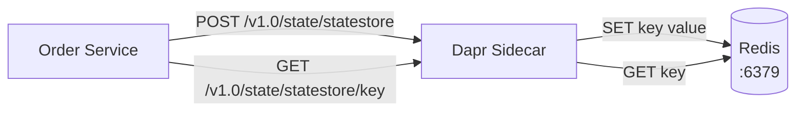

# How to Run Dapr Quickstart for State Management

Author: [nawazdhandala](https://www.github.com/nawazdhandala)

Tags: Dapr, State Management, Quickstart, Redis, Getting Started

Description: Run the Dapr state management quickstart to save, retrieve, and delete key-value state using the Dapr state API with Redis as the backend.

---

## What You Will Build

An order service that saves, retrieves, and deletes order state using the Dapr state management API. The state is persisted in Redis but your code only talks to the Dapr sidecar.



## Prerequisites

```bash
dapr init
```

The default statestore component (Redis) is already configured at `~/.dapr/components/statestore.yaml`.

## The Order Service

```python
# order-service/app.py
import requests
import os
import json

DAPR_HTTP_PORT = os.getenv('DAPR_HTTP_PORT', '3500')
STATESTORE_URL = f"http://localhost:{DAPR_HTTP_PORT}/v1.0/state/statestore"

def save_order(order_id: str, order: dict):
    response = requests.post(
        STATESTORE_URL,
        data=json.dumps([{"key": order_id, "value": order}]),
        headers={"Content-Type": "application/json"}
    )
    print(f"Saved order {order_id}: HTTP {response.status_code}")

def get_order(order_id: str) -> dict:
    response = requests.get(f"{STATESTORE_URL}/{order_id}")
    return response.json() if response.status_code == 200 else None

def delete_order(order_id: str):
    response = requests.delete(f"{STATESTORE_URL}/{order_id}")
    print(f"Deleted order {order_id}: HTTP {response.status_code}")

# Save orders
for i in range(1, 6):
    order = {
        "orderId": i,
        "item": f"widget-{i}",
        "quantity": i * 2,
        "status": "pending"
    }
    save_order(f"order-{i}", order)

# Retrieve orders
for i in range(1, 6):
    order = get_order(f"order-{i}")
    print(f"Retrieved order-{i}: {order}")

# Update an order
order = get_order("order-1")
order["status"] = "shipped"
save_order("order-1", order)
print(f"Updated order-1: {get_order('order-1')}")

# Delete an order
delete_order("order-3")
print(f"After delete, order-3: {get_order('order-3')}")
```

## Run the Service

```bash
cd order-service
pip3 install requests
dapr run \
  --app-id order-service \
  --dapr-http-port 3500 \
  -- python3 app.py
```

## Expected Output

```text
Saved order order-1: HTTP 204
Saved order order-2: HTTP 204
...
Retrieved order-1: {'orderId': 1, 'item': 'widget-1', 'quantity': 2, 'status': 'pending'}
...
Updated order-1: {'orderId': 1, 'item': 'widget-1', 'quantity': 2, 'status': 'shipped'}
Deleted order order-3: HTTP 204
After delete, order-3: None
```

## Bulk State Operations

Save multiple state entries in a single call:

```python
entries = [
    {"key": f"product-{i}", "value": {"price": i * 10, "stock": i * 5}}
    for i in range(1, 21)
]
requests.post(STATESTORE_URL, json=entries)
```

Retrieve multiple entries:

```bash
curl -X POST http://localhost:3500/v1.0/state/statestore/bulk \
  -H "Content-Type: application/json" \
  -d '{"keys": ["order-1", "order-2", "order-3"]}'
```

## State Transactions

```python
transaction = {
    "operations": [
        {
            "operation": "upsert",
            "request": {"key": "order-10", "value": {"status": "placed"}}
        },
        {
            "operation": "upsert",
            "request": {"key": "inventory-widget", "value": {"stock": 95}}
        },
        {
            "operation": "delete",
            "request": {"key": "cart-user1"}
        }
    ]
}
requests.post(f"{STATESTORE_URL.replace('/state/', '/state/')}/transaction", json=transaction)
```

Wait - the transaction endpoint:

```python
requests.post(
    f"http://localhost:{DAPR_HTTP_PORT}/v1.0/state/statestore/transaction",
    json=transaction
)
```

## Using ETags for Optimistic Concurrency

Get the etag when reading:

```python
response = requests.get(f"{STATESTORE_URL}/order-1")
etag = response.headers.get('ETag')

# Include etag to prevent overwriting concurrent changes
requests.post(STATESTORE_URL, json=[{
    "key": "order-1",
    "value": updated_order,
    "etag": etag,
    "options": {"concurrency": "first-write", "consistency": "strong"}
}])
```

## State TTL

Set a time-to-live for state entries:

```python
requests.post(STATESTORE_URL, json=[{
    "key": "session-abc",
    "value": {"userId": "u1"},
    "metadata": {"ttlInSeconds": "3600"}  # expire after 1 hour
}])
```

## Default State Store Component

```yaml
# ~/.dapr/components/statestore.yaml
apiVersion: dapr.io/v1alpha1
kind: Component
metadata:
  name: statestore
spec:
  type: state.redis
  version: v1
  metadata:
  - name: redisHost
    value: localhost:6379
  - name: redisPassword
    value: ""
  - name: actorStateStore
    value: "true"
```

## Summary

The Dapr state management quickstart demonstrates saving, retrieving, updating, and deleting key-value state through the Dapr HTTP API with Redis as the backend. The API supports bulk operations, transactions, optimistic concurrency with ETags, and TTL-based expiry. Swapping Redis for another store requires only a component YAML change.
