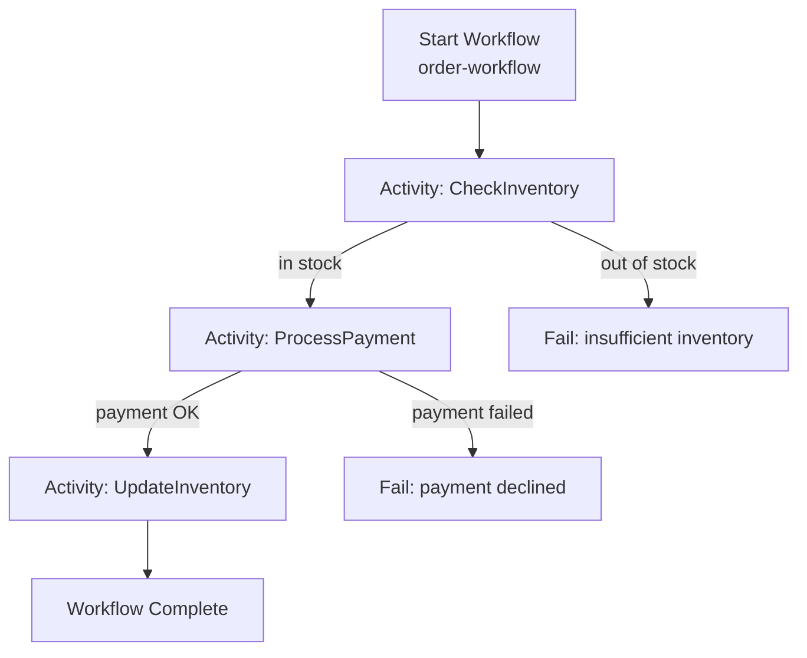
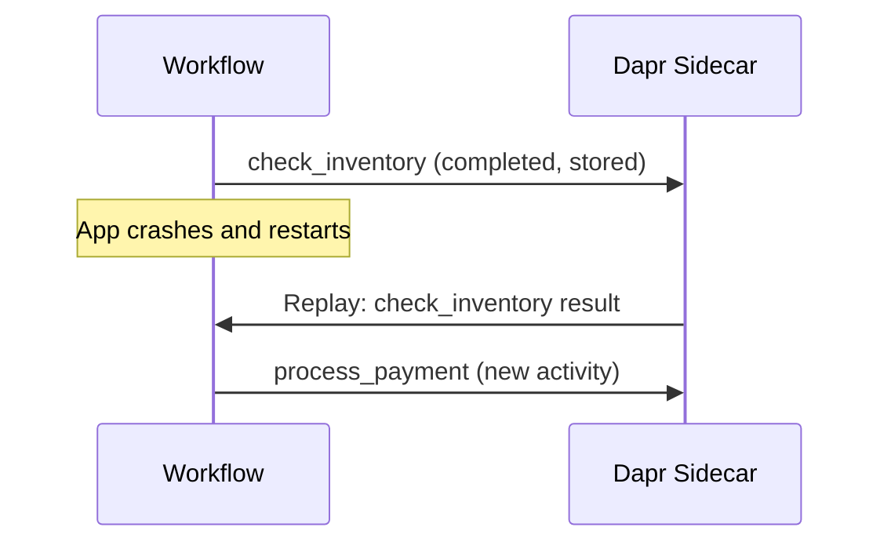

# How to Run Dapr Quickstart for Workflow

Author: [nawazdhandala](https://www.github.com/nawazdhandala)

Tags: Dapr, Workflow, Quickstart, Orchestration, Durable Execution

Description: Run the Dapr workflow quickstart to define a multi-step order processing workflow with activities, manage workflow instances, and understand durable execution.

---

## What You Will Build

An order processing workflow that orchestrates three sequential activities: check inventory, process payment, and update inventory. The workflow uses durable execution and survives restarts.



## Prerequisites

```bash
dapr init
pip3 install dapr dapr-ext-workflow flask
```

## Defining the Workflow and Activities

```python
# app.py
import time
from dapr.ext.workflow import WorkflowRuntime, DaprWorkflowContext, WorkflowActivityContext
from dapr.clients import DaprClient
from flask import Flask, request, jsonify

flask_app = Flask(__name__)
workflow_runtime = WorkflowRuntime()

# Activity 1: Check Inventory
@workflow_runtime.activity(name='check_inventory')
def check_inventory(ctx: WorkflowActivityContext, order: dict) -> dict:
    print(f"Checking inventory for {order['item']}, quantity {order['quantity']}")
    # Simulate inventory check
    available = 100  # current stock
    if order['quantity'] > available:
        raise Exception(f"Insufficient inventory: need {order['quantity']}, have {available}")
    return {"available": available, "reserved": order['quantity']}

# Activity 2: Process Payment
@workflow_runtime.activity(name='process_payment')
def process_payment(ctx: WorkflowActivityContext, payment_info: dict) -> dict:
    print(f"Processing payment of ${payment_info['amount']}")
    time.sleep(0.5)  # simulate payment gateway latency
    return {"transactionId": f"txn-{int(time.time())}", "status": "approved"}

# Activity 3: Update Inventory
@workflow_runtime.activity(name='update_inventory')
def update_inventory(ctx: WorkflowActivityContext, order: dict) -> dict:
    print(f"Updating inventory: removing {order['quantity']} of {order['item']}")
    return {"updated": True, "newStock": 100 - order['quantity']}

# Workflow Orchestrator
@workflow_runtime.workflow(name='order_workflow')
def order_workflow(ctx: DaprWorkflowContext, order: dict):
    # Step 1: Check inventory
    inventory = yield ctx.call_activity(check_inventory, input=order)

    # Step 2: Process payment
    payment_info = {
        "amount": order['quantity'] * order['unitPrice'],
        "orderId": order['orderId']
    }
    payment = yield ctx.call_activity(process_payment, input=payment_info)

    # Step 3: Update inventory
    result = yield ctx.call_activity(update_inventory, input=order)

    return {
        "orderId": order['orderId'],
        "transactionId": payment['transactionId'],
        "newStock": result['newStock']
    }

# Flask endpoints for starting and checking workflows
@flask_app.route('/start-workflow', methods=['POST'])
def start_workflow():
    order = request.get_json()
    with DaprClient() as client:
        result = client.start_workflow(
            workflow_component="dapr",
            workflow_name="order_workflow",
            input=order,
            instance_id=f"order-{order['orderId']}"
        )
    return jsonify({"instanceId": result.instance_id})

@flask_app.route('/workflow/<instance_id>', methods=['GET'])
def get_workflow(instance_id):
    with DaprClient() as client:
        state = client.get_workflow(
            instance_id=instance_id,
            workflow_component="dapr"
        )
    return jsonify({
        "instanceId": state.instance_id,
        "status": state.runtime_status.name,
        "result": state.serialized_output
    })

if __name__ == '__main__':
    workflow_runtime.start()
    flask_app.run(port=5001)
```

## Run the Workflow App

```bash
dapr run \
  --app-id workflow-app \
  --app-port 5001 \
  --dapr-http-port 3500 \
  -- python3 app.py
```

## Start a Workflow Instance

```bash
curl -X POST http://localhost:5001/start-workflow \
  -H "Content-Type: application/json" \
  -d '{
    "orderId": "ord-001",
    "item": "widget",
    "quantity": 5,
    "unitPrice": 9.99
  }'
```

Response:

```json
{"instanceId": "order-ord-001"}
```

## Check Workflow Status

```bash
curl http://localhost:5001/workflow/order-ord-001
```

Response:

```json
{
  "instanceId": "order-ord-001",
  "status": "COMPLETED",
  "result": "{\"orderId\": \"ord-001\", \"transactionId\": \"txn-...\", \"newStock\": 95}"
}
```

## Workflow Status Values

| Status | Description |
|--------|-------------|
| `RUNNING` | Workflow is executing |
| `COMPLETED` | Workflow finished successfully |
| `FAILED` | Workflow encountered an unhandled error |
| `TERMINATED` | Workflow was manually terminated |
| `SUSPENDED` | Workflow is waiting for an external event |

## Terminating a Workflow

```bash
curl -X POST \
  "http://localhost:3500/v1.0-beta1/workflows/dapr/order-ord-001/terminate"
```

## Purging a Workflow

Remove the workflow history:

```bash
curl -X DELETE \
  "http://localhost:3500/v1.0-beta1/workflows/dapr/order-ord-001/purge"
```

## Durable Execution

If the workflow app restarts mid-execution, Dapr replays the event history to restore the workflow state:



The workflow continues from where it left off.

## Summary

The Dapr workflow quickstart demonstrates defining a multi-step order processing workflow with sequential activities. The `WorkflowRuntime` manages activity execution, the `DaprWorkflowContext` provides `yield`-based orchestration, and workflow state is persisted durably so instances survive restarts. Workflows are started and monitored through the Dapr workflow HTTP API.
