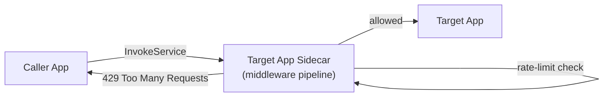

# How to Configure Dapr Rate Limiting for Service Calls

Author: [nawazdhandala](https://www.github.com/nawazdhandala)

Tags: Dapr, Rate Limiting, Middleware, Service Invocation, Microservice

Description: Implement rate limiting for Dapr service invocation using the middleware pipeline with the rate-limit component and Kubernetes-level controls.

---

## Overview

Dapr does not have a first-party Resiliency rate-limit policy for outbound calls, but it supports inbound rate limiting through the HTTP middleware pipeline. You configure a `middleware.http.ratelimit` component and attach it to a pipeline on a specific app via the Dapr `Configuration` CRD.

## Architecture



## Step 1: Define the Rate-Limit Middleware Component

```yaml
# components/ratelimit.yaml
apiVersion: dapr.io/v1alpha1
kind: Component
metadata:
  name: ratelimit
  namespace: default
spec:
  type: middleware.http.ratelimit
  version: v1
  metadata:
  - name: maxRequestsPerSecond
    value: "100"
```

The `maxRequestsPerSecond` field sets the maximum number of requests per second allowed into the app. Requests beyond this limit receive a `429 Too Many Requests` response from the sidecar.

## Step 2: Create the Dapr Configuration

Reference the middleware in a pipeline on the target app's configuration:

```yaml
# components/config.yaml
apiVersion: dapr.io/v1alpha1
kind: Configuration
metadata:
  name: appconfig
  namespace: default
spec:
  httpPipeline:
    handlers:
    - name: ratelimit
      type: middleware.http.ratelimit
```

## Step 3: Apply the Configuration to Your App

Annotate the target app's Kubernetes pod to use this configuration:

```yaml
# k8s/deployment.yaml
apiVersion: apps/v1
kind: Deployment
metadata:
  name: order-service
spec:
  replicas: 2
  selector:
    matchLabels:
      app: order-service
  template:
    metadata:
      labels:
        app: order-service
      annotations:
        dapr.io/enabled: "true"
        dapr.io/app-id: "order-service"
        dapr.io/app-port: "8080"
        dapr.io/config: "appconfig"
    spec:
      containers:
      - name: order-service
        image: myregistry/order-service:latest
        ports:
        - containerPort: 8080
```

## Step 4: Apply to Kubernetes

```bash
kubectl apply -f components/ratelimit.yaml
kubectl apply -f components/config.yaml
kubectl apply -f k8s/deployment.yaml
```

## Step 5: Self-Hosted Mode

In self-hosted mode, pass the config file via `--config`:

```bash
dapr run \
  --app-id order-service \
  --app-port 8080 \
  --config ./components/config.yaml \
  --components-path ./components \
  -- go run main.go
```

## Handling 429 in the Calling App

```go
// Go client
resp, err := client.InvokeMethodWithContent(ctx, "order-service", "createOrder", "post", content)
if err != nil {
    // Check for 429 rate limit response
    if daprErr, ok := err.(*dapr.DaprError); ok && daprErr.HTTPStatusCode() == 429 {
        time.Sleep(time.Second)
        // Retry or enqueue the request
    }
    return err
}
```

```python
# Python client
import asyncio
from dapr.clients import DaprClient
from dapr.clients.exceptions import DaprInternalError

async with DaprClient() as client:
    try:
        resp = await client.invoke_method(
            app_id="order-service",
            method_name="createOrder",
            http_verb="POST",
            data=payload,
        )
    except DaprInternalError as e:
        if "429" in str(e):
            await asyncio.sleep(1)
            # retry
```

## Multiple Middleware in a Pipeline

Chain rate limiting with authentication or tracing middleware:

```yaml
spec:
  httpPipeline:
    handlers:
    - name: ratelimit
      type: middleware.http.ratelimit
    - name: oauth2
      type: middleware.http.oauth2
    - name: uppercase
      type: middleware.http.uppercase
```

Handlers are applied in order from top to bottom on inbound requests.

## Tuning the Rate Limit

| Scenario | Recommended maxRequestsPerSecond |
|---|---|
| Internal microservice | 1000 |
| User-facing API | 100 |
| Payment / auth service | 50 |
| Background batch processor | 10 |

## Combining with Kubernetes HPA

Rate limiting at the Dapr layer complements Kubernetes Horizontal Pod Autoscaler (HPA). Dapr sheds load while HPA scales out more pods:

```yaml
apiVersion: autoscaling/v2
kind: HorizontalPodAutoscaler
metadata:
  name: order-service-hpa
spec:
  scaleTargetRef:
    apiVersion: apps/v1
    kind: Deployment
    name: order-service
  minReplicas: 2
  maxReplicas: 10
  metrics:
  - type: Resource
    resource:
      name: cpu
      target:
        type: Utilization
        averageUtilization: 70
```

## Summary

Dapr rate limiting is implemented as an HTTP middleware component (`middleware.http.ratelimit`) configured with `maxRequestsPerSecond`. The middleware is attached to the app's inbound HTTP pipeline via the Dapr `Configuration` CRD. When the limit is exceeded the sidecar returns `429` to the caller without the request reaching the application. Combine with retries in the calling app's Resiliency policy for graceful degradation under load.
