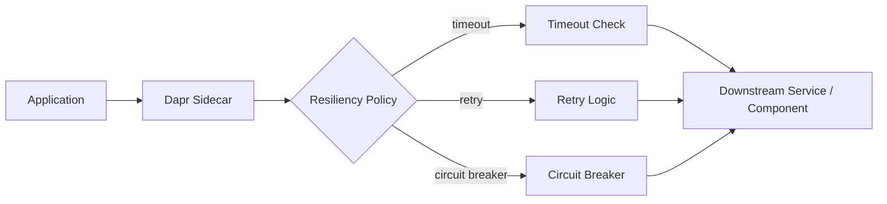
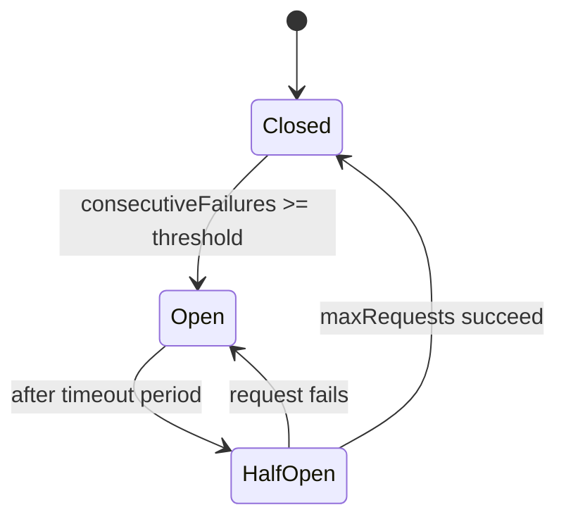

# How to Understand Dapr Resiliency Policies

Author: [nawazdhandala](https://www.github.com/nawazdhandala)

Tags: Dapr, Resiliency, Retry, Circuit Breaker, Timeout

Description: Learn how to define Dapr resiliency policies for retries, timeouts, and circuit breakers to make your microservices fault-tolerant and self-healing.

---

## What Are Dapr Resiliency Policies?

Dapr resiliency policies let you define retry logic, timeout limits, and circuit breaker behavior declaratively in YAML. You apply them to service invocation calls, state store operations, pub/sub subscriptions, and actor calls - without writing retry loops in your application code.



## Resiliency YAML Structure

A `Resiliency` resource has three sections: `policies` (defining named retry, timeout, and circuit breaker configurations), and `targets` (binding policies to specific services, components, or actors).

```yaml
apiVersion: dapr.io/v1alpha1
kind: Resiliency
metadata:
  name: myresiliency
  namespace: default
spec:
  policies:
    retries:
      retryForever:
        policy: constant
        duration: 5s
        maxRetries: -1
      shortRetry:
        policy: exponential
        maxInterval: 15s
        maxRetries: 3
    timeouts:
      general: 5s
      longOp: 30s
    circuitBreakers:
      simpleCB:
        maxRequests: 1
        interval: 8s
        timeout: 45s
        trip: consecutiveFailures >= 5
  targets:
    apps:
      payment-service:
        timeout: general
        retry: shortRetry
        circuitBreaker: simpleCB
    components:
      statestore:
        outbound:
          timeout: general
          retry: retryForever
    actors:
      myactortype:
        timeout: longOp
        retry: shortRetry
        circuitBreaker: simpleCB
        circuitBreakerScope: type
```

## Retry Policies

### Constant Backoff

Retries at a fixed interval:

```yaml
retries:
  constantRetry:
    policy: constant
    duration: 2s        # wait 2 seconds between retries
    maxRetries: 5       # -1 for infinite
```

### Exponential Backoff

Doubles the wait time after each failure:

```yaml
retries:
  expRetry:
    policy: exponential
    initialInterval: 500ms    # first retry after 500ms
    maxInterval: 30s          # cap at 30 seconds
    multiplier: 1.5           # growth factor
    randomizationFactor: 0.5  # jitter
    maxRetries: 10
```

### When Retries Apply

Retries activate on network errors, `429 Too Many Requests`, and `5xx` responses. They do not activate on `4xx` errors (client errors) by default.

## Timeouts

Timeouts abort an operation if it does not complete within the specified duration:

```yaml
timeouts:
  fast: 1s
  normal: 5s
  slow: 60s
```

Apply a timeout to a specific target:

```yaml
targets:
  apps:
    inventory-service:
      timeout: normal
```

If the timeout expires, Dapr returns a `504 Gateway Timeout` to your application.

## Circuit Breakers

A circuit breaker prevents cascading failures by stopping calls to a failing target.



Circuit breaker states:
- **Closed**: Normal operation. Calls pass through.
- **Open**: Failures exceeded threshold. Calls fail immediately without hitting the target.
- **Half-Open**: Test phase. A limited number of calls are allowed through.

```yaml
circuitBreakers:
  productCB:
    maxRequests: 1          # requests allowed in half-open state
    interval: 8s            # window for counting failures
    timeout: 45s            # how long to stay open before moving to half-open
    trip: consecutiveFailures >= 5
```

## Applying Policies to App-to-App Calls

```yaml
targets:
  apps:
    checkout-service:
      timeout: normal
      retry: expRetry
      circuitBreaker: productCB
```

When your app calls `/v1.0/invoke/checkout-service/method/...`, the sidecar automatically applies these policies.

## Applying Policies to Components

```yaml
targets:
  components:
    statestore:
      outbound:
        timeout: normal
        retry: expRetry
    kafka-pubsub:
      outbound:
        timeout: fast
        retry: constantRetry
      inbound:
        timeout: slow
        retry: retryForever
```

`outbound` covers writes to the component; `inbound` covers messages coming from the component (e.g., pub/sub delivery to your app).

## Actor Resiliency

```yaml
targets:
  actors:
    OrderActor:
      timeout: normal
      retry: expRetry
      circuitBreaker: productCB
      circuitBreakerScope: type  # "id" or "type"
```

`circuitBreakerScope: type` means one circuit breaker per actor type. `circuitBreakerScope: id` means one circuit breaker per actor instance.

## Registering a Resiliency Resource

In self-hosted mode, place the YAML in your components directory:

```bash
cp myresiliency.yaml ~/.dapr/components/
```

In Kubernetes:

```bash
kubectl apply -f myresiliency.yaml -n default
```

Verify it is loaded:

```bash
dapr resiliency --app-id myapp
```

## Testing Resiliency

You can test circuit breaker behavior by stopping a downstream service and observing that your app receives fast failures after the threshold:

```bash
# Stop the target service and call it repeatedly
for i in {1..10}; do
  curl -w "\nHTTP %{http_code}\n" http://localhost:3500/v1.0/invoke/payment-service/method/pay \
    -H "Content-Type: application/json" \
    -d '{"amount": 100}'
done
```

After 5 consecutive failures, subsequent calls return `503 Service Unavailable` immediately while the circuit is open.

## Summary

Dapr resiliency policies define retry, timeout, and circuit breaker behavior in YAML and apply them declaratively to app-to-app calls, component operations, and actor invocations. Constant and exponential backoff retries handle transient failures; timeouts prevent hanging calls from blocking threads; and circuit breakers stop cascading failures by opening when a target exceeds a failure threshold. These policies require no application code changes.
