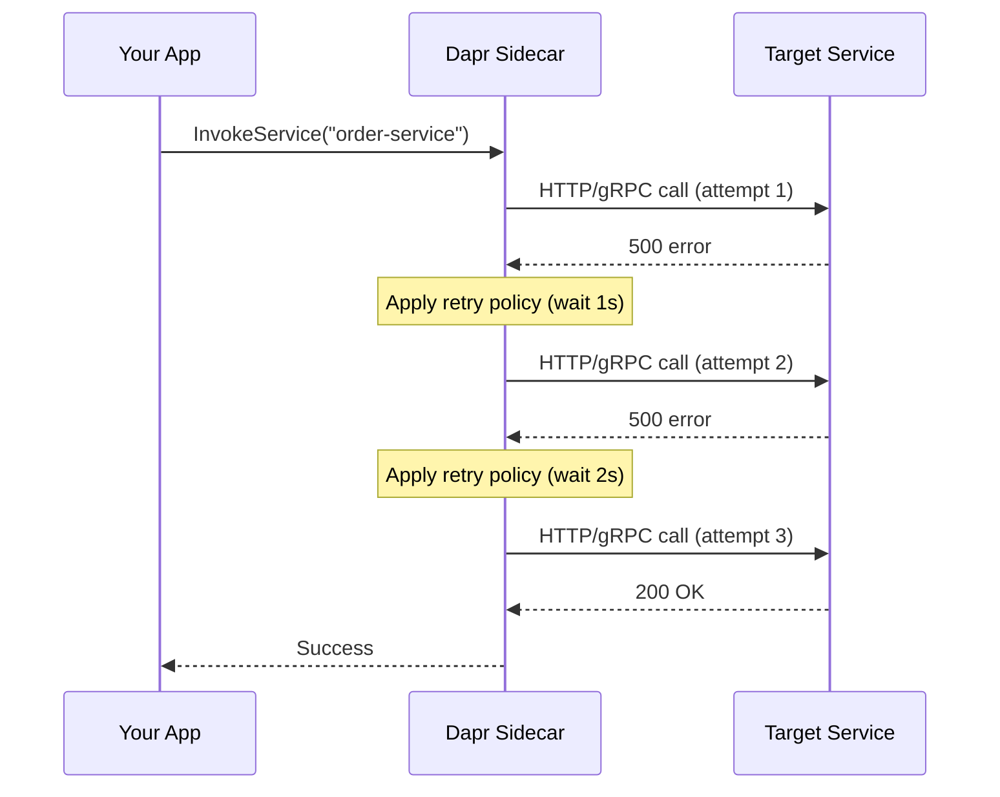

# How to Configure Dapr Retry Policies with Resiliency CRD

Author: [nawazdhandala](https://www.github.com/nawazdhandala)

Tags: Dapr, Resiliency, Retry, Microservice, Kubernetes

Description: Configure automatic retry policies for Dapr service invocation and pub/sub using the Resiliency CRD with constant, linear, and exponential backoff strategies.

---

## Overview

Dapr's Resiliency API lets you declare retry policies as YAML without changing application code. The `Resiliency` CRD (or local YAML file) defines named policies that are applied to service invocations, state stores, and pub/sub components.

## How Resiliency Works



## Resiliency Policy Structure

```yaml
apiVersion: dapr.io/v1alpha1
kind: Resiliency
metadata:
  name: myresiliency
spec:
  policies:
    retries:
      <policy-name>:
        policy: <constant|linear|exponential>
        duration: <duration>
        maxInterval: <duration>
        maxRetries: <int>
    timeouts:
      <policy-name>: <duration>
    circuitBreakers:
      <policy-name>: ...
  targets:
    apps:
      <app-id>:
        retry: <policy-name>
        timeout: <policy-name>
        circuitBreaker: <policy-name>
    components:
      <component-name>:
        inbound:
          retry: <policy-name>
        outbound:
          retry: <policy-name>
```

## Retry Policy Types

### Constant Backoff

Each retry waits a fixed duration:

```yaml
apiVersion: dapr.io/v1alpha1
kind: Resiliency
metadata:
  name: order-resiliency
  namespace: default
spec:
  policies:
    retries:
      constantRetry:
        policy: constant
        duration: 1s
        maxRetries: 5

  targets:
    apps:
      order-service:
        retry: constantRetry
```

### Linear Backoff

Wait time increases linearly with each attempt (`duration * attempt`):

```yaml
spec:
  policies:
    retries:
      linearRetry:
        policy: linear
        duration: 500ms
        maxInterval: 10s
        maxRetries: 8

  targets:
    apps:
      payment-service:
        retry: linearRetry
```

### Exponential Backoff

Wait time doubles each attempt (most common for production):

```yaml
spec:
  policies:
    retries:
      exponentialRetry:
        policy: exponential
        initialInterval: 100ms
        maxInterval: 30s
        maxRetries: 10
        multiplier: 2.0

  targets:
    apps:
      inventory-service:
        retry: exponentialRetry
```

## Apply Retry to Multiple Targets

```yaml
apiVersion: dapr.io/v1alpha1
kind: Resiliency
metadata:
  name: global-resiliency
  namespace: production
spec:
  policies:
    retries:
      defaultRetry:
        policy: exponential
        initialInterval: 200ms
        maxInterval: 60s
        maxRetries: 5

  targets:
    apps:
      order-service:
        retry: defaultRetry
      inventory-service:
        retry: defaultRetry
      payment-service:
        retry: defaultRetry
    components:
      statestore:
        outbound:
          retry: defaultRetry
      pubsub:
        outbound:
          retry: defaultRetry
```

## Retry with Jitter

Add jitter to avoid thundering herd on retry storms:

```yaml
spec:
  policies:
    retries:
      jitteredRetry:
        policy: exponential
        initialInterval: 100ms
        maxInterval: 30s
        maxRetries: 7
        multiplier: 1.5
        matchHttpResponseCodes: [429, 500, 502, 503, 504]
```

## Pub/Sub Inbound Retry

Apply retry to the sidecar calling your subscriber endpoint:

```yaml
spec:
  policies:
    retries:
      pubsubRetry:
        policy: constant
        duration: 2s
        maxRetries: 3

  targets:
    components:
      pubsub:
        inbound:
          retry: pubsubRetry
```

## Self-Hosted Mode (Local YAML)

In self-hosted mode, place the Resiliency file in the components directory:

```bash
dapr run \
  --app-id order-service \
  --components-path ./components \
  -- go run main.go
```

```yaml
# components/resiliency.yaml
apiVersion: dapr.io/v1alpha1
kind: Resiliency
metadata:
  name: order-resiliency
spec:
  policies:
    retries:
      defaultRetry:
        policy: exponential
        initialInterval: 100ms
        maxInterval: 15s
        maxRetries: 5
  targets:
    apps:
      inventory-service:
        retry: defaultRetry
```

## Kubernetes Mode

Apply to the cluster:

```bash
kubectl apply -f resiliency.yaml
```

Verify it is loaded:

```bash
kubectl get resiliency -n default
kubectl describe resiliency order-resiliency -n default
```

## Verify Retry Behaviour with Dapr Logs

```bash
# In self-hosted mode
dapr run --app-id order-service --log-level debug -- go run main.go

# Look for retry log lines:
# DEBU[...] App returned non-successful status code 500. Retrying...
# DEBU[...] Backoff duration: 200ms
```

## Summary

Dapr Resiliency CRD allows you to declare retry policies (constant, linear, exponential) in YAML and bind them to service invocations or component calls without changing application code. Policies are named and reused across multiple targets. For production systems, exponential backoff with jitter and `matchHttpResponseCodes` filtering is the recommended pattern to handle transient failures gracefully.
