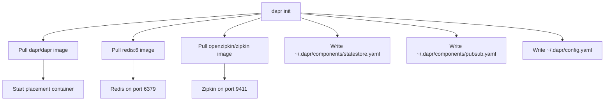
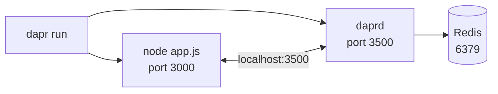

# How to Run Your First Dapr Application Locally

Author: [nawazdhandala](https://www.github.com/nawazdhandala)

Tags: Dapr, Getting Started, Local Development, Self-Hosted, Microservice

Description: A step-by-step guide to running your first Dapr application locally using the Dapr CLI, covering prerequisites, sidecar startup, and basic API calls.

---

## What You Will Build

In this guide you will install the Dapr CLI, initialize the local Dapr environment, write a minimal HTTP service, and run it with a Dapr sidecar. By the end you will have a service that reads and writes state through the Dapr API.

## Prerequisites

- Docker Desktop installed and running
- Node.js 18+ or Python 3.9+ (examples use both)
- A terminal on macOS, Linux, or Windows (WSL2)

## Step 1 - Install the Dapr CLI

```bash
# macOS
brew install dapr/tap/dapr-cli

# Linux
wget -q https://raw.githubusercontent.com/dapr/cli/master/install/install.sh -O - | /bin/bash

# Windows (PowerShell)
powershell -Command "iwr -useb https://raw.githubusercontent.com/dapr/cli/master/install/install.ps1 | iex"
```

Verify the installation:

```bash
dapr --version
```

Expected output:

```text
CLI version: 1.14.0
Runtime version: n/a
```

## Step 2 - Initialize Dapr

```bash
dapr init
```

This command pulls Docker images for Redis, Zipkin, and the Dapr placement service, then writes default component YAML files under `~/.dapr/components/`.



Verify the running containers:

```bash
docker ps --format "table {{.Names}}\t{{.Image}}\t{{.Ports}}"
```

## Step 3 - Write a Simple Application

Create a directory and a minimal HTTP server:

```bash
mkdir hello-dapr && cd hello-dapr
```

**app.js** (Node.js):

```javascript
const express = require('express');
const axios = require('axios');
const app = express();
app.use(express.json());

const DAPR_HTTP_PORT = process.env.DAPR_HTTP_PORT || 3500;
const STATE_URL = `http://localhost:${DAPR_HTTP_PORT}/v1.0/state/statestore`;

app.post('/order', async (req, res) => {
  const { orderId, item } = req.body;
  await axios.post(STATE_URL, [{ key: orderId, value: { item, status: 'new' } }]);
  res.json({ saved: true, orderId });
});

app.get('/order/:id', async (req, res) => {
  const r = await axios.get(`${STATE_URL}/${req.params.id}`);
  res.json(r.data);
});

app.listen(3000, () => console.log('App listening on port 3000'));
```

Install dependencies:

```bash
npm init -y && npm install express axios
```

## Step 4 - Run the Application with a Dapr Sidecar

```bash
dapr run \
  --app-id order-service \
  --app-port 3000 \
  --dapr-http-port 3500 \
  -- node app.js
```

The CLI starts two processes: your application and the `daprd` sidecar.



## Step 5 - Test the Application

In a new terminal, save an order:

```bash
curl -X POST http://localhost:3000/order \
  -H "Content-Type: application/json" \
  -d '{"orderId": "ord-001", "item": "widget"}'
```

Response:

```json
{"saved": true, "orderId": "ord-001"}
```

Retrieve the order:

```bash
curl http://localhost:3000/order/ord-001
```

Response:

```json
{"item": "widget", "status": "new"}
```

You can also call the state API directly through the Dapr sidecar:

```bash
curl http://localhost:3500/v1.0/state/statestore/ord-001
```

## Step 6 - View the Dashboard

```bash
dapr dashboard
```

Open `http://localhost:8080` to see your running application, loaded components, and configuration.

## Step 7 - Stop the Application

Press `Ctrl+C` in the terminal running `dapr run`. The sidecar and application both stop.

## What the Default Components Provide

```yaml
# ~/.dapr/components/statestore.yaml
apiVersion: dapr.io/v1alpha1
kind: Component
metadata:
  name: statestore
spec:
  type: state.redis
  version: v1
  metadata:
  - name: redisHost
    value: localhost:6379
  - name: actorStateStore
    value: "true"
```

```yaml
# ~/.dapr/components/pubsub.yaml
apiVersion: dapr.io/v1alpha1
kind: Component
metadata:
  name: pubsub
spec:
  type: pubsub.redis
  version: v1
  metadata:
  - name: redisHost
    value: localhost:6379
```

## Next Steps

- Add a pub/sub subscriber to your application
- Explore the Dapr building blocks documentation
- Move to Kubernetes using `dapr init --kubernetes`

## Summary

Running your first Dapr application locally takes under ten minutes. The Dapr CLI bootstraps a Redis state store, a Zipkin tracing backend, and a placement service. Your application talks to the Dapr sidecar over localhost on port 3500 and gains access to state management, pub/sub, and all other building blocks without any infrastructure code in your service.
