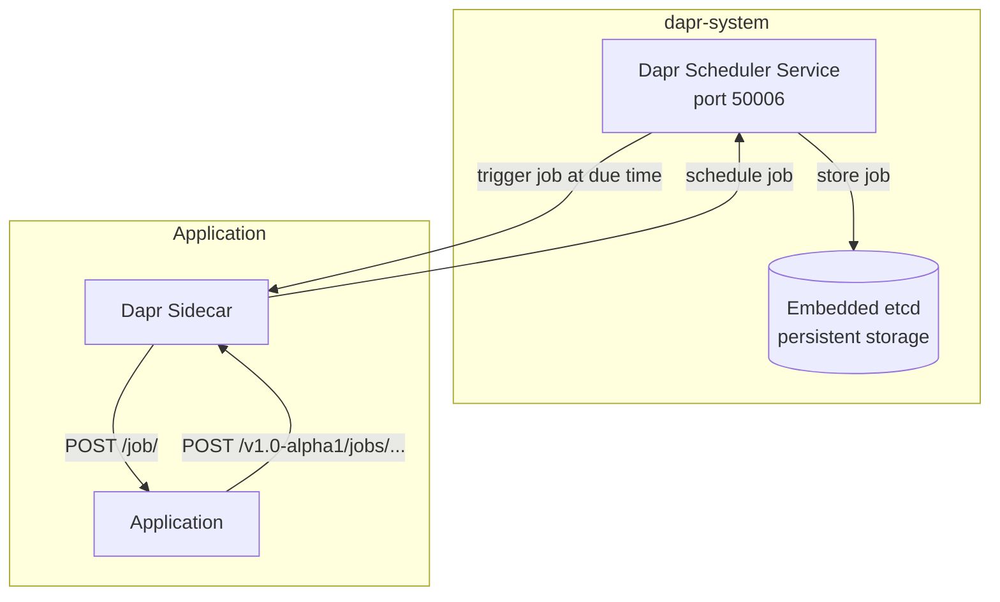
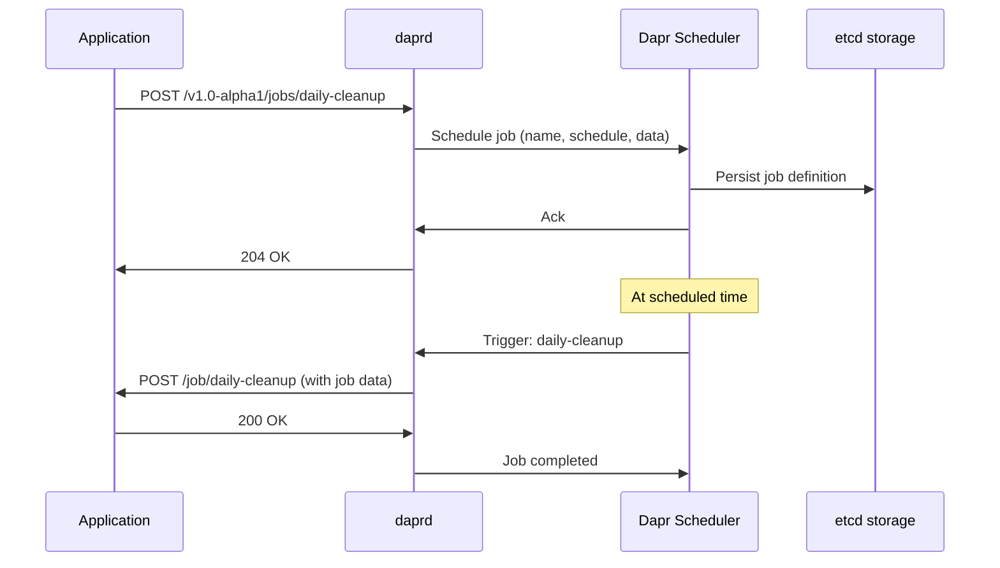

# How to Understand the Dapr Scheduler Service

Author: [nawazdhandala](https://www.github.com/nawazdhandala)

Tags: Dapr, Scheduler Service, Job, Control Plane, Cron

Description: Learn what the Dapr Scheduler service does, how it stores and triggers durable jobs, and how it differs from the cron binding for scheduling work in your microservices.

---

## What Is the Dapr Scheduler Service?

The Dapr Scheduler service is a control plane component introduced in Dapr 1.14 that stores and triggers scheduled jobs durably. Unlike the `bindings.cron` binding which uses in-memory scheduling, the Scheduler service persists job definitions and survives sidecar restarts. It is the backend for the Dapr Jobs API building block.



## How the Scheduler Works

The Scheduler service embeds `etcd` for durable job storage. When you schedule a job through the Dapr Jobs API, the sidecar sends the job definition to the Scheduler, which persists it. At the scheduled time, the Scheduler triggers a callback to the sidecar, which then calls your application endpoint.



## Scheduler vs. Cron Binding

| Feature | Scheduler Service | Cron Binding |
|---------|------------------|-------------|
| Storage | Persistent (etcd) | In-memory |
| Survives restart | Yes | No |
| API | Jobs API | Binding trigger |
| Scheduling | One-time and recurring | Recurring only |
| Job payload | Supported | Not supported |
| Cancellation | Supported | Not supported |

Use the Scheduler service for production jobs that must not be missed. Use cron bindings for simple recurring tasks where loss on restart is acceptable.

## Installing and Checking the Scheduler

The Scheduler service is deployed as part of the Dapr control plane:

```bash
# Check the scheduler pod
kubectl get pods -n dapr-system -l app=dapr-scheduler-server

# View scheduler logs
kubectl logs -n dapr-system -l app=dapr-scheduler-server --tail=50
```

In self-hosted mode, the Scheduler starts as a Docker container with `dapr init` (Dapr 1.14+):

```bash
docker ps | grep scheduler
```

## Scheduling a Job

```bash
curl -X POST http://localhost:3500/v1.0-alpha1/jobs/send-report \
  -H "Content-Type: application/json" \
  -d '{
    "schedule": "@every 24h",
    "data": {
      "reportType": "daily-sales",
      "recipients": ["team@example.com"]
    }
  }'
```

Schedule formats:

```text
@every 30s         - every 30 seconds
@every 1h          - every hour
@daily             - once per day at midnight
@weekly            - once per week
0 9 * * 1-5        - 09:00 Monday through Friday (cron syntax)
```

## One-Time Jobs

```bash
curl -X POST http://localhost:3500/v1.0-alpha1/jobs/process-batch \
  -H "Content-Type: application/json" \
  -d '{
    "dueTime": "2026-04-01T08:00:00Z",
    "data": {
      "batchId": "batch-march-2026"
    }
  }'
```

The job fires once at the specified time and is removed after execution.

## Handling Job Triggers in Your Application

Your application must expose a `POST /job/<job-name>` endpoint:

```javascript
// Node.js Express
app.post('/job/send-report', (req, res) => {
  const { reportType, recipients } = req.body.data || req.body;
  console.log(`Generating ${reportType} report for ${recipients}`);
  // do work here
  res.status(200).send();
});
```

```python
# Python Flask
@app.route('/job/send-report', methods=['POST'])
def handle_send_report():
    data = request.get_json()
    report_type = data.get('reportType')
    print(f'Processing {report_type}')
    return '', 200
```

## Getting Job Status

```bash
curl http://localhost:3500/v1.0-alpha1/jobs/send-report
```

Response:

```json
{
  "name": "send-report",
  "schedule": "@every 24h",
  "data": {"reportType": "daily-sales"},
  "status": {
    "lastRunTime": "2026-03-31T00:00:00Z",
    "nextRunTime": "2026-04-01T00:00:00Z"
  }
}
```

## Deleting a Job

```bash
curl -X DELETE http://localhost:3500/v1.0-alpha1/jobs/send-report
```

## High Availability

Run the Scheduler with 3 replicas for production:

```yaml
dapr_scheduler:
  replicaCount: 3
  etcd:
    dataDir: /var/run/dapr/scheduler
    storageClassName: fast-ssd
```

```bash
helm upgrade dapr dapr/dapr \
  --namespace dapr-system \
  --set dapr_scheduler.replicaCount=3
```

The embedded etcd cluster uses Raft consensus and requires an odd number of replicas.

## Scheduler Port Configuration

The Scheduler listens on port `50006` by default. Sidecars discover it through the `dapr-scheduler-server` Kubernetes service.

```bash
kubectl get svc -n dapr-system dapr-scheduler-server
```

## Summary

The Dapr Scheduler service is a durable job scheduling backend that persists job definitions in an embedded etcd cluster. It supports one-time and recurring schedules, job payloads, and cancellation through the Jobs API. Unlike the cron binding, scheduled jobs survive sidecar and service restarts. In production, deploy the Scheduler with 3 replicas using Raft consensus for high availability.
