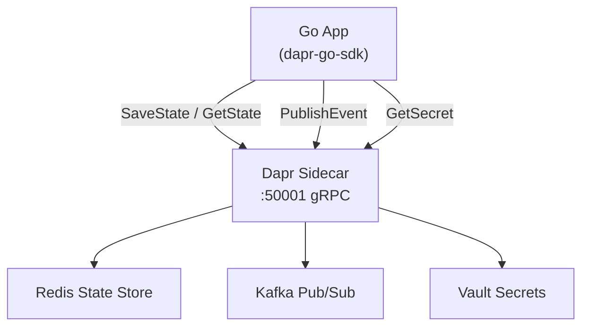

# How to Use Dapr SDK for Go to Build Microservices

Author: [nawazdhandala](https://www.github.com/nawazdhandala)

Tags: Dapr, Go, SDK, Microservice, State Management

Description: Build microservices in Go using the official Dapr Go SDK for state management, service invocation, pub/sub messaging, and secret retrieval.

---

## Overview

The Dapr Go SDK (`github.com/dapr/go-sdk`) wraps the Dapr gRPC API into idiomatic Go interfaces. It provides a `Client` for calling Dapr APIs and a `Service` helper to host your app so the sidecar can call back into it.

## Architecture



## Prerequisites

```bash
# Initialize Dapr (self-hosted)
dapr init

# Create a Go module
mkdir order-service && cd order-service
go mod init github.com/example/order-service

# Add the Dapr SDK
go get github.com/dapr/go-sdk@latest
```

## Step 1: Create the Dapr Client

```go
// main.go
package main

import (
    "context"
    "encoding/json"
    "fmt"
    "log"

    dapr "github.com/dapr/go-sdk/client"
)

func main() {
    // NewClient reads DAPR_GRPC_PORT from the environment
    client, err := dapr.NewClient()
    if err != nil {
        log.Fatalf("failed to create Dapr client: %v", err)
    }
    defer client.Close()

    ctx := context.Background()

    // --- State Management ---
    type Order struct {
        ID    string  `json:"id"`
        Total float64 `json:"total"`
    }

    order := Order{ID: "order-1", Total: 99.95}
    data, _ := json.Marshal(order)

    err = client.SaveStateWithETag(ctx, "statestore", "order-1", data, nil, nil)
    if err != nil {
        log.Fatalf("SaveState error: %v", err)
    }

    item, err := client.GetState(ctx, "statestore", "order-1", nil)
    if err != nil {
        log.Fatalf("GetState error: %v", err)
    }
    fmt.Printf("Retrieved: %s\n", item.Value)

    // --- Publish Event ---
    err = client.PublishEvent(ctx, "pubsub", "orders", data)
    if err != nil {
        log.Fatalf("PublishEvent error: %v", err)
    }
    fmt.Println("Event published")

    // --- Service Invocation ---
    content := &dapr.DataContent{
        ContentType: "application/json",
        Data:        []byte(`{"query":"status"}`),
    }
    resp, err := client.InvokeMethodWithContent(ctx, "inventory-service", "checkStock", "post", content)
    if err != nil {
        log.Fatalf("InvokeMethod error: %v", err)
    }
    fmt.Printf("Inventory response: %s\n", resp)

    // --- Secret Retrieval ---
    secret, err := client.GetSecret(ctx, "secretstore", "db-password", nil)
    if err != nil {
        log.Fatalf("GetSecret error: %v", err)
    }
    fmt.Printf("DB password: %s\n", secret["db-password"])
}
```

## Step 2: Host a Dapr Service (Receive Invocations and Pub/Sub)

```go
// service.go
package main

import (
    "context"
    "encoding/json"
    "fmt"
    "log"

    "github.com/dapr/go-sdk/service/common"
    daprd "github.com/dapr/go-sdk/service/grpc"
)

type Order struct {
    ID    string  `json:"id"`
    Total float64 `json:"total"`
}

func handleInvoke(ctx context.Context, in *common.InvocationEvent) (out *common.Content, err error) {
    fmt.Printf("Invoked: method=%s data=%s\n", in.Verb, in.Data)
    return &common.Content{
        Data:        []byte(`{"status":"received"}`),
        ContentType: "application/json",
    }, nil
}

func handleOrder(ctx context.Context, e *common.TopicEvent) (retry bool, err error) {
    var order Order
    if err := json.Unmarshal(e.RawData, &order); err != nil {
        return false, err
    }
    fmt.Printf("Order received: %+v\n", order)
    return false, nil
}

func main() {
    // gRPC service on port 6000
    s, err := daprd.NewService(":6000")
    if err != nil {
        log.Fatalf("failed to start service: %v", err)
    }

    // Register service invocation handler
    s.AddServiceInvocationHandler("processOrder", handleInvoke)

    // Register pub/sub handler
    s.AddTopicEventHandler(&common.Subscription{
        PubsubName: "pubsub",
        Topic:      "orders",
        Route:      "/orders",
    }, handleOrder)

    if err := s.Start(); err != nil {
        log.Fatalf("service error: %v", err)
    }
}
```

## Step 3: Run with Dapr

```bash
dapr run \
  --app-id order-service \
  --app-port 6000 \
  --app-protocol grpc \
  --dapr-grpc-port 50001 \
  --components-path ./components \
  -- go run .
```

## Step 4: State Transactions

```go
ops := make([]*dapr.StateOperation, 0)

ops = append(ops, &dapr.StateOperation{
    Type: dapr.StateOperationTypeUpsert,
    Item: &dapr.SetStateItem{
        Key:   "order-2",
        Value: []byte(`{"id":"order-2","total":49.99}`),
    },
})
ops = append(ops, &dapr.StateOperation{
    Type: dapr.StateOperationTypeDelete,
    Item: &dapr.SetStateItem{
        Key: "order-1",
    },
})

err = client.ExecuteStateTransaction(ctx, "statestore", nil, ops)
```

## Step 5: Bulk State Operations

```go
// Bulk save
items := []*dapr.SetStateItem{
    {Key: "k1", Value: []byte(`"v1"`)},
    {Key: "k2", Value: []byte(`"v2"`)},
}
err = client.SaveBulkState(ctx, "statestore", items...)

// Bulk get
keys := []string{"k1", "k2"}
bulkItems, err := client.GetBulkState(ctx, "statestore", keys, nil, 0)
for _, item := range bulkItems {
    fmt.Printf("%s = %s\n", item.Key, item.Value)
}
```

## Component YAML Files

```yaml
# components/statestore.yaml
apiVersion: dapr.io/v1alpha1
kind: Component
metadata:
  name: statestore
spec:
  type: state.redis
  version: v1
  metadata:
  - name: redisHost
    value: localhost:6379
  - name: redisPassword
    value: ""
```

```yaml
# components/pubsub.yaml
apiVersion: dapr.io/v1alpha1
kind: Component
metadata:
  name: pubsub
spec:
  type: pubsub.redis
  version: v1
  metadata:
  - name: redisHost
    value: localhost:6379
```

## Summary

The Dapr Go SDK provides a `dapr.Client` for outbound calls (state, pub/sub, secrets, service invocation) and a `daprd.NewService` helper for hosting a gRPC app that the sidecar can invoke. All SDK calls ultimately translate to gRPC calls against the Dapr sidecar on `DAPR_GRPC_PORT`, keeping your business logic decoupled from the underlying infrastructure components.
