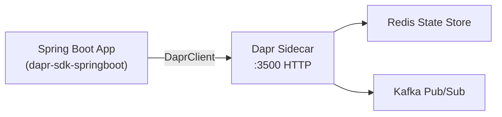

# How to Use Dapr SDK for Java to Build Microservices

Author: [nawazdhandala](https://www.github.com/nawazdhandala)

Tags: Dapr, Java, SDK, Microservice, Spring Boot

Description: Use the official Dapr Java SDK with Spring Boot to build microservices with state management, pub/sub, service invocation, and actors.

---

## Overview

The Dapr Java SDK (`io.dapr:dapr-sdk`) integrates natively with Spring Boot through the `dapr-sdk-springboot` extension. It provides a reactive `DaprClient` backed by Project Reactor and annotated controllers for receiving service invocations and pub/sub events.

## Architecture



## Prerequisites

Add the Dapr SDK dependencies to `pom.xml`:

```xml
<dependency>
  <groupId>io.dapr</groupId>
  <artifactId>dapr-sdk</artifactId>
  <version>1.13.0</version>
</dependency>
<dependency>
  <groupId>io.dapr</groupId>
  <artifactId>dapr-sdk-springboot</artifactId>
  <version>1.13.0</version>
</dependency>
```

Or in `build.gradle`:

```groovy
implementation 'io.dapr:dapr-sdk:1.13.0'
implementation 'io.dapr:dapr-sdk-springboot:1.13.0'
```

## Step 1: Dapr Client Bean

```java
// DaprConfig.java
package com.example.orderservice;

import io.dapr.client.DaprClient;
import io.dapr.client.DaprClientBuilder;
import org.springframework.context.annotation.Bean;
import org.springframework.context.annotation.Configuration;

@Configuration
public class DaprConfig {
    @Bean
    public DaprClient daprClient() {
        return new DaprClientBuilder().build();
    }
}
```

## Step 2: State Management

```java
// StateService.java
package com.example.orderservice;

import io.dapr.client.DaprClient;
import io.dapr.client.domain.State;
import org.springframework.stereotype.Service;
import reactor.core.publisher.Mono;

@Service
public class StateService {
    private static final String STORE = "statestore";
    private final DaprClient daprClient;

    public StateService(DaprClient daprClient) {
        this.daprClient = daprClient;
    }

    public void saveOrder(String orderId, Order order) {
        daprClient.saveState(STORE, orderId, order)
            .block(); // block for simplicity; use .subscribe() in reactive code
    }

    public Order getOrder(String orderId) {
        State<Order> state = daprClient
            .getState(STORE, orderId, Order.class)
            .block();
        return state != null ? state.getValue() : null;
    }

    public void deleteOrder(String orderId) {
        daprClient.deleteState(STORE, orderId).block();
    }
}
```

## Step 3: Publish Events

```java
// PublishService.java
package com.example.orderservice;

import io.dapr.client.DaprClient;
import org.springframework.stereotype.Service;

@Service
public class PublishService {
    private final DaprClient daprClient;

    public PublishService(DaprClient daprClient) {
        this.daprClient = daprClient;
    }

    public void publishOrder(Order order) {
        daprClient.publishEvent("pubsub", "orders", order)
            .block();
        System.out.println("Published order: " + order.getId());
    }
}
```

## Step 4: Subscribe to Events with Spring Controller

```java
// OrderSubscriberController.java
package com.example.orderservice;

import io.dapr.Topic;
import io.dapr.client.domain.CloudEvent;
import org.springframework.web.bind.annotation.PostMapping;
import org.springframework.web.bind.annotation.RequestBody;
import org.springframework.web.bind.annotation.RestController;

@RestController
public class OrderSubscriberController {

    @Topic(name = "orders", pubsubName = "pubsub")
    @PostMapping("/orders")
    public void handleOrder(@RequestBody CloudEvent<Order> event) {
        Order order = event.getData();
        System.out.printf("Received order id=%s total=%.2f%n",
            order.getId(), order.getTotal());
    }
}
```

## Step 5: Handle Service Invocations

```java
// InvokeController.java
package com.example.orderservice;

import org.springframework.web.bind.annotation.PostMapping;
import org.springframework.web.bind.annotation.RequestBody;
import org.springframework.web.bind.annotation.RestController;

@RestController
public class InvokeController {

    @PostMapping("/processOrder")
    public java.util.Map<String, String> processOrder(@RequestBody Order order) {
        System.out.println("Invoked: " + order.getId());
        return java.util.Map.of("status", "received");
    }
}
```

## Step 6: Call Another Service

```java
// ServiceInvoker.java
package com.example.orderservice;

import io.dapr.client.DaprClient;
import io.dapr.client.domain.HttpExtension;
import org.springframework.stereotype.Service;

@Service
public class ServiceInvoker {
    private final DaprClient daprClient;

    public ServiceInvoker(DaprClient daprClient) {
        this.daprClient = daprClient;
    }

    public String checkInventory(String productId) {
        return daprClient.invokeMethod(
            "inventory-service",
            "checkStock",
            productId,
            HttpExtension.POST,
            String.class
        ).block();
    }
}
```

## Step 7: Retrieve Secrets

```java
// SecretService.java
package com.example.orderservice;

import io.dapr.client.DaprClient;
import org.springframework.stereotype.Service;
import java.util.Map;

@Service
public class SecretService {
    private final DaprClient daprClient;

    public SecretService(DaprClient daprClient) {
        this.daprClient = daprClient;
    }

    public String getDbPassword() {
        Map<String, String> secrets = daprClient
            .getSecret("secretstore", "db-password")
            .block();
        return secrets != null ? secrets.get("db-password") : null;
    }
}
```

## Application Properties

```yaml
# src/main/resources/application.yaml
spring:
  application:
    name: order-service

server:
  port: 8080

dapr:
  http:
    port: 3500
```

## Run with Dapr

```bash
dapr run \
  --app-id order-service \
  --app-port 8080 \
  --dapr-http-port 3500 \
  --components-path ./components \
  -- java -jar target/order-service.jar
```

## Order Model

```java
// Order.java
package com.example.orderservice;

public class Order {
    private String id;
    private double total;

    public Order() {}
    public Order(String id, double total) {
        this.id = id;
        this.total = total;
    }
    public String getId() { return id; }
    public void setId(String id) { this.id = id; }
    public double getTotal() { return total; }
    public void setTotal(double total) { this.total = total; }
}
```

## Summary

The Dapr Java SDK integrates with Spring Boot via annotations and auto-configuration. `DaprClient` provides a reactive API for state, pub/sub, service invocation, and secrets. The `@Topic` annotation on a Spring MVC controller automatically registers pub/sub subscriptions with the sidecar. Service invocations are received through standard `@PostMapping` or `@GetMapping` endpoints, making Dapr transparent to the Spring framework.
