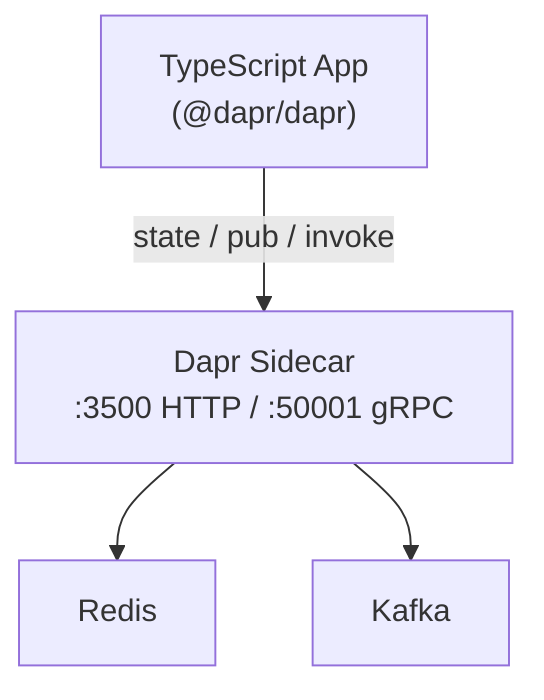

# How to Use Dapr SDK for JavaScript/TypeScript to Build Microservices

Author: [nawazdhandala](https://www.github.com/nawazdhandala)

Tags: Dapr, TypeScript, JavaScript, SDK, Microservice

Description: Use the official Dapr JavaScript SDK to build Node.js microservices with state management, pub/sub, service invocation, and actor support.

---

## Overview

The Dapr JavaScript SDK (`@dapr/dapr`) supports both JavaScript and TypeScript. It exposes a `DaprClient` for calling Dapr APIs and a `DaprServer` for hosting your app so the sidecar can call back in. The SDK communicates with the sidecar over HTTP by default and can be switched to gRPC.

## Architecture



## Prerequisites

```bash
npm init -y
npm install @dapr/dapr
npm install -D typescript ts-node @types/node
npx tsc --init
dapr init
```

## Step 1: Dapr Client for Outbound Calls

```typescript
// src/client.ts
import { DaprClient, CommunicationProtocolEnum } from "@dapr/dapr";

const DAPR_HOST = process.env.DAPR_HOST ?? "http://localhost";
const DAPR_HTTP_PORT = process.env.DAPR_HTTP_PORT ?? "3500";

async function main() {
  const client = new DaprClient({
    daprHost: DAPR_HOST,
    daprPort: DAPR_HTTP_PORT,
    communicationProtocol: CommunicationProtocolEnum.HTTP,
  });

  // --- State Management ---
  const order = { id: "order-1", total: 99.95 };
  await client.state.save("statestore", [
    { key: "order-1", value: order },
  ]);

  const saved = await client.state.get("statestore", "order-1");
  console.log("Retrieved:", saved);

  // --- Publish Event ---
  await client.pubsub.publish("pubsub", "orders", order);
  console.log("Event published");

  // --- Service Invocation ---
  const resp = await client.invoker.invoke(
    "inventory-service",
    "checkStock",
    "POST",
    { query: "status" }
  );
  console.log("Inventory:", resp);

  // --- Secret Retrieval ---
  const secret = await client.secret.get("secretstore", "db-password");
  console.log("Secret:", secret);
}

main().catch(console.error);
```

## Step 2: Dapr Server for Inbound Calls

```typescript
// src/server.ts
import { DaprServer, CommunicationProtocolEnum } from "@dapr/dapr";

const APP_HOST = "localhost";
const APP_PORT = "6000";
const DAPR_HOST = "http://localhost";
const DAPR_HTTP_PORT = "3500";

async function main() {
  const server = new DaprServer({
    serverHost: APP_HOST,
    serverPort: APP_PORT,
    clientOptions: {
      daprHost: DAPR_HOST,
      daprPort: DAPR_HTTP_PORT,
      communicationProtocol: CommunicationProtocolEnum.HTTP,
    },
  });

  // Register service invocation handler
  await server.invoker.listen("processOrder", async (data) => {
    console.log("Invoked with:", data.body);
    return { status: "received" };
  });

  // Register pub/sub subscription handler
  await server.pubsub.subscribe("pubsub", "orders", async (data) => {
    console.log("Order received:", data);
    return { success: true };
  });

  await server.start();
  console.log(`DaprServer listening on port ${APP_PORT}`);
}

main().catch(console.error);
```

Run:

```bash
dapr run \
  --app-id order-service \
  --app-port 6000 \
  --components-path ./components \
  -- npx ts-node src/server.ts
```

## Step 3: State Transactions

```typescript
import { DaprClient } from "@dapr/dapr";

const client = new DaprClient();

await client.state.transaction("statestore", [
  {
    operation: "upsert",
    request: { key: "order-2", value: { id: "order-2", total: 49.99 } },
  },
  {
    operation: "delete",
    request: { key: "order-1" },
  },
]);
```

## Step 4: Bulk State Operations

```typescript
// Bulk save
await client.state.saveBulk("statestore", [
  { key: "k1", value: "v1" },
  { key: "k2", value: "v2" },
]);

// Bulk get
const items = await client.state.getBulk("statestore", ["k1", "k2"]);
items.forEach((item) => console.log(item.key, "=", item.data));
```

## Step 5: Actor Client

```typescript
import { DaprClient, ActorProxyBuilder, ActorId } from "@dapr/dapr";

interface OrderActorInterface {
  process(payload: object): Promise<object>;
}

const client = new DaprClient();
const builder = new ActorProxyBuilder<OrderActorInterface>("OrderActor", client);
const actor = builder.build(new ActorId("order-1"));

const result = await actor.process({ amount: 50 });
console.log(result);
```

## Step 6: gRPC Mode

```typescript
import { DaprClient, CommunicationProtocolEnum } from "@dapr/dapr";

const client = new DaprClient({
  daprHost: "localhost",
  daprPort: "50001",
  communicationProtocol: CommunicationProtocolEnum.GRPC,
});
```

## Component Files

```yaml
# components/statestore.yaml
apiVersion: dapr.io/v1alpha1
kind: Component
metadata:
  name: statestore
spec:
  type: state.redis
  version: v1
  metadata:
  - name: redisHost
    value: localhost:6379
```

```yaml
# components/pubsub.yaml
apiVersion: dapr.io/v1alpha1
kind: Component
metadata:
  name: pubsub
spec:
  type: pubsub.redis
  version: v1
  metadata:
  - name: redisHost
    value: localhost:6379
```

## Summary

The Dapr JavaScript/TypeScript SDK provides `DaprClient` for outbound calls and `DaprServer` for hosting your app as a Dapr service. Both HTTP and gRPC communication protocols are supported. The SDK is fully typed for TypeScript projects and covers state, pub/sub, service invocation, secrets, actors, and more through a consistent API surface.
