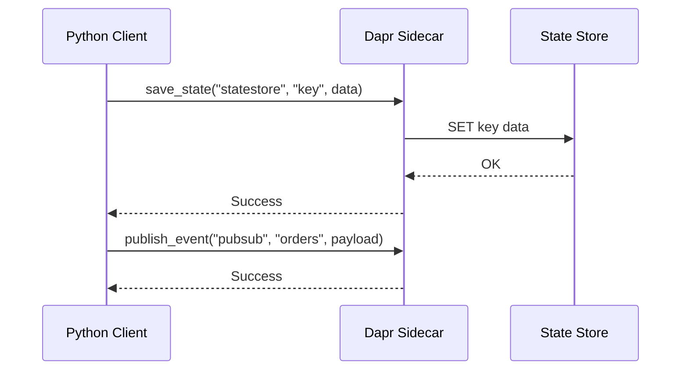

# How to Use Dapr SDK for Python to Build Microservices

Author: [nawazdhandala](https://www.github.com/nawazdhandala)

Tags: Dapr, Python, SDK, Microservice, Pub/Sub

Description: Build Python microservices with the official Dapr Python SDK for state management, pub/sub messaging, service invocation, and secrets.

---

## Overview

The Dapr Python SDK (`dapr-client`) provides an async-first client for interacting with the Dapr sidecar and a FastAPI/Flask extension for receiving invocations and pub/sub events. It communicates with the sidecar over gRPC.

## Architecture



## Prerequisites

```bash
pip install dapr dapr-ext-fastapi fastapi uvicorn
dapr init
```

## Step 1: Create the Dapr Client

```python
# client.py
import asyncio
import json
from dapr.clients import DaprClient

async def main():
    async with DaprClient() as client:
        # --- State Management ---
        order = {"id": "order-1", "total": 99.95}
        await client.save_state(
            store_name="statestore",
            key="order-1",
            value=json.dumps(order),
        )

        result = await client.get_state(store_name="statestore", key="order-1")
        print(f"Retrieved: {result.data}")

        # --- Publish Event ---
        await client.publish_event(
            pubsub_name="pubsub",
            topic_name="orders",
            data=json.dumps(order),
            data_content_type="application/json",
        )
        print("Event published")

        # --- Service Invocation ---
        response = await client.invoke_method(
            app_id="inventory-service",
            method_name="checkStock",
            http_verb="POST",
            data=json.dumps({"query": "status"}),
            content_type="application/json",
        )
        print(f"Inventory: {response.text()}")

        # --- Secret Retrieval ---
        secret = await client.get_secret(
            store_name="secretstore",
            key="db-password",
        )
        print(f"Secret: {secret.secret['db-password']}")

asyncio.run(main())
```

## Step 2: Receive Invocations and Pub/Sub with FastAPI

```python
# app.py
import json
from fastapi import FastAPI
from dapr.ext.fastapi import DaprApp
from dapr.clients.grpc._response import TopicEventResponse

app = FastAPI()
dapr_app = DaprApp(app)

@app.post("/processOrder")
async def process_order(order: dict):
    print(f"Invoked with: {order}")
    return {"status": "received"}

@dapr_app.subscribe(pubsub="pubsub", topic="orders")
async def order_handler(event: dict):
    print(f"Order received: {event['data']}")
    return TopicEventResponse("success")
```

Run:

```bash
dapr run \
  --app-id order-service \
  --app-port 8000 \
  --app-protocol http \
  --components-path ./components \
  -- uvicorn app:app --port 8000
```

## Step 3: State Transactions

```python
from dapr.clients import DaprClient
from dapr.clients.grpc._state import StateItem, TransactionalStateOperation, TransactionOperationType

async with DaprClient() as client:
    ops = [
        TransactionalStateOperation(
            operation_type=TransactionOperationType.upsert,
            item=StateItem(key="order-2", value=json.dumps({"id": "order-2"})),
        ),
        TransactionalStateOperation(
            operation_type=TransactionOperationType.delete,
            item=StateItem(key="order-1", value=""),
        ),
    ]
    await client.execute_state_transaction(store_name="statestore", operations=ops)
```

## Step 4: Bulk State Operations

```python
from dapr.clients.grpc._state import StateItem

async with DaprClient() as client:
    # Bulk save
    items = [
        StateItem(key="k1", value=b'"v1"'),
        StateItem(key="k2", value=b'"v2"'),
    ]
    await client.save_bulk_state(store_name="statestore", states=items)

    # Bulk get
    bulk = await client.get_bulk_state(
        store_name="statestore",
        keys=["k1", "k2"],
        parallelism=10,
    )
    for item in bulk.items:
        print(f"{item.key} = {item.data}")
```

## Step 5: Actor Client

```python
from dapr.actor import ActorProxy, ActorId
from dapr.clients import DaprClient

# Define the actor interface
class OrderActorInterface:
    async def process(self, payload: dict) -> dict: ...

async with DaprClient() as _:
    proxy = ActorProxy.create(
        actor_type="OrderActor",
        actor_id=ActorId("order-1"),
        actor_interface=OrderActorInterface,
    )
    result = await proxy.invoke_method("process", {"amount": 50})
    print(result)
```

## Component Files

```yaml
# components/statestore.yaml
apiVersion: dapr.io/v1alpha1
kind: Component
metadata:
  name: statestore
spec:
  type: state.redis
  version: v1
  metadata:
  - name: redisHost
    value: localhost:6379
  - name: redisPassword
    value: ""
```

```yaml
# components/pubsub.yaml
apiVersion: dapr.io/v1alpha1
kind: Component
metadata:
  name: pubsub
spec:
  type: pubsub.redis
  version: v1
  metadata:
  - name: redisHost
    value: localhost:6379
```

## Synchronous Client

If you prefer synchronous code use `DaprClient` without `async with`:

```python
from dapr.clients import DaprClient

with DaprClient() as client:
    client.save_state(store_name="statestore", key="k", value=b'"hello"')
    resp = client.get_state(store_name="statestore", key="k")
    print(resp.data)
```

## Summary

The Dapr Python SDK provides both sync and async clients for state, pub/sub, secrets, and service invocation. The `dapr-ext-fastapi` extension makes it straightforward to expose your FastAPI app as a Dapr service that receives both direct invocations and pub/sub events. All calls go through the local Dapr sidecar, keeping your Python code free of infrastructure-specific dependencies.
