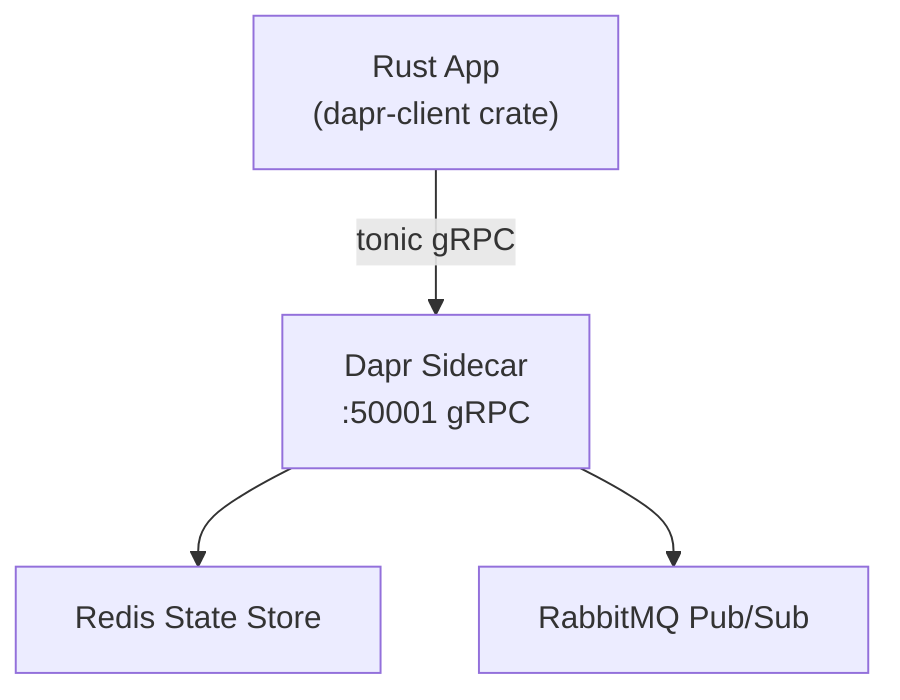

# How to Use Dapr SDK for Rust (Community SDK)

Author: [nawazdhandala](https://www.github.com/nawazdhandala)

Tags: Dapr, Rust, SDK, Microservice, Community

Description: Use the community Dapr Rust SDK to build microservices in Rust with state management, pub/sub messaging, and service invocation via gRPC.

---

## Overview

The Dapr Rust SDK (`dapr-client`) is a community-maintained crate that wraps the Dapr gRPC interface. It provides an async client built on Tokio and Tonic for interacting with the Dapr sidecar from Rust applications.

## Architecture



## Prerequisites

Add to `Cargo.toml`:

```toml
[package]
name = "order-service"
version = "0.1.0"
edition = "2021"

[dependencies]
dapr = "0.15"
tokio = { version = "1", features = ["full"] }
serde = { version = "1", features = ["derive"] }
serde_json = "1"
tonic = "0.11"
prost = "0.12"
```

Install Dapr:

```bash
dapr init
```

## Step 1: Connect to the Dapr Sidecar

```rust
// src/main.rs
use dapr::Client;
use std::collections::HashMap;
use serde::{Deserialize, Serialize};

#[derive(Serialize, Deserialize, Debug, Clone)]
struct Order {
    id: String,
    total: f64,
}

#[tokio::main]
async fn main() -> Result<(), Box<dyn std::error::Error>> {
    // The DAPR_GRPC_PORT env var defaults to 50001
    let addr = format!(
        "http://localhost:{}",
        std::env::var("DAPR_GRPC_PORT").unwrap_or_else(|_| "50001".to_string())
    );

    let mut client = Client::connect(addr).await?;

    // --- Save State ---
    let order = Order { id: "order-1".to_string(), total: 99.95 };
    let data = serde_json::to_vec(&order)?;

    client
        .save_state(vec![("statestore", "order-1", data.clone())])
        .await?;
    println!("State saved");

    // --- Get State ---
    let result = client
        .get_state("statestore", "order-1", None)
        .await?;
    println!("Retrieved: {:?}", result.data);

    // --- Publish Event ---
    let mut metadata = HashMap::new();
    metadata.insert("Content-Type".to_string(), "application/json".to_string());

    client
        .publish_event("pubsub", "orders", data, Some(metadata))
        .await?;
    println!("Event published");

    Ok(())
}
```

## Step 2: Service Invocation

```rust
use dapr::Client;
use serde_json::json;

#[tokio::main]
async fn main() -> Result<(), Box<dyn std::error::Error>> {
    let mut client = Client::connect("http://localhost:50001").await?;

    let payload = serde_json::to_vec(&json!({ "query": "status" }))?;

    let response = client
        .invoke_service(
            "inventory-service",
            "checkStock",
            Some(dapr::appcallback::InvokeRequest {
                method: "checkStock".to_string(),
                data: Some(prost_types::Any {
                    type_url: "application/json".to_string(),
                    value: payload,
                }),
                content_type: "application/json".to_string(),
                http_extension: None,
            }),
        )
        .await?;

    if let Some(data) = response.data {
        println!("Response: {:?}", data.value);
    }

    Ok(())
}
```

## Step 3: Secret Retrieval

```rust
use dapr::Client;

#[tokio::main]
async fn main() -> Result<(), Box<dyn std::error::Error>> {
    let mut client = Client::connect("http://localhost:50001").await?;

    let secret = client
        .get_secret("secretstore", "db-password", None)
        .await?;

    let password = secret.data.get("db-password").cloned().unwrap_or_default();
    println!("DB password: {}", password);

    Ok(())
}
```

## Step 4: Delete State

```rust
client.delete_state("statestore", "order-1", None).await?;
println!("State deleted");
```

## Step 5: Build and Run with Dapr

```bash
cargo build --release

dapr run \
  --app-id order-service \
  --dapr-grpc-port 50001 \
  --components-path ./components \
  -- ./target/release/order-service
```

## Component Files

```yaml
# components/statestore.yaml
apiVersion: dapr.io/v1alpha1
kind: Component
metadata:
  name: statestore
spec:
  type: state.redis
  version: v1
  metadata:
  - name: redisHost
    value: localhost:6379
  - name: redisPassword
    value: ""
```

```yaml
# components/pubsub.yaml
apiVersion: dapr.io/v1alpha1
kind: Component
metadata:
  name: pubsub
spec:
  type: pubsub.redis
  version: v1
  metadata:
  - name: redisHost
    value: localhost:6379
```

## Kubernetes Deployment

```yaml
# k8s/deployment.yaml
apiVersion: apps/v1
kind: Deployment
metadata:
  name: order-service
spec:
  replicas: 1
  selector:
    matchLabels:
      app: order-service
  template:
    metadata:
      labels:
        app: order-service
      annotations:
        dapr.io/enabled: "true"
        dapr.io/app-id: "order-service"
        dapr.io/app-protocol: "grpc"
        dapr.io/app-port: "6000"
    spec:
      containers:
      - name: order-service
        image: myregistry/order-service:latest
        ports:
        - containerPort: 6000
```

## Implementing the AppCallback gRPC Server

The Rust SDK also provides stubs for implementing the `AppCallback` gRPC server to handle incoming invocations and pub/sub events:

```rust
use dapr::appcallback::{
    app_callback_server::{AppCallback, AppCallbackServer},
    InvokeRequest, InvokeResponse,
    ListTopicSubscriptionsResponse, TopicEventRequest, TopicEventResponse,
    TopicSubscription,
};
use tonic::{transport::Server, Request, Response, Status};

#[derive(Default)]
struct AppCallbackService;

#[tonic::async_trait]
impl AppCallback for AppCallbackService {
    async fn on_invoke(
        &self,
        request: Request<InvokeRequest>,
    ) -> Result<Response<InvokeResponse>, Status> {
        let method = &request.get_ref().method;
        println!("OnInvoke: method={}", method);
        Ok(Response::new(InvokeResponse::default()))
    }

    async fn list_topic_subscriptions(
        &self,
        _request: Request<()>,
    ) -> Result<Response<ListTopicSubscriptionsResponse>, Status> {
        Ok(Response::new(ListTopicSubscriptionsResponse {
            subscriptions: vec![TopicSubscription {
                pubsub_name: "pubsub".to_string(),
                topic: "orders".to_string(),
                ..Default::default()
            }],
        }))
    }

    async fn on_topic_event(
        &self,
        request: Request<TopicEventRequest>,
    ) -> Result<Response<TopicEventResponse>, Status> {
        println!("OnTopicEvent: topic={}", request.get_ref().topic);
        Ok(Response::new(TopicEventResponse::default()))
    }
}

#[tokio::main]
async fn main() -> Result<(), Box<dyn std::error::Error>> {
    let addr = "[::]:6000".parse()?;
    Server::builder()
        .add_service(AppCallbackServer::new(AppCallbackService))
        .serve(addr)
        .await?;
    Ok(())
}
```

## Summary

The Dapr Rust SDK is a community-maintained crate built on Tonic gRPC. It provides `Client::connect` for outbound calls to the sidecar (state, pub/sub, service invocation, secrets) and gRPC server stubs for implementing `AppCallback` to receive inbound invocations and pub/sub events. The SDK is async-first and integrates naturally with Tokio-based Rust applications.
