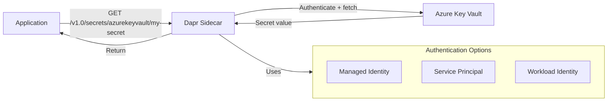

# How to Use Dapr Secrets Management with Azure Key Vault

Author: [nawazdhandala](https://www.github.com/nawazdhandala)

Tags: Dapr, Secret, Azure, Key Vault, Security

Description: Learn how to configure the Dapr Azure Key Vault secret store component to read secrets from Azure Key Vault using managed identity or client credentials.

---

## Introduction

Dapr integrates with Azure Key Vault as a secret store backend, allowing your applications to read secrets from Key Vault through the standard Dapr secrets API. This eliminates the need for Azure SDK configuration in your application code and makes your app portable across secret store backends.

## Architecture



## Prerequisites

- Azure subscription with Key Vault created
- Azure CLI installed and configured (`az login`)
- Dapr installed on Kubernetes or locally
- Azure identity configured (managed identity, service principal, or workload identity)

## Step 1: Create an Azure Key Vault and Add Secrets

```bash
# Create resource group and Key Vault
az group create --name myResourceGroup --location eastus

az keyvault create \
  --name my-dapr-keyvault \
  --resource-group myResourceGroup \
  --location eastus

# Add secrets to Key Vault
az keyvault secret set \
  --vault-name my-dapr-keyvault \
  --name db-password \
  --value "SuperSecretPass123"

az keyvault secret set \
  --vault-name my-dapr-keyvault \
  --name stripe-api-key \
  --value "sk_live_abc123"
```

## Step 2: Configure Authentication

### Option A - Managed Identity (Recommended for AKS)

Assign managed identity to your AKS node pool and grant Key Vault access:

```bash
# Get AKS managed identity principal ID
IDENTITY_PRINCIPAL_ID=$(az aks show \
  --resource-group myResourceGroup \
  --name myAKSCluster \
  --query identityProfile.kubeletidentity.objectId \
  -o tsv)

# Grant Key Vault secrets read permission
az keyvault set-policy \
  --name my-dapr-keyvault \
  --object-id $IDENTITY_PRINCIPAL_ID \
  --secret-permissions get list
```

### Option B - Service Principal

```bash
# Create service principal
az ad sp create-for-rbac --name dapr-keyvault-sp

# Grant access
az keyvault set-policy \
  --name my-dapr-keyvault \
  --spn <app-id> \
  --secret-permissions get list
```

Store SP credentials as a Kubernetes secret:

```bash
kubectl create secret generic azure-sp-creds \
  --from-literal=clientId=<app-id> \
  --from-literal=clientSecret=<client-secret>
```

## Step 3: Configure the Dapr Component

### Using Managed Identity

```yaml
apiVersion: dapr.io/v1alpha1
kind: Component
metadata:
  name: azurekeyvault
  namespace: default
spec:
  type: secretstores.azure.keyvault
  version: v1
  metadata:
  - name: vaultName
    value: "my-dapr-keyvault"
  - name: azureEnvironment
    value: "AZUREPUBLICCLOUD"
```

### Using Service Principal

```yaml
apiVersion: dapr.io/v1alpha1
kind: Component
metadata:
  name: azurekeyvault
  namespace: default
spec:
  type: secretstores.azure.keyvault
  version: v1
  metadata:
  - name: vaultName
    value: "my-dapr-keyvault"
  - name: azureTenantId
    value: "<tenant-id>"
  - name: azureClientId
    secretKeyRef:
      name: azure-sp-creds
      key: clientId
  - name: azureClientSecret
    secretKeyRef:
      name: azure-sp-creds
      key: clientSecret
```

```bash
kubectl apply -f azurekeyvault-component.yaml
```

## Step 4: Read Secrets in Your Application

### Via HTTP API

```bash
curl http://localhost:3500/v1.0/secrets/azurekeyvault/db-password
```

Response:

```json
{
  "db-password": "SuperSecretPass123"
}
```

### Via Go SDK

```go
package main

import (
    "context"
    "fmt"
    "log"

    dapr "github.com/dapr/go-sdk/client"
)

func main() {
    client, err := dapr.NewClient()
    if err != nil {
        log.Fatal(err)
    }
    defer client.Close()

    ctx := context.Background()

    secret, err := client.GetSecret(ctx, "azurekeyvault", "db-password", nil)
    if err != nil {
        log.Fatal(err)
    }
    fmt.Printf("Got secret with %d keys\n", len(secret))
    dbPassword := secret["db-password"]
    _ = dbPassword
}
```

### Via Python SDK

```python
from dapr.clients import DaprClient

with DaprClient() as client:
    secret = client.get_secret(
        store_name='azurekeyvault',
        key='db-password'
    )
    db_password = secret.secret['db-password']
    print("Secret retrieved successfully")
```

## Accessing a Specific Secret Version

Key Vault supports versioning. To retrieve a specific version:

```bash
curl "http://localhost:3500/v1.0/secrets/azurekeyvault/db-password?metadata.version=abc123def456"
```

## Using Workload Identity (AKS)

For AKS clusters with workload identity enabled:

```yaml
apiVersion: dapr.io/v1alpha1
kind: Component
metadata:
  name: azurekeyvault
  namespace: default
spec:
  type: secretstores.azure.keyvault
  version: v1
  metadata:
  - name: vaultName
    value: "my-dapr-keyvault"
  - name: azureClientId
    value: "<workload-identity-client-id>"
```

Annotate your Kubernetes Service Account for workload identity:

```yaml
apiVersion: v1
kind: ServiceAccount
metadata:
  name: dapr-app-sa
  namespace: default
  annotations:
    azure.workload.identity/client-id: "<workload-identity-client-id>"
```

## Summary

Dapr's Azure Key Vault secret store lets your application read Key Vault secrets through a standard API without Azure SDK code. Use managed identity or workload identity in AKS for credential-free authentication. Configure the component with your Key Vault name and authentication details, and read secrets via `GET /v1.0/secrets/azurekeyvault/{secretName}`. This approach keeps your application portable and centralizes secret rotation in Azure Key Vault.
