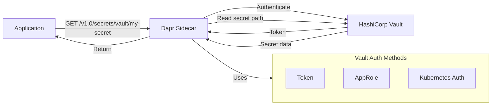

# How to Use Dapr Secrets Management with HashiCorp Vault

Author: [nawazdhandala](https://www.github.com/nawazdhandala)

Tags: Dapr, Secret, HashiCorp Vault, Security, Configuration

Description: Learn how to configure the Dapr HashiCorp Vault secret store component to read secrets from Vault using token, AppRole, or Kubernetes authentication methods.

---

## Introduction

Dapr integrates with HashiCorp Vault as a secret store backend, allowing your applications to read secrets through Dapr's standard API without Vault SDK code. Vault provides enterprise-grade secrets management with dynamic secrets, leasing, renewal, and fine-grained policies.

## Architecture



## Prerequisites

- HashiCorp Vault deployed and accessible
- Vault CLI configured (`vault login`)
- Dapr initialized locally or on Kubernetes
- Vault secrets engine enabled (KV v2 recommended)

## Step 1: Configure HashiCorp Vault

Enable the KV v2 secrets engine and add secrets:

```bash
# Enable KV v2 secrets engine at "secret/" path
vault secrets enable -path=secret kv-v2

# Write secrets
vault kv put secret/db-credentials username=admin password=SuperSecretPass123
vault kv put secret/api-keys stripe=sk_live_abc123 sendgrid=SG.xyz789
```

Create a policy for Dapr:

```hcl
path "secret/data/db-credentials" {
  capabilities = ["read"]
}

path "secret/data/api-keys" {
  capabilities = ["read"]
}
```

```bash
vault policy write dapr-policy dapr-policy.hcl
```

## Step 2: Configure Authentication

### Option A - Token Authentication (Development)

```bash
# Create a token with the Dapr policy
vault token create -policy=dapr-policy -ttl=8760h
```

### Option B - AppRole Authentication (Recommended for Production)

```bash
# Enable AppRole auth method
vault auth enable approle

# Create AppRole for Dapr
vault write auth/approle/role/dapr-role \
  token_policies=dapr-policy \
  token_ttl=1h \
  token_max_ttl=24h

# Get AppRole credentials
vault read auth/approle/role/dapr-role/role-id
vault write -f auth/approle/role/dapr-role/secret-id
```

### Option C - Kubernetes Authentication (Recommended for Kubernetes)

```bash
# Enable Kubernetes auth
vault auth enable kubernetes

# Configure with Kubernetes cluster details
vault write auth/kubernetes/config \
  kubernetes_host=https://kubernetes.default.svc:443

# Create role for Dapr service accounts
vault write auth/kubernetes/role/dapr-role \
  bound_service_account_names=default \
  bound_service_account_namespaces=default \
  policies=dapr-policy \
  ttl=1h
```

## Step 3: Configure the Dapr Component

### Using Token Authentication

```yaml
apiVersion: dapr.io/v1alpha1
kind: Component
metadata:
  name: vault
  namespace: default
spec:
  type: secretstores.hashicorp.vault
  version: v1
  metadata:
  - name: vaultAddr
    value: "https://vault.example.com:8200"
  - name: vaultToken
    secretKeyRef:
      name: vault-token-secret
      key: token
  - name: enginePath
    value: "secret"
  - name: vaultKVUsePrefix
    value: "true"
```

Create the Kubernetes secret holding the Vault token:

```bash
kubectl create secret generic vault-token-secret \
  --from-literal=token=<your-vault-token>
```

### Using AppRole Authentication

```yaml
apiVersion: dapr.io/v1alpha1
kind: Component
metadata:
  name: vault
  namespace: default
spec:
  type: secretstores.hashicorp.vault
  version: v1
  metadata:
  - name: vaultAddr
    value: "https://vault.example.com:8200"
  - name: vaultAuth
    value: "approle"
  - name: roleID
    secretKeyRef:
      name: vault-approle-creds
      key: roleId
  - name: secretID
    secretKeyRef:
      name: vault-approle-creds
      key: secretId
  - name: enginePath
    value: "secret"
```

### Using Kubernetes Authentication

```yaml
apiVersion: dapr.io/v1alpha1
kind: Component
metadata:
  name: vault
  namespace: default
spec:
  type: secretstores.hashicorp.vault
  version: v1
  metadata:
  - name: vaultAddr
    value: "https://vault.example.com:8200"
  - name: vaultAuth
    value: "kubernetes"
  - name: vaultKubernetesRole
    value: "dapr-role"
  - name: enginePath
    value: "secret"
```

## Step 4: Read Secrets in Your Application

### Via HTTP API

```bash
curl http://localhost:3500/v1.0/secrets/vault/db-credentials
```

Response:

```json
{
  "username": "admin",
  "password": "SuperSecretPass123"
}
```

### Via Go SDK

```go
package main

import (
    "context"
    "fmt"
    "log"

    dapr "github.com/dapr/go-sdk/client"
)

func main() {
    client, err := dapr.NewClient()
    if err != nil {
        log.Fatal(err)
    }
    defer client.Close()

    ctx := context.Background()

    secret, err := client.GetSecret(ctx, "vault", "db-credentials", nil)
    if err != nil {
        log.Fatal(err)
    }

    fmt.Printf("Username: %s\n", secret["username"])
}
```

### Via Python SDK

```python
from dapr.clients import DaprClient

with DaprClient() as client:
    secret = client.get_secret(
        store_name='vault',
        key='db-credentials'
    )
    username = secret.secret['username']
    print(f"Username: {username}")
```

## Nested Secret Paths

For secrets stored at nested paths (e.g., `secret/data/app/prod/db`):

```bash
curl "http://localhost:3500/v1.0/secrets/vault/app/prod/db"
```

Set `vaultKVUsePrefix: "true"` in the component to prepend `data/` automatically for KV v2.

## Summary

Dapr's HashiCorp Vault integration supports multiple authentication methods - token, AppRole, and Kubernetes - making it flexible for both development and production. Configure your secret engine path and authentication in the Dapr component YAML, and read secrets through the standard Dapr API. For Kubernetes deployments, use the Vault Kubernetes auth method to authenticate using service account tokens without managing static credentials.
