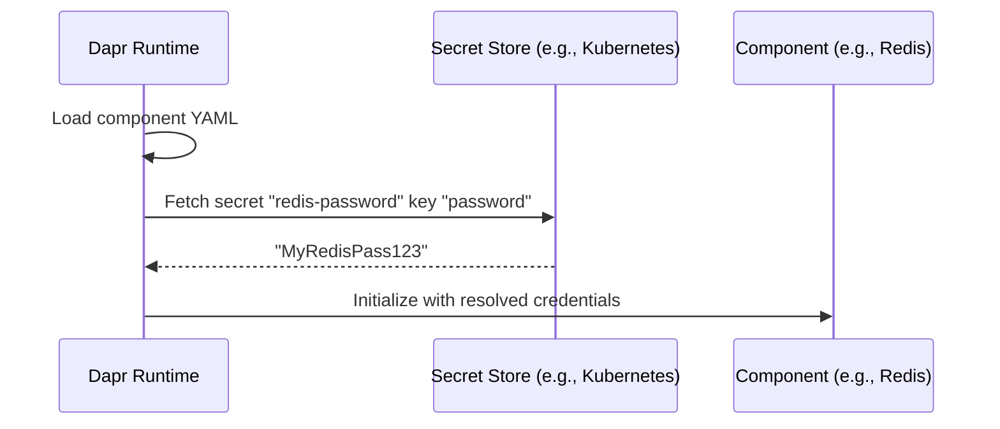

# How to Reference Dapr Secrets in Component Configuration

Author: [nawazdhandala](https://www.github.com/nawazdhandala)

Tags: Dapr, Secret, Component, Configuration, Security

Description: Learn how to reference secrets from a Dapr secret store within Dapr component configuration files, avoiding hard-coded credentials in component YAML files.

---

## Introduction

Dapr component configuration files (YAML) often contain sensitive values such as database passwords, API keys, and connection strings. Rather than embedding these values directly, Dapr supports `secretKeyRef` in component metadata, allowing you to reference secrets stored in any configured secret store. This keeps credentials out of your configuration files and version control.

## How secretKeyRef Works

When Dapr loads a component, it reads any `secretKeyRef` references and fetches the corresponding values from the specified secret store before initializing the component.



## Prerequisites

- A configured Dapr secret store (Kubernetes Secrets, Azure Key Vault, HashiCorp Vault, etc.)
- Dapr components directory or Kubernetes Component resources

## Basic secretKeyRef Syntax

In a component metadata field, replace a hardcoded value with:

```yaml
- name: someCredential
  secretKeyRef:
    name: <secret-name-in-store>
    key: <key-within-secret>
```

The `name` is the secret identifier in the store. The `key` is the specific key within a multi-key secret (e.g., a Kubernetes Secret with multiple data keys).

## Example 1: Redis State Store with Kubernetes Secret

Create the Kubernetes secret:

```bash
kubectl create secret generic redis-secret \
  --from-literal=password=MyRedisPass123
```

Reference it in the Dapr component:

```yaml
apiVersion: dapr.io/v1alpha1
kind: Component
metadata:
  name: statestore
  namespace: default
spec:
  type: state.redis
  version: v1
  metadata:
  - name: redisHost
    value: "redis-master.default.svc.cluster.local:6379"
  - name: redisPassword
    secretKeyRef:
      name: redis-secret
      key: password
  - name: actorStateStore
    value: "true"
```

## Example 2: PostgreSQL State Store with Vault

Assuming a HashiCorp Vault secret at path `secret/postgres`:

```yaml
apiVersion: dapr.io/v1alpha1
kind: Component
metadata:
  name: postgresql-store
  namespace: default
spec:
  type: state.postgresql
  version: v1
  metadata:
  - name: connectionString
    secretKeyRef:
      name: postgres
      key: connectionString
auth:
  secretStore: vault
```

The `auth.secretStore` field specifies which secret store to use for resolving references in this component.

## Example 3: Azure Service Bus Pub/Sub with Azure Key Vault

```yaml
apiVersion: dapr.io/v1alpha1
kind: Component
metadata:
  name: servicebus-pubsub
  namespace: default
spec:
  type: pubsub.azure.servicebus.queues
  version: v1
  metadata:
  - name: connectionString
    secretKeyRef:
      name: servicebus-connection-string
      key: servicebus-connection-string
auth:
  secretStore: azurekeyvault
```

## Example 4: Multiple Secrets in One Component

A component can reference multiple secrets from the same store:

```yaml
apiVersion: dapr.io/v1alpha1
kind: Component
metadata:
  name: kafka-pubsub
  namespace: default
spec:
  type: pubsub.kafka
  version: v1
  metadata:
  - name: brokers
    value: "kafka-broker:9092"
  - name: saslUsername
    secretKeyRef:
      name: kafka-credentials
      key: username
  - name: saslPassword
    secretKeyRef:
      name: kafka-credentials
      key: password
  - name: saslMechanism
    value: "SCRAM-SHA-256"
  - name: authType
    value: "scram"
auth:
  secretStore: kubernetes
```

## Default Secret Store Behavior

If `auth.secretStore` is not specified, Dapr uses the default secret store for the environment:

- **Kubernetes**: uses the built-in `kubernetes` secret store automatically
- **Self-hosted (local)**: uses the `local.file` secret store

You can override the default by specifying `auth.secretStore` explicitly.

## Local Development with File-Based Secrets

For local development, use a local file secret store:

```yaml
apiVersion: dapr.io/v1alpha1
kind: Component
metadata:
  name: local-secret-store
spec:
  type: secretstores.local.file
  version: v1
  metadata:
  - name: secretsFile
    value: "./secrets.json"
  - name: nestedSeparator
    value: ":"
```

Create `secrets.json`:

```json
{
  "redis-secret": {
    "password": "MyRedisPass123"
  },
  "db-credentials": {
    "username": "admin",
    "password": "DevPassword123"
  }
}
```

Components can reference these the same way as production secrets:

```yaml
- name: redisPassword
  secretKeyRef:
    name: redis-secret
    key: password
```

## Bootstrap Secret Store Limitation

The secret store used for `secretKeyRef` in other components must be initialized first. Dapr loads components in a specific order: secret stores are initialized before other components. Avoid creating circular dependencies where a secret store references secrets from another secret store.

## Summary

Dapr's `secretKeyRef` syntax allows component configurations to reference secrets from any Dapr-configured secret store without embedding credentials in YAML files. Specify `auth.secretStore` to choose which secret store resolves the references, or rely on the environment default. Use this pattern to keep all component credentials in your centralized secret store - whether Kubernetes Secrets, Azure Key Vault, AWS Secrets Manager, or HashiCorp Vault - and out of your code repository.
