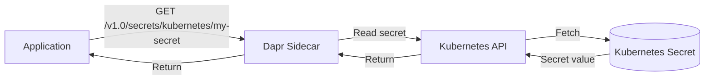

# How to Use Dapr Secrets Management with Kubernetes Secrets

Author: [nawazdhandala](https://www.github.com/nawazdhandala)

Tags: Dapr, Secret, Kubernetes, Security, Configuration

Description: Learn how to configure Dapr's secrets management building block to read Kubernetes Secrets, retrieve them in your application, and reference them in Dapr components.

---

## Introduction

Dapr's secrets management building block provides a uniform API for accessing secrets from various backends. When running on Kubernetes, you can use the built-in `secretstores.kubernetes` component to read Kubernetes Secrets through the Dapr API - without mounting secrets as environment variables or volumes in every pod.

Benefits of using Dapr for Kubernetes secrets:
- Consistent secrets API across different environments
- Application code is not tied to Kubernetes-specific APIs
- Secrets access is logged by the Dapr sidecar
- Fine-grained access control via Dapr component scoping

## Architecture



## Prerequisites

- Kubernetes cluster with Dapr installed
- Kubernetes Secrets already created in the namespace

## Step 1: Create Kubernetes Secrets

Create the secrets your application needs:

```bash
kubectl create secret generic db-credentials \
  --from-literal=username=admin \
  --from-literal=password=SuperSecretPass123 \
  -n default

kubectl create secret generic api-keys \
  --from-literal=stripe-api-key=sk_live_abc123 \
  --from-literal=sendgrid-api-key=SG.xyz789 \
  -n default
```

Or via YAML (encode values in base64):

```yaml
apiVersion: v1
kind: Secret
metadata:
  name: db-credentials
  namespace: default
type: Opaque
data:
  username: YWRtaW4=
  password: U3VwZXJTZWNyZXRQYXNzMTIz
```

```bash
kubectl apply -f secret.yaml
```

## Step 2: Configure the Dapr Kubernetes Secret Store Component

The Kubernetes secret store is built into Dapr and requires minimal configuration. Create a component:

```yaml
apiVersion: dapr.io/v1alpha1
kind: Component
metadata:
  name: kubernetes
  namespace: default
spec:
  type: secretstores.kubernetes
  version: v1
  metadata: []
```

```bash
kubectl apply -f secretstore.yaml
```

The default secret store name for Kubernetes is `kubernetes` and it is available without any custom component definition when running in Kubernetes mode.

## Step 3: Grant RBAC Access (if needed)

In some clusters you may need to grant the Dapr service account permission to read secrets:

```yaml
apiVersion: rbac.authorization.k8s.io/v1
kind: Role
metadata:
  name: dapr-secret-reader
  namespace: default
rules:
- apiGroups: [""]
  resources: ["secrets"]
  verbs: ["get", "list"]
---
apiVersion: rbac.authorization.k8s.io/v1
kind: RoleBinding
metadata:
  name: dapr-secret-reader-binding
  namespace: default
subjects:
- kind: ServiceAccount
  name: default
  namespace: default
roleRef:
  kind: Role
  name: dapr-secret-reader
  apiGroup: rbac.authorization.k8s.io
```

```bash
kubectl apply -f rbac.yaml
```

## Step 4: Retrieve Secrets in Your Application

### Via HTTP API

Read all keys in a secret:

```bash
curl http://localhost:3500/v1.0/secrets/kubernetes/db-credentials
```

Response:

```json
{
  "username": "admin",
  "password": "SuperSecretPass123"
}
```

Read a specific key:

```bash
curl "http://localhost:3500/v1.0/secrets/kubernetes/db-credentials?metadata.namespace=default"
```

### Via Go SDK

```go
package main

import (
    "context"
    "fmt"
    "log"

    dapr "github.com/dapr/go-sdk/client"
)

func main() {
    client, err := dapr.NewClient()
    if err != nil {
        log.Fatal(err)
    }
    defer client.Close()

    ctx := context.Background()

    // Get all keys in a secret
    secret, err := client.GetSecret(ctx, "kubernetes", "db-credentials", nil)
    if err != nil {
        log.Fatal(err)
    }
    username := secret["username"]
    password := secret["password"]
    fmt.Printf("DB User: %s\n", username)
    _ = password // use securely, don't print
}
```

### Via Python SDK

```python
from dapr.clients import DaprClient

with DaprClient() as client:
    secret = client.get_secret(
        store_name='kubernetes',
        key='db-credentials'
    )
    username = secret.secret['username']
    password = secret.secret['password']
    print(f"DB User: {username}")
```

### Via .NET SDK

```csharp
using Dapr.Client;

var client = new DaprClientBuilder().Build();
var secret = await client.GetSecretAsync("kubernetes", "db-credentials");
var username = secret["username"];
var password = secret["password"];
```

## Step 5: Bulk Secret Retrieval

Get all secrets accessible to the Dapr component (use with caution):

```bash
curl http://localhost:3500/v1.0/secrets/kubernetes/bulk
```

## Restricting Secret Access with Component Scoping

Limit which apps can access specific secrets using `allowedSecrets` and `deniedSecrets`:

```yaml
apiVersion: dapr.io/v1alpha1
kind: Component
metadata:
  name: kubernetes
  namespace: default
spec:
  type: secretstores.kubernetes
  version: v1
  metadata:
  - name: defaultAccess
    value: deny
  - name: allowedSecrets
    value: '["db-credentials", "api-keys"]'
```

## Summary

Dapr's Kubernetes secret store provides a clean abstraction over Kubernetes Secrets. Your application uses the Dapr secrets API regardless of whether it runs locally (with a different secret store) or in Kubernetes. Configure RBAC to grant the Dapr service account secret read access, use `allowedSecrets` to restrict which secrets are accessible, and read secrets via HTTP API or SDK. This decouples your application code from Kubernetes-specific secrets APIs.
