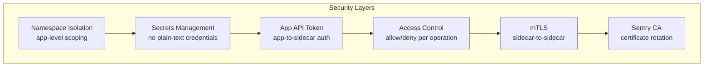
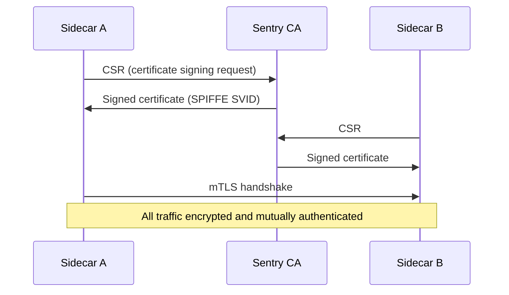

# How to Understand Dapr Security Design Principles

Author: [nawazdhandala](https://www.github.com/nawazdhandala)

Tags: Dapr, Security, mTLS, Access Control, Zero Trust

Description: Learn Dapr's security design principles including mTLS, certificate rotation, API authorization, secret management, and zero-trust networking between services.

---

## Dapr Security Overview

Dapr is designed around zero-trust networking principles. Every communication channel is encrypted and authenticated. The key security capabilities are:

1. **Mutual TLS (mTLS)** between all sidecars for service-to-service communication
2. **Certificate lifecycle management** via the Sentry service
3. **API-level access control** through allow/deny policies
4. **Secret store integration** to avoid credentials in configuration
5. **App API token authentication** between your app and its sidecar
6. **Network namespace isolation** in Kubernetes



## 1 - Mutual TLS Between Sidecars

By default, all communication between Dapr sidecars is encrypted with mTLS. Each sidecar has a workload certificate issued by the Dapr Sentry service. The Sentry service is an internal certificate authority (CA).



### Checking mTLS Status

```bash
# Self-hosted
dapr mtls

# Kubernetes
kubectl get configurations/daprsystem -n dapr-system -o jsonpath='{.spec.mtls}'
```

### Disabling mTLS (Not Recommended)

```yaml
apiVersion: dapr.io/v1alpha1
kind: Configuration
metadata:
  name: daprsystem
  namespace: dapr-system
spec:
  mtls:
    enabled: false
```

## 2 - Certificate Management with Sentry

Sentry issues short-lived X.509 certificates (SPIFFE SVIDs) to each sidecar. Certificates are rotated automatically before expiry.

Default certificate lifetimes:
- Workload certificate: 24 hours
- Root certificate: 365 days

You can bring your own root CA:

```bash
# Generate a root CA
openssl genrsa -out ca.key 4096
openssl req -new -x509 -days 3650 -key ca.key \
  -subj "/C=US/O=MyOrg/CN=Dapr Root CA" -out ca.crt

# Create a Kubernetes secret
kubectl create secret generic dapr-trust-bundle \
  --from-file=ca.crt=ca.crt \
  --from-file=issuer.crt=issuer.crt \
  --from-file=issuer.key=issuer.key \
  -n dapr-system
```

## 3 - Access Control Policies

Dapr access control policies let you define which operations a service is allowed to call on another service.

```yaml
apiVersion: dapr.io/v1alpha1
kind: Configuration
metadata:
  name: appconfig
spec:
  accessControl:
    defaultAction: deny          # deny all by default
    trustDomain: "public"
    policies:
    - appId: frontend
      defaultAction: deny
      trustDomain: "public"
      namespace: "default"
      operations:
      - name: /orders
        httpVerb: ["GET"]
        action: allow
      - name: /checkout
        httpVerb: ["POST"]
        action: allow
    - appId: inventory-service
      defaultAction: allow
      trustDomain: "public"
      namespace: "default"
```

Apply this configuration to the receiving service, not the caller. Services without a policy entry follow the `defaultAction`.

## 4 - App API Token Authentication

The App API token adds a secret layer between your application and its sidecar. The sidecar validates the `dapr-api-token` header on every call from your app.

```bash
# Generate a token
export APP_API_TOKEN=$(openssl rand -base64 32)

# Set it as a Kubernetes secret
kubectl create secret generic dapr-api-token \
  --from-literal=token="$APP_API_TOKEN" -n default
```

Reference it in your pod annotation:

```yaml
annotations:
  dapr.io/app-token-secret: "dapr-api-token"
```

Your application must then include the token header:

```bash
curl http://localhost:3500/v1.0/state/statestore \
  -H "dapr-api-token: $APP_API_TOKEN" \
  -H "Content-Type: application/json" \
  -d '[{"key": "k1", "value": "v1"}]'
```

## 5 - Secrets Management

Never put credentials in component YAML files as plain text. Use secret store references:

```yaml
# BAD
metadata:
- name: redisPassword
  value: "mysecretpassword"

# GOOD
metadata:
- name: redisPassword
  secretKeyRef:
    name: redis-secret
    key: password
auth:
  secretStore: kubernetes
```

The sidecar resolves the secret at startup from the specified store.

## 6 - Namespace Isolation

In Kubernetes, Dapr respects namespace boundaries. A service in namespace `team-a` cannot call a service in namespace `team-b` unless explicitly allowed.

To call across namespaces:

```bash
# From team-a, call team-b/payment-service
curl http://localhost:3500/v1.0/invoke/payment-service.team-b/method/pay
```

Namespaced component scoping:

```yaml
metadata:
  name: statestore
  namespace: team-a   # only accessible by apps in team-a namespace
scopes:
- order-service       # further restrict to specific app IDs within the namespace
```

## 7 - Network Policy Integration

For defense in depth, combine Dapr's mTLS with Kubernetes NetworkPolicies:

```yaml
apiVersion: networking.k8s.io/v1
kind: NetworkPolicy
metadata:
  name: allow-dapr-only
  namespace: default
spec:
  podSelector: {}
  policyTypes:
  - Ingress
  ingress:
  - from:
    - namespaceSelector:
        matchLabels:
          kubernetes.io/metadata.name: dapr-system
  - ports:
    - port: 3500    # Dapr HTTP
    - port: 50001   # Dapr gRPC
```

## Security Checklist

| Control | Status |
|---------|--------|
| mTLS enabled between sidecars | Default ON |
| Custom root CA configured | Recommended for production |
| `defaultAction: deny` in access control | Recommended |
| App API token configured | Recommended |
| No plain-text credentials in components | Required |
| Namespace isolation applied | Recommended |
| Certificate rotation monitored | Required |

## Summary

Dapr implements a zero-trust security model by default. mTLS encrypts all sidecar-to-sidecar communication using SPIFFE-compliant certificates issued by the Sentry CA. Access control policies enforce allow/deny rules at the operation level. App API tokens authenticate calls from application code to the sidecar. Secrets management ensures no credentials appear in plain text. Namespace isolation and Kubernetes NetworkPolicies provide additional network-level boundaries.
