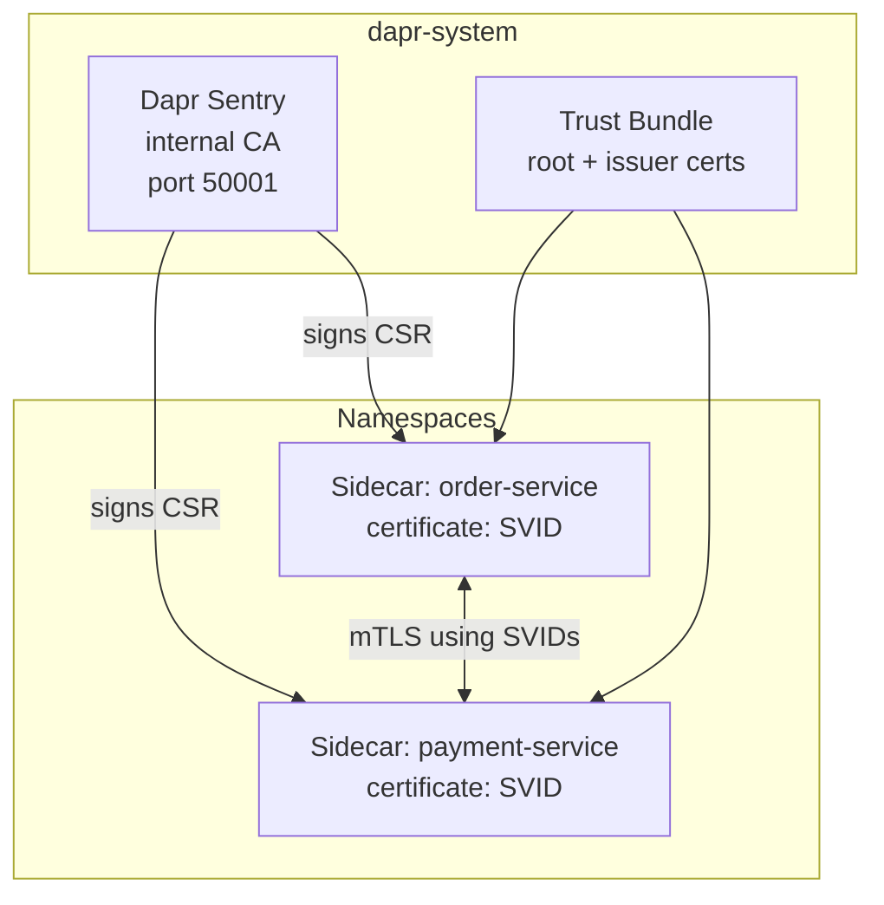
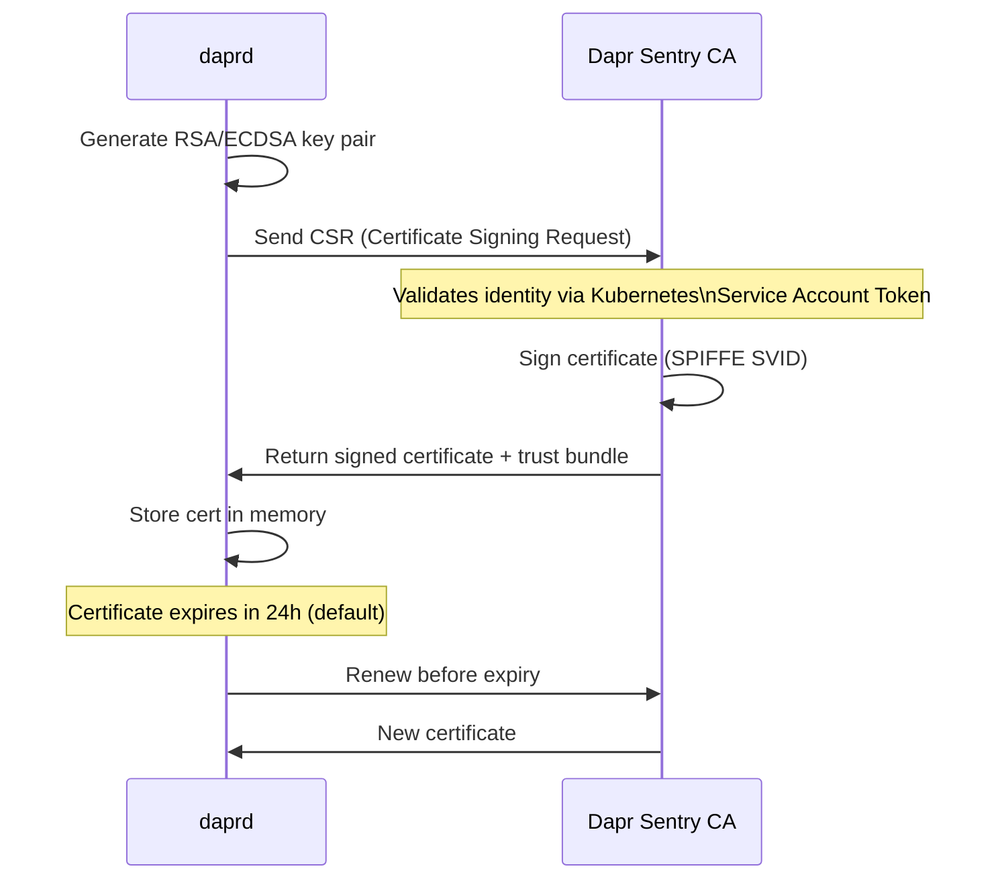

# How to Understand the Dapr Sentry Service for Certificate Management

Author: [nawazdhandala](https://www.github.com/nawazdhandala)

Tags: Dapr, Sentry Service, Certificate, mTLS, Security

Description: Learn how the Dapr Sentry service acts as a certificate authority, issues SPIFFE-compliant workload certificates to sidecars, and enables automatic mTLS rotation.

---

## What Is the Dapr Sentry Service?

The Dapr Sentry service is an internal Certificate Authority (CA) that runs in the `dapr-system` namespace. It issues X.509 certificates to every Dapr sidecar using the SPIFFE (Secure Production Identity Framework For Everyone) standard. These certificates enable mutual TLS between all sidecars.



## SPIFFE Identity

Each certificate issued by Sentry contains a SPIFFE identity URI in the Subject Alternative Name (SAN) field:

```text
spiffe://<trust-domain>/ns/<namespace>/<app-id>
```

For example, `order-service` in the `default` namespace with trust domain `cluster.local`:

```text
spiffe://cluster.local/ns/default/order-service
```

This identity is what sidecars use to authenticate each other during the mTLS handshake.

## Certificate Lifecycle



Certificates are rotated automatically. The sidecar renews its certificate before expiry without any application restart.

## Trust Bundle

The trust bundle contains the root and issuer certificates. Sidecars use the trust bundle to verify certificates presented by other sidecars during mTLS handshakes.

In Kubernetes, the trust bundle is stored as a Kubernetes secret:

```bash
kubectl get secret dapr-trust-bundle -n dapr-system -o yaml
```

The secret contains:
- `ca.crt` - root CA certificate
- `issuer.crt` - issuer certificate
- `issuer.key` - issuer private key

## Using the Default Sentry CA

By default, Sentry generates a self-signed root CA at startup. This is suitable for development and testing. For production, use a custom CA.

Check the current certificate status:

```bash
# Self-hosted
dapr mtls

# Kubernetes
kubectl get configurations/daprsystem -n dapr-system \
  -o jsonpath='{.spec.mtls}'
```

## Configuring a Custom Root CA

Generate a root CA and issuer certificate:

```bash
# Step 1: Generate root CA key
openssl ecparam -name prime256v1 -genkey -noout -out ca.key

# Step 2: Generate root CA certificate (10 years)
openssl req -new -x509 -sha256 \
  -key ca.key \
  -out ca.crt \
  -days 3650 \
  -subj "/O=MyOrg/CN=Dapr Root CA"

# Step 3: Generate issuer key
openssl ecparam -name prime256v1 -genkey -noout -out issuer.key

# Step 4: Generate issuer certificate signing request
openssl req -new -sha256 \
  -key issuer.key \
  -out issuer.csr \
  -subj "/O=MyOrg/CN=Dapr Issuer"

# Step 5: Sign the issuer cert with the root CA
openssl x509 -req -sha256 \
  -CA ca.crt -CAkey ca.key -CAcreateserial \
  -in issuer.csr -out issuer.crt -days 365
```

Create the Kubernetes secret:

```bash
kubectl create secret generic dapr-trust-bundle \
  --from-file=ca.crt=ca.crt \
  --from-file=issuer.crt=issuer.crt \
  --from-file=issuer.key=issuer.key \
  -n dapr-system
```

Restart Sentry to pick up the new certificates:

```bash
kubectl rollout restart deployment dapr-sentry -n dapr-system
```

## Configuring Certificate Lifetime

Control workload certificate lifetimes in the `daprsystem` configuration:

```yaml
apiVersion: dapr.io/v1alpha1
kind: Configuration
metadata:
  name: daprsystem
  namespace: dapr-system
spec:
  mtls:
    enabled: true
    workloadCertTTL: 24h       # how long each sidecar cert is valid
    allowedClockSkew: 15m      # tolerance for clock drift between nodes
```

Apply with:

```bash
kubectl apply -f daprsystem-config.yaml -n dapr-system
```

## Checking Sentry Health

```bash
# Check the sentry pod
kubectl get pods -n dapr-system -l app=dapr-sentry

# View sentry logs
kubectl logs -n dapr-system -l app=dapr-sentry --tail=100

# Look for certificate issuance events
kubectl logs -n dapr-system -l app=dapr-sentry | grep "cert issued\|signed\|error"
```

## Sentry in Self-Hosted Mode

In self-hosted mode, Sentry is not used - mTLS is disabled by default. You can enable it explicitly:

```bash
dapr run \
  --app-id myapp \
  --enable-mtls \
  --sentry-address localhost:50001 \
  -- node app.js
```

You would also need to run the Sentry binary separately in self-hosted mode, which is uncommon outside of testing.

## Rotating the Root CA

When the root CA is approaching expiry:

1. Generate a new root CA certificate
2. Create a new Kubernetes secret with both old and new certs (bundle)
3. Restart Sentry - it picks up the new CA and issues new workload certs
4. After all workload certs are renewed, remove the old CA from the bundle

```bash
# Monitor certificate expiry
kubectl get secret dapr-trust-bundle -n dapr-system \
  -o jsonpath='{.data.ca\.crt}' | base64 -d | \
  openssl x509 -noout -enddate
```

## Summary

The Dapr Sentry service is an internal X.509 Certificate Authority that issues SPIFFE SVIDs to every sidecar. These certificates enable mutual TLS between all sidecars and are rotated automatically before expiry. In production, replace the default self-signed CA with your own root CA by creating a `dapr-trust-bundle` Kubernetes secret. Sentry validates sidecar identity using Kubernetes Service Account tokens before signing certificate requests.
