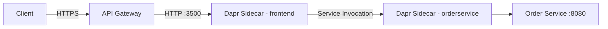

# How to Use Dapr Service Invocation with API Gateways

Author: [nawazdhandala](https://www.github.com/nawazdhandala)

Tags: Dapr, Service Invocation, API Gateway, Microservice, Kubernetes

Description: Learn how to integrate Dapr service invocation with popular API gateways like Kong, NGINX, and Envoy to expose microservices securely and efficiently.

---

## Introduction

Dapr service invocation lets microservices call each other by name without hard-coding addresses. When you add an API gateway to the picture, you gain a single entry point for external traffic while Dapr handles internal service discovery, retries, and observability. This guide walks through the integration patterns and configuration steps.

## Architecture Overview



The API gateway terminates external TLS and routes requests to a Dapr-enabled frontend service. The frontend service then calls downstream services through its local Dapr sidecar.

## How Dapr Service Invocation Works

When service A calls service B, the request flows:

1. App A sends HTTP/gRPC to its local Dapr sidecar on port 3500.
2. The Dapr sidecar resolves service B using name resolution (mDNS in self-hosted, Kubernetes DNS in cluster).
3. The sidecar on service B's side forwards the request to the app process.

```bash
# Direct Dapr service invocation (internal)
curl http://localhost:3500/v1.0/invoke/orderservice/method/orders
```

## Deploying the Order Service with Dapr

```yaml
apiVersion: apps/v1
kind: Deployment
metadata:
  name: orderservice
spec:
  replicas: 2
  selector:
    matchLabels:
      app: orderservice
  template:
    metadata:
      labels:
        app: orderservice
      annotations:
        dapr.io/enabled: "true"
        dapr.io/app-id: "orderservice"
        dapr.io/app-port: "8080"
    spec:
      containers:
        - name: orderservice
          image: myregistry/orderservice:latest
          ports:
            - containerPort: 8080
```

## Configuring Kong as the API Gateway

Install Kong with the Kubernetes Ingress Controller:

```bash
helm repo add kong https://charts.konghq.com
helm repo update
helm install kong kong/ingress -n kong --create-namespace
```

Create an Ingress resource that routes external calls to the frontend service:

```yaml
apiVersion: networking.k8s.io/v1
kind: Ingress
metadata:
  name: dapr-api-gateway
  annotations:
    konghq.com/strip-path: "true"
spec:
  ingressClassName: kong
  rules:
    - host: api.example.com
      http:
        paths:
          - path: /orders
            pathType: Prefix
            backend:
              service:
                name: frontend
                port:
                  number: 80
```

The frontend service in turn calls `orderservice` through Dapr:

```bash
# Called by the frontend app internally
curl http://localhost:3500/v1.0/invoke/orderservice/method/orders \
  -H "Content-Type: application/json" \
  -d '{"item": "widget", "qty": 3}'
```

## Using NGINX Ingress with Dapr

```yaml
apiVersion: networking.k8s.io/v1
kind: Ingress
metadata:
  name: dapr-nginx-gateway
  annotations:
    nginx.ingress.kubernetes.io/rewrite-target: /
spec:
  ingressClassName: nginx
  rules:
    - host: api.example.com
      http:
        paths:
          - path: /api/orders
            pathType: Prefix
            backend:
              service:
                name: frontend-dapr
                port:
                  number: 80
```

## Direct Dapr Sidecar Access via API Gateway (Advanced)

In some architectures you can expose the Dapr HTTP API directly through the gateway using a Kubernetes Service:

```yaml
apiVersion: v1
kind: Service
metadata:
  name: dapr-sidecar-external
spec:
  selector:
    app: frontend
  ports:
    - name: dapr-http
      port: 3500
      targetPort: 3500
```

Then configure the gateway to forward to port 3500 and let the sidecar handle the request. Apply rate limiting at the gateway layer:

```yaml
# Kong Plugin for rate limiting
apiVersion: configuration.konghq.com/v1
kind: KongPlugin
metadata:
  name: rate-limit-orders
plugin: rate-limiting
config:
  minute: 100
  policy: local
```

## Adding Authentication at the Gateway Layer

Use a JWT plugin at the gateway so only authenticated requests reach Dapr:

```yaml
apiVersion: configuration.konghq.com/v1
kind: KongPlugin
metadata:
  name: jwt-auth
plugin: jwt
config:
  secret_is_base64: false
  claims_to_verify:
    - exp
```

Annotate the Ingress:

```yaml
metadata:
  annotations:
    konghq.com/plugins: jwt-auth,rate-limit-orders
```

## Observability: Tracing Through the Gateway

Enable Dapr distributed tracing so that gateway-originated requests carry trace context end-to-end:

```yaml
apiVersion: dapr.io/v1alpha1
kind: Configuration
metadata:
  name: dapr-config
spec:
  tracing:
    samplingRate: "1"
    zipkin:
      endpointAddress: http://zipkin.monitoring:9411/api/v2/spans
```

The gateway passes `traceparent` and `tracestate` headers downstream; Dapr propagates them automatically between sidecars.

## Testing the Integration

```bash
# From outside the cluster
curl -H "Authorization: Bearer $JWT_TOKEN" \
  https://api.example.com/orders

# Expected response from orderservice via Dapr
# {"orderId": "abc-123", "status": "created"}
```

## Troubleshooting

```bash
# Check Dapr sidecar logs for routing issues
kubectl logs deployment/frontend -c daprd

# Verify Dapr app registration
dapr list -k

# Test internal invocation from inside the pod
kubectl exec -it deploy/frontend -- \
  curl http://localhost:3500/v1.0/invoke/orderservice/method/orders
```

## Summary

Integrating Dapr service invocation with an API gateway combines the best of both worlds: the gateway handles external-facing concerns like TLS termination, authentication, and rate limiting, while Dapr handles internal service discovery, retries, and observability. Configure your gateway to route to Dapr-enabled services, annotate your deployments with `dapr.io/app-id`, and use Dapr's name-based invocation for all internal calls. Trace context flows automatically through both layers, giving you full end-to-end visibility.
