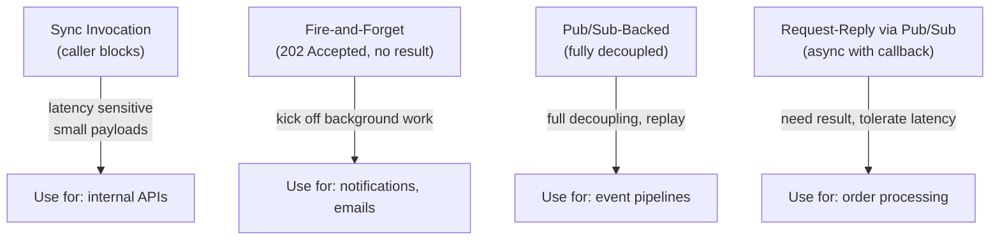
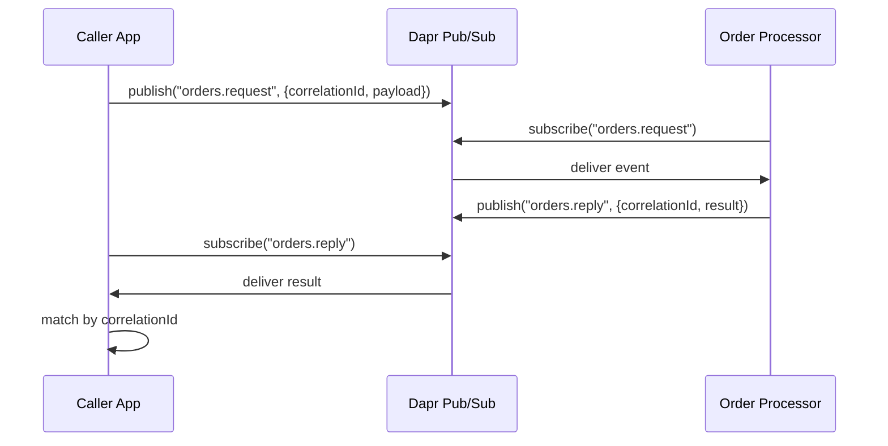

# How to Use Dapr Service Invocation for Async Patterns

Author: [nawazdhandala](https://www.github.com/nawazdhandala)

Tags: Dapr, Service Invocation, Async, Microservice, Event-Driven

Description: Implement async service invocation patterns with Dapr using fire-and-forget, pub/sub-backed calls, and response callbacks for non-blocking microservices.

---

## Overview

By default, Dapr service invocation is synchronous: the caller blocks until the target returns a response. For long-running operations, high-throughput pipelines, or decoupled systems you need async patterns. This guide covers three approaches: fire-and-forget HTTP, pub/sub-backed async invocation, and response callbacks via a separate topic.

## Async Pattern Comparison



## Pattern 1: Fire-and-Forget via HTTP Dapr Metadata

Accept the invocation immediately and process in the background using a goroutine or background thread.

### Target Service (Go)

```go
// server.go
package main

import (
    "encoding/json"
    "fmt"
    "net/http"
)

type Order struct {
    ID    string  `json:"id"`
    Total float64 `json:"total"`
}

func processOrderAsync(order Order) {
    // Simulate long-running processing
    fmt.Printf("Processing order %s in background...\n", order.ID)
}

func handleCreateOrder(w http.ResponseWriter, r *http.Request) {
    var order Order
    json.NewDecoder(r.Body).Decode(&order)

    // Return 202 immediately
    w.WriteHeader(http.StatusAccepted)
    w.Write([]byte(`{"status":"accepted"}`))

    // Process asynchronously
    go processOrderAsync(order)
}

func main() {
    http.HandleFunc("/createOrder", handleCreateOrder)
    http.ListenAndServe(":8080", nil)
}
```

### Caller

```go
// caller.go
resp, err := client.InvokeMethodWithContent(ctx, "order-service", "createOrder", "post", content)
// resp may be 202 Accepted - we don't wait for processing to complete
```

## Pattern 2: Async via Pub/Sub (Fully Decoupled)

The caller publishes an event instead of invoking a service directly. The processor subscribes and handles it independently.

### Caller Publishes Instead of Invoking

```go
// caller publishes
order := map[string]interface{}{"id": "order-1", "total": 99.95}
data, _ := json.Marshal(order)

err = client.PublishEvent(ctx, "pubsub", "orders.create", data)
```

### Processor Subscribes

```go
// processor/server.go
package main

import (
    "context"
    "encoding/json"
    "fmt"

    "github.com/dapr/go-sdk/service/common"
    daprd "github.com/dapr/go-sdk/service/grpc"
)

func handleOrder(ctx context.Context, e *common.TopicEvent) (bool, error) {
    var order map[string]interface{}
    json.Unmarshal(e.RawData, &order)
    fmt.Printf("Processing order: %v\n", order)
    return false, nil
}

func main() {
    s, _ := daprd.NewService(":6001")
    s.AddTopicEventHandler(&common.Subscription{
        PubsubName: "pubsub",
        Topic:      "orders.create",
        Route:      "/orders/create",
    }, handleOrder)
    s.Start()
}
```

## Pattern 3: Request-Reply via Pub/Sub

The caller publishes a request event and subscribes to a reply topic. This achieves async invocation with a result.



### Caller Sends Request

```go
// caller sends request with correlation ID
import "github.com/google/uuid"

correlationID := uuid.New().String()

request := map[string]interface{}{
    "correlationId": correlationID,
    "replyTopic":    "orders.reply." + correlationID,
    "payload":       order,
}
data, _ := json.Marshal(request)

// Subscribe to the reply topic BEFORE publishing
s.AddTopicEventHandler(&common.Subscription{
    PubsubName: "pubsub",
    Topic:      "orders.reply." + correlationID,
    Route:      "/orders/reply/" + correlationID,
}, func(ctx context.Context, e *common.TopicEvent) (bool, error) {
    fmt.Printf("Got reply for %s: %s\n", correlationID, e.RawData)
    return false, nil
})

client.PublishEvent(ctx, "pubsub", "orders.request", data)
```

### Processor Replies

```go
func handleOrderRequest(ctx context.Context, e *common.TopicEvent) (bool, error) {
    var request map[string]interface{}
    json.Unmarshal(e.RawData, &request)

    correlationID := request["correlationId"].(string)
    replyTopic := request["replyTopic"].(string)

    // Process...
    result := map[string]interface{}{
        "correlationId": correlationID,
        "status":        "completed",
        "orderId":       "order-1",
    }
    data, _ := json.Marshal(result)

    // Publish reply
    daprClient.PublishEvent(ctx, "pubsub", replyTopic, data)
    return false, nil
}
```

## Pattern 4: Async via Dapr Workflow

For orchestrated multi-step async flows, use Dapr Workflow:

```go
// Define a workflow that orchestrates async activities
func OrderWorkflow(ctx *workflow.WorkflowContext) (any, error) {
    var input OrderPayload
    ctx.GetInput(&input)

    // Run activities asynchronously
    var validated bool
    if err := ctx.CallActivity(ValidateOrder, workflow.ActivityInput(input)).Await(&validated); err != nil {
        return nil, err
    }

    var charged bool
    if err := ctx.CallActivity(ChargePayment, workflow.ActivityInput(input)).Await(&charged); err != nil {
        return nil, err
    }

    return map[string]bool{"success": true}, nil
}
```

## Choosing the Right Pattern

| Requirement | Recommended Pattern |
|---|---|
| Need result immediately | Synchronous invocation |
| Background processing, no result needed | Fire-and-forget (202) |
| Full decoupling and replay | Pub/Sub async |
| Need result but can wait | Request-Reply via Pub/Sub |
| Multi-step with compensation | Dapr Workflow |

## Summary

Dapr service invocation supports async patterns through three main approaches: returning 202 and processing in a background goroutine, replacing direct invocation with pub/sub publish/subscribe for full decoupling, and implementing request-reply correlation over pub/sub when a result is required. For complex orchestration with compensation and state, Dapr Workflow is the recommended approach.
