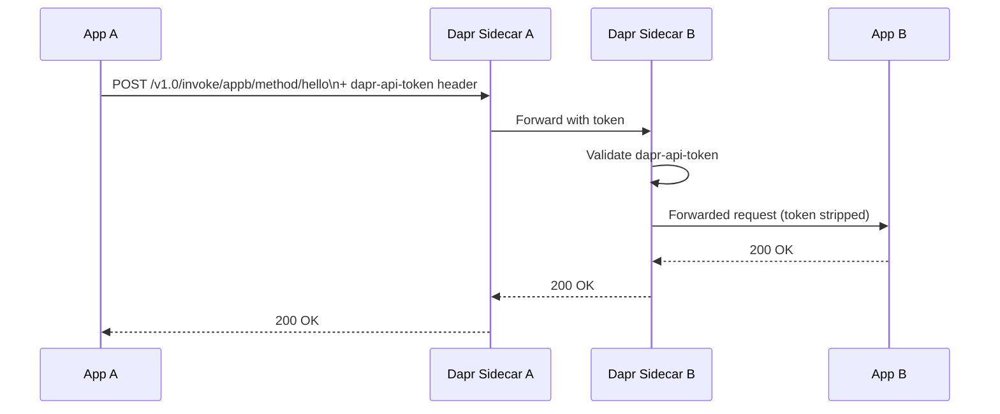
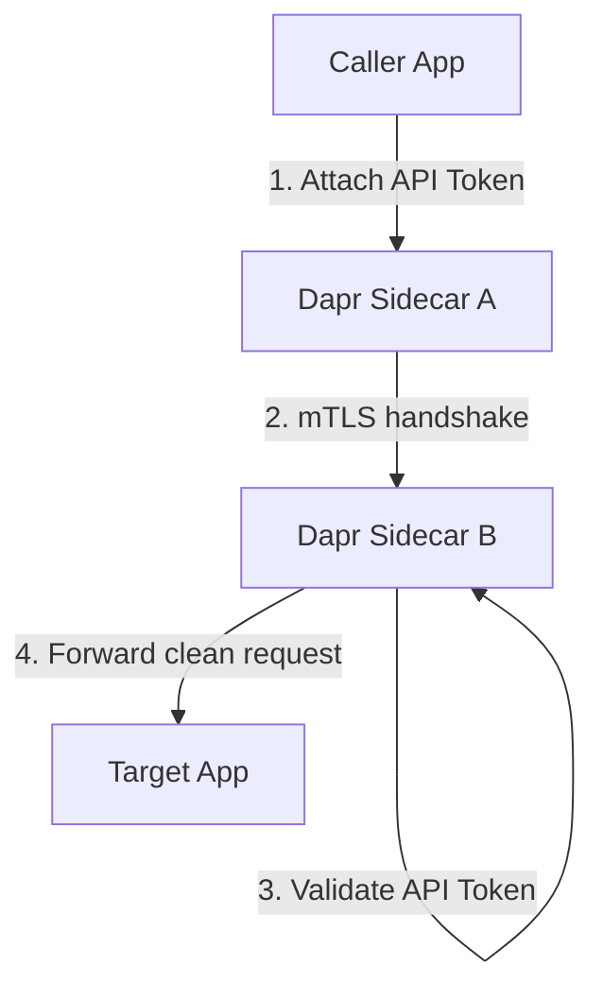

# How to Use Dapr Service Invocation with Authentication Tokens

Author: [nawazdhandala](https://www.github.com/nawazdhandala)

Tags: Dapr, Service Invocation, Authentication, Security, Microservice

Description: Learn how to secure Dapr service-to-service calls using API token authentication, including sidecar token validation and per-request token headers.

---

## Introduction

By default, Dapr service invocation trusts all callers within the same namespace. In many production scenarios you need an additional authentication layer so only authorised services can invoke a given endpoint. Dapr supports API token authentication at the sidecar level and integrates with middleware for JWT validation.

## Authentication Token Flow



## Enabling Dapr API Token Authentication

### Self-Hosted Mode

Set the `DAPR_API_TOKEN` environment variable before starting the Dapr sidecar. All HTTP calls to the sidecar must then include this token.

```bash
export DAPR_API_TOKEN=my-secret-token

dapr run --app-id myapp --app-port 8080 -- ./myapp
```

The calling application must attach the header:

```bash
curl http://localhost:3500/v1.0/invoke/targetapp/method/ping \
  -H "dapr-api-token: my-secret-token"
```

### Kubernetes Mode

Store the token in a Kubernetes Secret:

```bash
kubectl create secret generic dapr-api-token \
  --from-literal=token=my-super-secret-token
```

Reference the secret in the Dapr sidecar configuration using an annotation:

```yaml
apiVersion: apps/v1
kind: Deployment
metadata:
  name: orderservice
spec:
  template:
    metadata:
      annotations:
        dapr.io/enabled: "true"
        dapr.io/app-id: "orderservice"
        dapr.io/app-port: "8080"
        dapr.io/api-token-secret: "dapr-api-token"
    spec:
      containers:
        - name: orderservice
          image: myregistry/orderservice:latest
```

## Calling a Token-Protected Service

When the target sidecar requires a token, the calling app must include `dapr-api-token` in every invocation request:

```bash
# Caller must know the shared token
curl http://localhost:3500/v1.0/invoke/orderservice/method/orders \
  -H "Content-Type: application/json" \
  -H "dapr-api-token: my-super-secret-token" \
  -d '{"item": "laptop"}'
```

In Go:

```go
req, _ := http.NewRequest("POST",
    "http://localhost:3500/v1.0/invoke/orderservice/method/orders",
    strings.NewReader(`{"item":"laptop"}`))
req.Header.Set("Content-Type", "application/json")
req.Header.Set("dapr-api-token", os.Getenv("DAPR_API_TOKEN"))

client := &http.Client{}
resp, err := client.Do(req)
```

## Using Middleware for JWT Authentication

For OAuth2/OIDC-based authentication, use Dapr's HTTP middleware pipeline with a JWT validator. Define a middleware component:

```yaml
apiVersion: dapr.io/v1alpha1
kind: Component
metadata:
  name: jwt-auth
  namespace: default
spec:
  type: middleware.http.bearer
  version: v1
  metadata:
    - name: jwksURL
      value: "https://your-idp.example.com/.well-known/jwks.json"
    - name: audience
      value: "https://api.example.com"
    - name: issuer
      value: "https://your-idp.example.com"
```

Apply the middleware in a Dapr Configuration:

```yaml
apiVersion: dapr.io/v1alpha1
kind: Configuration
metadata:
  name: pipeline-config
  namespace: default
spec:
  httpPipeline:
    handlers:
      - name: jwt-auth
        type: middleware.http.bearer
```

Annotate your deployment to use this configuration:

```yaml
annotations:
  dapr.io/enabled: "true"
  dapr.io/app-id: "orderservice"
  dapr.io/config: "pipeline-config"
```

## Passing JWT Tokens in Service Invocation

The calling app obtains a token from the identity provider and forwards it:

```bash
TOKEN=$(curl -s -X POST https://your-idp.example.com/oauth/token \
  -d "grant_type=client_credentials&client_id=svcA&client_secret=secret&audience=https://api.example.com" \
  | jq -r '.access_token')

curl http://localhost:3500/v1.0/invoke/orderservice/method/orders \
  -H "Authorization: Bearer $TOKEN" \
  -H "Content-Type: application/json" \
  -d '{"item": "laptop"}'
```

Dapr's middleware validates the JWT before forwarding to the application. The application receives the request without needing to re-validate.

## Mutual TLS as an Additional Layer

Combine token-based auth with Dapr mTLS for defence in depth. mTLS is enabled by default in Kubernetes mode. Verify it is active:

```bash
dapr mtls -k
# Output: mTLS is enabled in your Kubernetes cluster
```



## Rotating Tokens Without Downtime

Update the Kubernetes Secret with the new token:

```bash
kubectl create secret generic dapr-api-token \
  --from-literal=token=new-secret-token \
  --dry-run=client -o yaml | kubectl apply -f -
```

Perform a rolling restart of affected deployments so sidecars pick up the new secret:

```bash
kubectl rollout restart deployment/orderservice
kubectl rollout restart deployment/callerservice
```

## Troubleshooting

```bash
# 401 Unauthorized - token mismatch or missing header
kubectl logs deployment/orderservice -c daprd | grep "token"

# Check the secret is mounted correctly
kubectl get secret dapr-api-token -o jsonpath='{.data.token}' | base64 -d

# Test with explicit token
kubectl exec -it deploy/callerservice -- \
  curl -H "dapr-api-token: my-super-secret-token" \
  http://localhost:3500/v1.0/invoke/orderservice/method/ping
```

## Summary

Dapr service invocation supports token-based authentication at two layers: the sidecar-level `dapr-api-token` for lightweight shared-secret protection, and HTTP middleware (JWT bearer) for full OAuth2/OIDC integration. Use Kubernetes Secrets to manage tokens securely, combine with Dapr mTLS for mutual authentication, and rotate secrets via rolling restarts. This layered approach ensures only authorised services can invoke protected endpoints within your Dapr application mesh.
