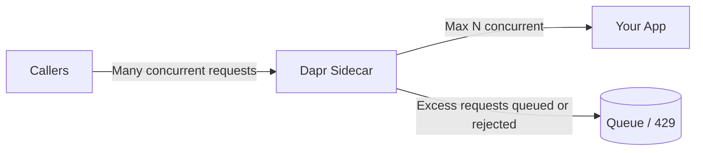

# How to Configure Concurrency Limits for Dapr Service Invocation

Author: [OneUptime](https://oneuptime.com)

Tags: Dapr, Service Invocation, Concurrency, Resiliency, Microservice

Description: Learn how to configure concurrency limits on Dapr service invocation to protect downstream services from overload and control request throughput.

---

## Introduction

Without concurrency limits, a downstream service can receive more simultaneous requests than it can handle, leading to cascading failures. Dapr allows you to cap the number of concurrent requests forwarded to your application through the sidecar, acting as an automatic throttle that protects your service.

## How Concurrency Limits Work in Dapr



The Dapr sidecar queues incoming requests and forwards them to the application at the configured maximum concurrency. Requests beyond the queue limit receive a `429 Too Many Requests` response.

## Configuring App Max Concurrency

### Via CLI (Self-Hosted)

```bash
dapr run \
  --app-id orderservice \
  --app-port 8080 \
  --app-max-concurrency 10 \
  -- ./orderservice
```

This limits the sidecar to forwarding at most 10 concurrent requests to `orderservice`.

### Via Kubernetes Annotation

```yaml
apiVersion: apps/v1
kind: Deployment
metadata:
  name: orderservice
spec:
  template:
    metadata:
      annotations:
        dapr.io/enabled: "true"
        dapr.io/app-id: "orderservice"
        dapr.io/app-port: "8080"
        dapr.io/app-max-concurrency: "10"
    spec:
      containers:
        - name: orderservice
          image: myregistry/orderservice:latest
```

The annotation `dapr.io/app-max-concurrency: "10"` sets the limit. The sidecar will hold excess requests up to its internal queue, then respond with `429` when the queue is full.

## Combining Concurrency with Resiliency Policies

Define a resiliency policy to handle the `429` responses from overloaded services:

```yaml
apiVersion: dapr.io/v1alpha1
kind: Resiliency
metadata:
  name: order-resiliency
  namespace: default
spec:
  policies:
    retries:
      retryWithBackoff:
        policy: exponential
        maxInterval: 10s
        maxRetries: 3
    circuitBreakers:
      orderCB:
        maxRequests: 1
        interval: 30s
        timeout: 60s
        trip: consecutiveFailures >= 5

  targets:
    apps:
      orderservice:
        retry: retryWithBackoff
        circuitBreaker: orderCB
```

Apply to the calling service:

```yaml
annotations:
  dapr.io/enabled: "true"
  dapr.io/app-id: "frontend"
  dapr.io/config: "resiliency-config"
```

## Testing Concurrency Limits

Use a load testing tool to verify the cap is working:

```bash
# Install hey
brew install hey

# Send 50 concurrent requests to the frontend which calls orderservice
hey -n 200 -c 50 http://localhost:3000/orders

# Expected output shows some 429 responses when orderservice is saturated
# Status code distribution:
#   [200] 150 responses
#   [429] 50 responses
```

## Monitoring Concurrency in Dapr Metrics

Dapr exposes Prometheus metrics for concurrency:

```bash
# Port-forward the Dapr metrics endpoint
kubectl port-forward deployment/orderservice 9090:9090

# Query the active request count
curl http://localhost:9090/metrics | grep dapr_http_server_request_count
```

Key metrics:

| Metric | Description |
|--------|-------------|
| `dapr_http_server_request_count` | Total HTTP requests received by sidecar |
| `dapr_http_server_latency` | Latency distribution per method |
| `dapr_http_client_request_count` | Outgoing invocation requests |

## Concurrency Limit vs Rate Limiting

| Feature | Concurrency Limit | Rate Limiting |
|---------|-----------------|--------------|
| Controls | Simultaneous active requests | Requests per time window |
| Dapr config | `app-max-concurrency` | Middleware or resiliency |
| Response when exceeded | `429` (queued then rejected) | `429` immediately |
| Use case | Protect CPU-bound services | API quotas, fair use |

For combined protection, use `app-max-concurrency` together with a rate-limiting middleware component:

```yaml
apiVersion: dapr.io/v1alpha1
kind: Component
metadata:
  name: rate-limit
  namespace: default
spec:
  type: middleware.http.ratelimit
  version: v1
  metadata:
    - name: maxRequestsPerSecond
      value: "100"
```

## Graceful Handling of 429 in the Caller

```python
import requests
import time

def invoke_order(payload, retries=3):
    for attempt in range(retries):
        resp = requests.post(
            "http://localhost:3500/v1.0/invoke/orderservice/method/orders",
            json=payload
        )
        if resp.status_code == 429:
            wait = 2 ** attempt
            print(f"Throttled, retrying in {wait}s...")
            time.sleep(wait)
            continue
        resp.raise_for_status()
        return resp.json()
    raise Exception("orderservice unavailable after retries")
```

## Summary

Dapr's `app-max-concurrency` setting throttles the number of simultaneous requests forwarded to your application, protecting it from overload. Configure it via the `--app-max-concurrency` CLI flag or the `dapr.io/app-max-concurrency` Kubernetes annotation. Pair concurrency limits with Dapr Resiliency policies (retries, circuit breakers) so callers handle `429` responses gracefully. Monitor actual concurrency using Dapr's built-in Prometheus metrics to tune the limit for your workload.
