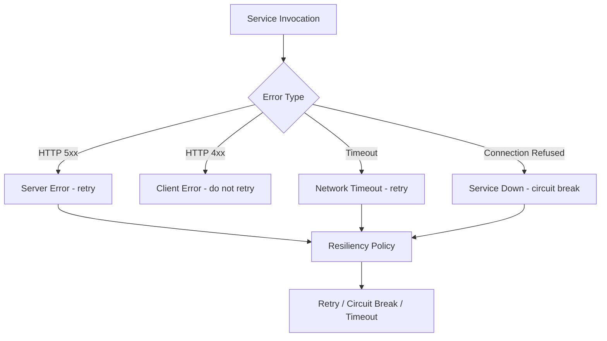
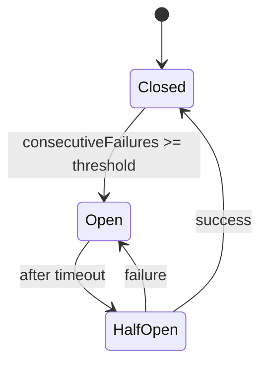

# How to Handle Service Invocation Errors in Dapr

Author: [nawazdhandala](https://www.github.com/nawazdhandala)

Tags: Dapr, Error Handling, Resiliency, Retry, Circuit Breaker

Description: Learn how to handle service invocation errors in Dapr using resiliency policies, retries, circuit breakers, timeouts, and fallback strategies.

---

## Overview

Service invocation in distributed systems can fail for many reasons: network timeouts, service downtime, rate limiting, or transient faults. Dapr provides a built-in Resiliency API that lets you configure retries, circuit breakers, and timeouts declaratively without changing application code.

## Types of Errors in Service Invocation



## How Dapr Returns Errors

When service invocation fails, the Dapr sidecar returns the error to the calling application as an HTTP or gRPC response. The status code from the target service is preserved.

Example error response for a 503:

```json
{
  "errorCode": "ERR_DIRECT_INVOKE",
  "message": "fail to invoke, id: service-b, err: rpc error: code = Unavailable"
}
```

## Handling Errors in Application Code

### Python

```python
import requests
import os

DAPR_HTTP_PORT = os.environ.get("DAPR_HTTP_PORT", "3500")

def invoke_with_error_handling(app_id, method, body=None):
    url = f"http://localhost:{DAPR_HTTP_PORT}/v1.0/invoke/{app_id}/method/{method}"
    try:
        response = requests.post(url, json=body, timeout=5)
        response.raise_for_status()
        return response.json()
    except requests.exceptions.Timeout:
        print("Request timed out")
        raise
    except requests.exceptions.HTTPError as e:
        if e.response.status_code == 404:
            print(f"Method not found on {app_id}")
        elif e.response.status_code >= 500:
            print(f"Service {app_id} returned server error: {e.response.status_code}")
        raise
    except requests.exceptions.ConnectionError:
        print("Could not reach Dapr sidecar")
        raise
```

### Go

```go
package main

import (
    "encoding/json"
    "fmt"
    "net/http"
    "time"
)

type DaprError struct {
    ErrorCode string `json:"errorCode"`
    Message   string `json:"message"`
}

func invokeService(appID, method string) error {
    client := &http.Client{Timeout: 5 * time.Second}
    url := fmt.Sprintf("http://localhost:3500/v1.0/invoke/%s/method/%s", appID, method)

    resp, err := client.Get(url)
    if err != nil {
        return fmt.Errorf("connection error: %w", err)
    }
    defer resp.Body.Close()

    if resp.StatusCode >= 400 {
        var daprErr DaprError
        json.NewDecoder(resp.Body).Decode(&daprErr)
        return fmt.Errorf("invocation failed (%d): %s", resp.StatusCode, daprErr.Message)
    }
    return nil
}
```

## Configuring Resiliency Policies

The Dapr Resiliency resource defines retry, timeout, and circuit breaker policies that the sidecar applies automatically.

```yaml
apiVersion: dapr.io/v1alpha1
kind: Resiliency
metadata:
  name: app-resiliency
  namespace: default
spec:
  policies:
    retries:
      # Exponential backoff retry
      retryWithBackoff:
        policy: exponential
        maxInterval: 10s
        maxRetries: 5
      # Constant interval retry
      retryThreeTimes:
        policy: constant
        duration: 2s
        maxRetries: 3
    timeouts:
      shortTimeout: 3s
      longTimeout: 15s
    circuitBreakers:
      serviceBCB:
        maxRequests: 1
        interval: 10s
        timeout: 30s
        trip: consecutiveFailures >= 3
  targets:
    apps:
      service-b:
        retry: retryWithBackoff
        timeout: shortTimeout
        circuitBreaker: serviceBCB
```

Apply it:

```bash
# Self-hosted: place in ~/.dapr/resiliency/
cp app-resiliency.yaml ~/.dapr/resiliency/

# Kubernetes:
kubectl apply -f app-resiliency.yaml
```

## How Circuit Breakers Work



- **Closed**: Normal operation. Requests pass through.
- **Open**: Too many failures. Requests fail fast without calling the service.
- **Half-Open**: A limited number of requests are allowed to test if the service has recovered.

## Retry Policies

### Constant Backoff

```yaml
retries:
  constant:
    policy: constant
    duration: 2s
    maxRetries: 5
```

### Exponential Backoff

```yaml
retries:
  exponential:
    policy: exponential
    initialInterval: 500ms
    randomizationFactor: 0.5
    multiplier: 1.5
    maxInterval: 60s
    maxRetries: 10
```

## Timeout Configuration

Set timeouts at the policy level:

```yaml
timeouts:
  invokeTimeout: 5s
```

Assign to a service target:

```yaml
targets:
  apps:
    payment-service:
      timeout: invokeTimeout
```

## Checking if Circuit is Open

When the circuit is open, Dapr returns a `503 Service Unavailable` with the error code `ERR_DIRECT_INVOKE`. Your application should handle this gracefully:

```python
def safe_invoke(app_id, method):
    try:
        return invoke_with_error_handling(app_id, method)
    except requests.exceptions.HTTPError as e:
        if e.response.status_code == 503:
            # Circuit is open - use fallback
            return get_cached_response(app_id, method)
        raise
```

## Viewing Resiliency Events

Dapr emits metrics for resiliency events. View them via the Dapr dashboard or Prometheus:

- `dapr_resiliency_count` - total resiliency policy activations
- `dapr_resiliency_activations_total` - retries, circuit breaks, timeouts

## Summary

Dapr provides a powerful Resiliency API for handling service invocation errors declaratively. By defining retry (constant or exponential backoff), timeout, and circuit breaker policies in a `Resiliency` YAML resource, you configure fault tolerance without modifying application code. The sidecar applies these policies automatically between services, protecting your system from cascading failures.
