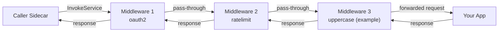

# How to Use Dapr Service Invocation with HTTP Middleware

Author: [nawazdhandala](https://www.github.com/nawazdhandala)

Tags: Dapr, Middleware, Service Invocation, HTTP, Pipeline

Description: Add cross-cutting behaviour to Dapr service invocation by configuring HTTP middleware pipelines for authentication, request transformation, and logging.

---

## Overview

Dapr's HTTP pipeline allows you to attach middleware components that run on every inbound service invocation before the request reaches your app. Common use cases include OAuth2 token validation, request/response transformation, and header manipulation.

## Middleware Pipeline Flow



## Available HTTP Middleware Components

| Component | type | Purpose |
|---|---|---|
| Rate Limit | `middleware.http.ratelimit` | Throttle inbound requests |
| OAuth2 | `middleware.http.oauth2` | Validate OAuth2 bearer tokens |
| OAuth2 Client Credentials | `middleware.http.oauth2clientcredentials` | Fetch and attach access tokens |
| Bearer | `middleware.http.bearer` | Validate JWT bearer tokens |
| OPA Policies | `middleware.http.opa` | Open Policy Agent authorisation |
| Sentinel | `middleware.http.sentinel` | Alibaba Sentinel flow control |
| Wasm | `middleware.http.wasm` | Run custom WebAssembly middleware |
| Uppercase (example) | `middleware.http.uppercase` | Transform request body to uppercase |

## Step 1: Define a Bearer Token Validation Middleware

```yaml
# components/bearer-auth.yaml
apiVersion: dapr.io/v1alpha1
kind: Component
metadata:
  name: bearer-auth
  namespace: default
spec:
  type: middleware.http.bearer
  version: v1
  metadata:
  - name: jwksURL
    value: "https://your-auth-provider.example.com/.well-known/jwks.json"
  - name: audience
    value: "order-service"
  - name: issuer
    value: "https://your-auth-provider.example.com"
```

## Step 2: Define a Rate-Limit Middleware

```yaml
# components/ratelimit.yaml
apiVersion: dapr.io/v1alpha1
kind: Component
metadata:
  name: ratelimit
  namespace: default
spec:
  type: middleware.http.ratelimit
  version: v1
  metadata:
  - name: maxRequestsPerSecond
    value: "200"
```

## Step 3: Create the Pipeline Configuration

```yaml
# components/pipeline-config.yaml
apiVersion: dapr.io/v1alpha1
kind: Configuration
metadata:
  name: pipeline-config
  namespace: default
spec:
  httpPipeline:
    handlers:
    - name: ratelimit
      type: middleware.http.ratelimit
    - name: bearer-auth
      type: middleware.http.bearer
```

Middleware runs top-to-bottom for inbound requests and bottom-to-top for responses.

## Step 4: Attach the Pipeline to Your App

```yaml
# k8s/deployment.yaml
apiVersion: apps/v1
kind: Deployment
metadata:
  name: order-service
spec:
  template:
    metadata:
      annotations:
        dapr.io/enabled: "true"
        dapr.io/app-id: "order-service"
        dapr.io/app-port: "8080"
        dapr.io/config: "pipeline-config"
```

## Step 5: OAuth2 Client Credentials (Outbound Token Injection)

For attaching an access token to outbound service invocations from your app:

```yaml
# components/oauth2cc.yaml
apiVersion: dapr.io/v1alpha1
kind: Component
metadata:
  name: oauth2cc
  namespace: default
spec:
  type: middleware.http.oauth2clientcredentials
  version: v1
  metadata:
  - name: clientID
    value: "your-client-id"
  - name: clientSecret
    secretKeyRef:
      name: oauth-secret
      key: clientSecret
  - name: tokenURL
    value: "https://auth.example.com/oauth/token"
  - name: scopes
    value: "api://order-service/.default"
  - name: authStyle
    value: "1"  # 1 = in header, 2 = in params
```

Add to the `appHttpPipeline` (outbound):

```yaml
spec:
  appHttpPipeline:
    handlers:
    - name: oauth2cc
      type: middleware.http.oauth2clientcredentials
```

## Step 6: OPA Policy Middleware

```yaml
# components/opa.yaml
apiVersion: dapr.io/v1alpha1
kind: Component
metadata:
  name: opa-authz
  namespace: default
spec:
  type: middleware.http.opa
  version: v1
  metadata:
  - name: rego
    value: |
      package http.authz
      default allow = false
      allow {
        input.request.method == "GET"
      }
      allow {
        input.request.headers["Authorization"][0] != ""
      }
  - name: defaultStatus
    value: "403"
  - name: includedHeaders
    value: "Authorization,Content-Type"
```

## Self-Hosted Mode

Pass the config file at startup:

```bash
dapr run \
  --app-id order-service \
  --app-port 8080 \
  --config ./components/pipeline-config.yaml \
  --components-path ./components \
  -- go run main.go
```

## Wasm Custom Middleware

For fully custom logic, compile a Wasm module and reference it:

```yaml
# components/wasm-mw.yaml
apiVersion: dapr.io/v1alpha1
kind: Component
metadata:
  name: custom-wasm
  namespace: default
spec:
  type: middleware.http.wasm
  version: v1
  metadata:
  - name: url
    value: "file://./custom-middleware.wasm"
  - name: guest
    value: "http_handler"
```

## Verify Middleware is Applied

```bash
# Check Dapr sidecar logs for pipeline activation
kubectl logs -n default <pod-name> -c daprd | grep -i middleware

# In self-hosted mode
dapr run --log-level debug ... 2>&1 | grep -i pipeline
```

## Summary

Dapr HTTP middleware pipelines are defined in a `Configuration` CRD under `spec.httpPipeline` (for inbound) and `spec.appHttpPipeline` (for outbound). Each entry references a `Component` of type `middleware.http.*`. Handlers chain in order, allowing you to compose authentication, rate limiting, and policy enforcement without modifying application code. Middleware components are scoped to the app they are configured on, so different services can have different pipelines.
