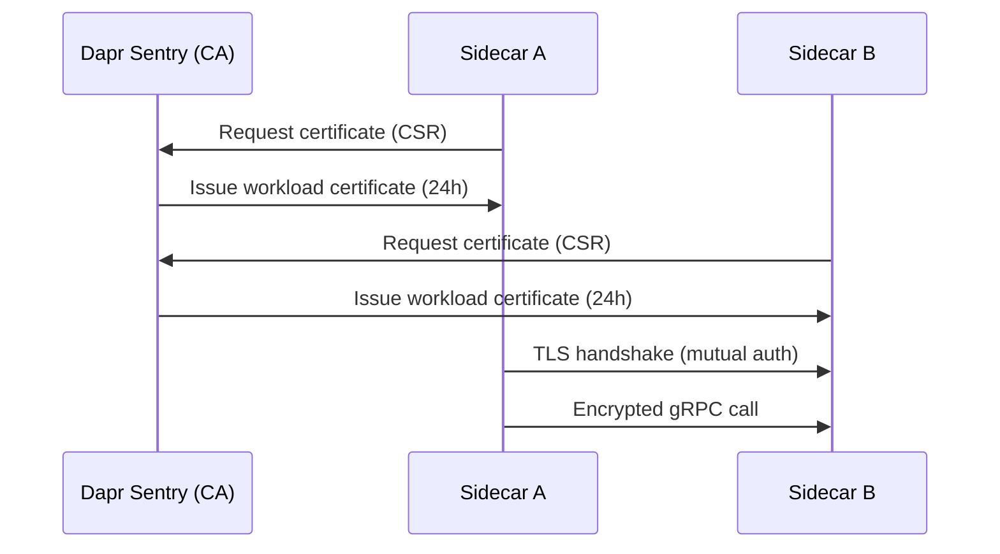

# How to Use Dapr Service Invocation with mTLS

Author: [nawazdhandala](https://www.github.com/nawazdhandala)

Tags: Dapr, mTLS, Security, Service Invocation, Certificate

Description: Learn how Dapr automatically secures service-to-service communication with mutual TLS (mTLS), including certificate management and access control policies.

---

## What Is mTLS in Dapr?

Mutual TLS (mTLS) means both the client and server authenticate each other using certificates. Dapr enables mTLS by default for all service-to-service communication in Kubernetes mode. The `dapr-sentry` control plane component acts as a certificate authority (CA) that issues short-lived certificates to each Dapr sidecar.

In self-hosted mode, mTLS is disabled by default but can be enabled.

## How Dapr mTLS Works



## mTLS on Kubernetes

mTLS is enabled automatically on Kubernetes. No configuration is needed. Each sidecar automatically requests a SPIFFE/X.509 certificate from Dapr Sentry and presents it during the TLS handshake.

Verify mTLS is active:

```bash
dapr mtls -k
```

Expected output:

```text
Mutual TLS is enabled in your Kubernetes cluster
```

Check certificate status:

```bash
dapr mtls expiry -k
```

## Disabling mTLS on Kubernetes

To disable mTLS (not recommended for production):

```yaml
# dapr-config.yaml
apiVersion: dapr.io/v1alpha1
kind: Configuration
metadata:
  name: daprConfig
  namespace: dapr-system
spec:
  mtls:
    enabled: false
```

```bash
kubectl apply -f dapr-config.yaml
```

## Custom CA Certificate

You can provide your own root CA instead of using Dapr's auto-generated CA.

Generate a root CA:

```bash
openssl genrsa -out ca.key 4096
openssl req -new -x509 -days 1825 -key ca.key -out ca.crt \
  -subj "/O=MyOrg/CN=cluster.local"
```

Generate Sentry issuer credentials:

```bash
openssl genrsa -out issuer.key 4096
openssl req -new -key issuer.key -out issuer.csr \
  -subj "/O=MyOrg/CN=cluster.local"
openssl x509 -req -days 365 -in issuer.csr \
  -CA ca.crt -CAkey ca.key -CAcreateserial -out issuer.crt
```

Create the Kubernetes secret:

```bash
kubectl create secret generic dapr-trust-bundle \
  --from-file=ca.crt=ca.crt \
  --from-file=issuer.crt=issuer.crt \
  --from-file=issuer.key=issuer.key \
  -n dapr-system
```

Install Dapr with the custom CA:

```bash
helm upgrade --install dapr dapr/dapr \
  --namespace dapr-system \
  --set-string dapr_sentry.trustAnchorsFile=ca.crt \
  --set-string dapr_sentry.issuerCertFile=issuer.crt \
  --set-string dapr_sentry.issuerKeyFile=issuer.key
```

## Enabling mTLS in Self-Hosted Mode

Generate a root CA and sidecar credentials, then pass them to the sidecar:

```bash
daprd \
  --app-id myapp \
  --app-port 3000 \
  --enable-mtls \
  --sentry-address localhost:50001 \
  --trust-anchors-file ca.crt \
  --cert-chain-file cert.crt \
  --cert-key-file cert.key
```

Or use the Dapr CLI with a configuration file:

```yaml
# config.yaml
apiVersion: dapr.io/v1alpha1
kind: Configuration
metadata:
  name: myconfig
spec:
  mtls:
    enabled: true
    workloadCertTTL: 24h
    allowedClockSkew: 15m
```

```bash
dapr run --config config.yaml --app-id myapp -- python app.py
```

## Access Control with mTLS

Combine mTLS with access control policies to restrict which services can call which operations:

```yaml
apiVersion: dapr.io/v1alpha1
kind: Configuration
metadata:
  name: appconfig
spec:
  accessControl:
    defaultAction: deny
    trustDomain: "cluster.local"
    policies:
    - appId: frontend
      defaultAction: deny
      trustDomain: "cluster.local"
      namespace: "default"
      operations:
      - name: /orders
        httpVerb: ['POST', 'GET']
        action: allow
      - name: /checkout/**
        httpVerb: ['*']
        action: allow
```

Apply to the target service on Kubernetes:

```yaml
annotations:
  dapr.io/config: "appconfig"
```

## Certificate Rotation

Dapr Sentry automatically rotates certificates before they expire. The default workload certificate TTL is 24 hours. The sidecar renews certificates 30 minutes before expiry.

Verify certificate expiry:

```bash
dapr mtls expiry -k
```

To manually trigger renewal, restart the Dapr Sentry pod:

```bash
kubectl rollout restart deployment/dapr-sentry -n dapr-system
```

## Verifying Encrypted Traffic

Use `tcpdump` or Wireshark to verify traffic between sidecars is encrypted:

```bash
# On the node, capture traffic on port 3500 (if you can reach it)
tcpdump -i eth0 -n port 3500 -w capture.pcap
```

All inter-sidecar traffic should show TLS handshake records, not plaintext.

## Summary

Dapr mTLS provides automatic, zero-configuration mutual TLS encryption for all service-to-service communication on Kubernetes. The Dapr Sentry control plane component issues short-lived SPIFFE/X.509 certificates to each sidecar. You can provide a custom CA, configure certificate TTL, and combine mTLS with access control policies for fine-grained service authorization.
