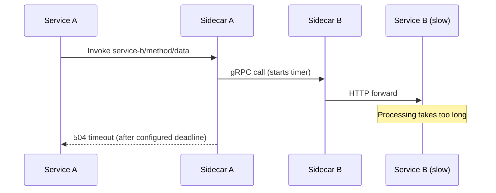

# How to Configure Dapr Service Invocation Timeout

Author: [nawazdhandala](https://www.github.com/nawazdhandala)

Tags: Dapr, Timeout, Service Invocation, Resiliency, Microservice

Description: Configure per-service and global timeouts for Dapr service invocation using the Resiliency API to prevent cascading failures in microservices.

---

## Why Timeouts Matter in Service Invocation

Without timeouts, a slow or unresponsive downstream service can hold connections open indefinitely, exhausting thread pools and causing cascading failures across your application. Dapr allows you to configure timeouts declaratively using the Resiliency API, without changing any application code.

## How Dapr Applies Timeouts



## Prerequisites

- Dapr initialized (self-hosted or Kubernetes)
- Two running services with Dapr sidecars
- Resiliency feature available (Dapr 1.7+)

## Defining a Timeout in a Resiliency Policy

Timeouts are defined in a `Resiliency` resource and assigned to service targets:

```yaml
apiVersion: dapr.io/v1alpha1
kind: Resiliency
metadata:
  name: service-timeout-policy
  namespace: default
spec:
  policies:
    timeouts:
      # Short timeout for fast APIs
      quickTimeout: 2s
      # Longer timeout for batch operations
      batchTimeout: 30s
      # Default timeout for most services
      defaultTimeout: 5s

  targets:
    apps:
      payment-service:
        timeout: quickTimeout
      report-service:
        timeout: batchTimeout
      inventory-service:
        timeout: defaultTimeout
```

Save and apply:

```bash
# Self-hosted
cp service-timeout-policy.yaml ~/.dapr/resiliency/

# Kubernetes
kubectl apply -f service-timeout-policy.yaml
```

## Combining Timeout with Retry

When combining timeouts with retries, the timeout applies per attempt, not to the total operation:

```yaml
spec:
  policies:
    timeouts:
      perAttempt: 3s
    retries:
      withRetry:
        policy: constant
        duration: 1s
        maxRetries: 3
  targets:
    apps:
      payment-service:
        timeout: perAttempt
        retry: withRetry
```

In this configuration, each of the 3 retry attempts has a 3-second timeout. The maximum total time is approximately 12 seconds (3 attempts x 3s timeout + 2 x 1s delay).

## Setting Timeout on the Client Side

You can also set a timeout at the HTTP client level in your application code as a defense-in-depth measure.

### Python

```python
import requests
import os

DAPR_HTTP_PORT = os.environ.get("DAPR_HTTP_PORT", "3500")

def invoke_with_timeout(app_id, method, timeout_seconds=5):
    url = f"http://localhost:{DAPR_HTTP_PORT}/v1.0/invoke/{app_id}/method/{method}"
    try:
        response = requests.get(url, timeout=timeout_seconds)
        response.raise_for_status()
        return response.json()
    except requests.exceptions.Timeout:
        print(f"Timeout calling {app_id}/{method} after {timeout_seconds}s")
        return None
```

### Go

```go
package main

import (
    "context"
    "fmt"
    "net/http"
    "time"
)

func invokeWithTimeout(appID, method string, timeout time.Duration) error {
    ctx, cancel := context.WithTimeout(context.Background(), timeout)
    defer cancel()

    url := fmt.Sprintf("http://localhost:3500/v1.0/invoke/%s/method/%s", appID, method)
    req, _ := http.NewRequestWithContext(ctx, "GET", url, nil)

    client := &http.Client{}
    resp, err := client.Do(req)
    if err != nil {
        if ctx.Err() == context.DeadlineExceeded {
            return fmt.Errorf("invocation timed out after %s", timeout)
        }
        return err
    }
    defer resp.Body.Close()
    fmt.Println("Status:", resp.Status)
    return nil
}

func main() {
    err := invokeWithTimeout("payment-service", "charge", 2*time.Second)
    if err != nil {
        fmt.Println("Error:", err)
    }
}
```

### Node.js

```javascript
const axios = require('axios');

const DAPR_PORT = process.env.DAPR_HTTP_PORT || 3500;

async function invokeWithTimeout(appId, method, timeoutMs = 5000) {
  const url = `http://localhost:${DAPR_PORT}/v1.0/invoke/${appId}/method/${method}`;
  try {
    const response = await axios.get(url, { timeout: timeoutMs });
    return response.data;
  } catch (error) {
    if (error.code === 'ECONNABORTED') {
      console.error(`Timeout calling ${appId}/${method} after ${timeoutMs}ms`);
    }
    throw error;
  }
}

invokeWithTimeout('payment-service', 'status', 2000)
  .then(console.log)
  .catch(console.error);
```

## Timeout Error Response

When a timeout occurs, the Dapr sidecar returns:

```
HTTP 504 Gateway Timeout
```

With a body like:

```json
{
  "errorCode": "ERR_DIRECT_INVOKE",
  "message": "fail to invoke, id: payment-service, err: context deadline exceeded"
}
```

## Scoping Resiliency Policies

You can scope a Resiliency resource to specific namespaces or use labels to target specific sidecars:

```yaml
apiVersion: dapr.io/v1alpha1
kind: Resiliency
metadata:
  name: namespace-timeouts
  namespace: production
spec:
  policies:
    timeouts:
      default: 5s
  targets:
    apps:
      all:
        timeout: default
```

## Monitoring Timeout Events

Dapr emits metrics for timeout events. Query them in Prometheus:

```
dapr_resiliency_count{name="service-timeout-policy", namespace="default", policy="timeout", target="payment-service"}
```

## Summary

Configuring timeouts in Dapr prevents slow services from blocking your entire application. The Resiliency API lets you define named timeouts and assign them to specific service targets without modifying application code. Timeouts compose cleanly with retry and circuit breaker policies, giving you full control over fault tolerance behavior in your microservice architecture.
